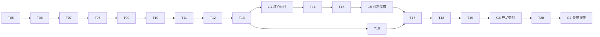

# 决策感知型 Coding Agent Harness 实现计划

> **For agentic workers:** REQUIRED SUB-SKILL: Use `superpowers:subagent-driven-development` (recommended) or `superpowers:executing-plans` to implement this plan task-by-task. Steps use checkbox (`- [ ]`) syntax for tracking.

**Goal:** 构建一个自研的决策感知型 Coding Agent Harness，使小型团队的 Coding Agent 在副作用发生前使用当前有效决策、阻断过期快照和冲突，并以离线 mock、审计 Trace、WebUI、CI 和单容器分发证明系统可靠。

**Architecture:** 采用 TypeScript 模块化单体：React WebUI 只通过 HTTP/SSE 白名单 DTO 调用 Fastify；应用服务编排领域、Runtime 与基础设施；领域规则、Agent 主循环、治理、反馈、上下文和状态机均由项目代码实现。生产由单个非 root Linux `amd64` 容器提供 API 与前端静态资源，SQLite 位于 `/data`，被管理仓库挂载到 `/workspace`。

**Tech Stack:** 项目锁定的 Node.js LTS、pnpm、TypeScript strict、Fastify、React、Vite、Zod、SQLite、Drizzle ORM、Vitest、Playwright、Node.js `crypto`、Argon2id、SSE、Docker/OCI、GitLab CI。

## Global Constraints

- 权威需求为 `SPEC.md` 1.0.0；状态为 G1、G2、G3 已通过。
- G3 通过前禁止在项目工作区创建或修改本计划描述的正式源码、测试、依赖、Dockerfile 或 CI 文件，也不得提交、合并或把试做结果计为任何 T05–T20 任务进度。
- T04 冷启动试做是上述禁令的隔离验证活动：允许陌生智能体在不连接项目工作区的外部网页或一次性沙箱中静态模拟 T05 Step 1–5，并在回答正文中生成一次性文本草案或失败证据；即使 G3、`OPEN-03` 尚未满足，也可继续这种明确标为“模拟/未执行”的推演。模拟中不得伪造 G3 证据、版本候选已获批准、命令结果或文件产物；其内容不得写回项目工作区、不得作为可执行产物保留，也不构成 G3 豁免。环境没有终端、Git 或写入能力时，应如实报告并继续可验证的静态分析，不得伪造执行结果。
- 首版只支持一个项目、最多 10 名成员、单应用实例、4 个并发任务；SQLite 开启外键与 WAL。
- Agent 每轮最多一个 `Action`，每任务最多 30 Step；连续验证失败或 Rebaseline 达到 3 次后升级给人。
- 命令默认超时 120 秒，保存输出上限 64 KiB；子进程只接收允许列表环境变量，绝不继承模型 Key。
- 核心测试和三项演示必须使用 `ScriptedMockLLM`，不得访问网络、真实 LLM 或真实 Key。
- 主循环、工具分发、上下文、治理、反馈、配置与 Trace 必须由项目代码实现；禁止使用任何现成 Agent Runner。
- `.env`/密钥读取、工作区外访问、删除、Shell 字符串拼接、联网部署、强推和绕过验证是不可覆盖 `deny`。
- 写入和其他副作用必须绑定有效快照、目标文件摘要与可消费授权；审批有效期 15 分钟且只消费一次。
- 快照使用 UTF-8 规范 JSON 与 SHA-256；时间、数据库返回顺序和运行顺序不得进入指纹。
- 凭据使用 AES-256-GCM；本地主密码以 Argon2id（至少 64 MiB、3 次迭代、并行度 1）派生主密钥。
- 所有提交使用 `类型: 中文解释`；代码注释使用中文；每个 Txx 独立 branch/worktree/MR，目标为 `dev`，禁止 squash。
- 每个实现行为遵循红—绿—重构；每个 Task 先做 Spec 合规评审，再做代码质量评审，Critical 问题全部修复。

---

## 1. 文档控制与 Gate

| 字段 | 值 |
| --- | --- |
| PLAN 版本 | 1.0.3 |
| SPEC 基线 | `SPEC.md` 1.0.0，批准时间 2026-07-16 16:53:08 +08:00 |
| 当前批准状态 | 项目负责人已批准 1.0.0、授权 1.0.1 执行一致性修订，并于 2026-07-18 统一批准 1.0.2/1.0.3 冷启动边界修订；G2、G3 已通过 |
| 实现权限 | 有条件开放；T04 合入 `dev` 后，T05 从最新 `dev` 创建独立分支/worktree，并在 OPEN-03 获批后开始正式工程动作 |
| 计划范围 | T05–T20；T04 只消费本计划、进行隔离试做并暴露规约缺陷，不计入实现进度 |
| 目标平台 | Windows 11 x86-64、Linux x86-64；生产 Linux `amd64` |
| 记录平台 | 南京大学 GitLab，MR 与 `.gitlab-ci.yml` |

## 2. 架构边界

调用方向固定为：`apps/web` → `apps/api` → `packages/application` → `packages/domain|runtime` → `packages/infrastructure`。`domain` 不依赖 Fastify、React、Drizzle、文件系统或供应商 SDK；`runtime` 只消费端口接口；`infrastructure` 实现 Repository、Git、进程、加密、LLM 和 Trace 适配器；API 路由和 React 组件不得包含领域状态转换。

## 3. 实现文件地图

### 3.1 根配置

| 路径 | 单一职责 |
| --- | --- |
| `package.json` | 工作区统一脚本：test、lint、typecheck、build、e2e、demo |
| `pnpm-workspace.yaml` | 声明 `apps/*` 与 `packages/*` |
| `pnpm-lock.yaml` | 冻结依赖版本；由 T05 生成 |
| `tsconfig.base.json` | TypeScript strict 与共享编译选项 |
| `eslint.config.js` | 静态规则、安全禁用项和目录边界规则 |
| `vitest.workspace.ts` | unit/integration 项目和覆盖率入口 |
| `.gitignore` | 排除依赖、构建物、数据库、密钥、`.env`、测试产物 |

### 3.2 领域与应用

| 路径 | 单一职责 |
| --- | --- |
| `packages/domain/src/decision/types.ts` | `DecisionRecord`、`DecisionVersion`、`ScopeRule`、`StructuredConstraint` |
| `packages/domain/src/decision/state-machine.ts` | 决策版本合法转换与活动唯一性规则 |
| `packages/domain/src/context/types.ts` | 选择结果、`ContextSnapshot`、diff、Rebaseline 类型 |
| `packages/domain/src/context/selector.ts` | 四级范围确定性选择与理由 |
| `packages/domain/src/context/canonical-json.ts` | Unicode/路径/键/集合规范化与唯一 JSON 表示 |
| `packages/domain/src/context/snapshot-builder.ts` | 代码状态与决策集合的 SHA-256 快照 |
| `packages/domain/src/context/conflict-detector.ts` | 四种操作符的结构化冲突检测 |
| `packages/domain/src/task/types.ts` | `TaskRun`、状态、预算、`AgentStep`、停机原因 |
| `packages/domain/src/task/state-machine.ts` | TaskRun 合法状态转换与终态规则 |
| `packages/domain/src/action/types.ts` | `Action`、`ToolCall`、`ToolResult`、`Observation` |
| `packages/domain/src/governance/types.ts` | `PolicyDecision`、`ApprovalRequest` 与审批状态 |
| `packages/domain/src/feedback/types.ts` | `FeedbackResult` 与五类传感器结果 |
| `packages/domain/src/trace/types.ts` | `TraceEvent`、事件类型与单调序号 |
| `packages/domain/src/credential/types.ts` | `CredentialRef` 与公开凭据状态 |
| `packages/domain/src/errors.ts` | 稳定 `error_code` 联合类型和 `DomainError` |
| `packages/domain/src/ports.ts` | Repository、Clock、IdGenerator、Hasher 等领域端口 |
| `packages/application/src/services/decision-service.ts` | 决策创建、版本创建和事务激活用例 |
| `packages/application/src/services/context-service.ts` | 选择、冲突、代码状态与快照用例 |
| `packages/application/src/services/task-service.ts` | 创建、调度、取消、恢复中断任务 |
| `packages/application/src/services/approval-service.ts` | 审批创建、决定、绑定校验和消费 |
| `packages/application/src/services/credential-service.ts` | 隐藏录入后的保存、状态、更新和清除 |

### 3.3 Agent Runtime 与基础设施

| 路径 | 单一职责 |
| --- | --- |
| `packages/runtime/src/llm/types.ts` | 单次 `LLMProvider` 调用接口与供应商错误 |
| `packages/runtime/src/llm/scripted-mock.ts` | 可重复脚本响应与调用记录 |
| `packages/runtime/src/action/parser.ts` | 严格 Zod Action 解析 |
| `packages/runtime/src/tools/registry.ts` | 工具名称、Schema 与处理器注册 |
| `packages/runtime/src/tools/dispatcher.ts` | 查找、校验、超时和结构化 ToolResult |
| `packages/runtime/src/governance/policy-engine.ts` | 确定性 `allow/ask/deny` 规则 |
| `packages/runtime/src/feedback/engine.ts` | 传感器执行、分类、Observation 回灌 |
| `packages/runtime/src/agent/agent-runtime.ts` | 自研主循环、完成门、预算与停机 |
| `packages/runtime/src/agent/context-builder.ts` | 组织快照、历史、反馈与 Action Schema |
| `packages/runtime/src/config/schema.ts` | YAML 配置 Zod Schema 与安全默认值 |
| `packages/infrastructure/src/db/schema.ts` | Drizzle 表、索引、外键和唯一约束 |
| `packages/infrastructure/src/db/repositories/*.ts` | Repository 的 SQLite 事务实现 |
| `packages/infrastructure/src/git/code-state-reader.ts` | Git commit、dirty 摘要和目标文件哈希 |
| `packages/infrastructure/src/tools/path-guard.ts` | realpath、symlink/junction 和敏感路径围栏 |
| `packages/infrastructure/src/tools/file-tools.ts` | compare-and-set 受限读写 |
| `packages/infrastructure/src/tools/process-runner.ts` | 参数数组、最小环境、超时、输出限制 |
| `packages/infrastructure/src/feedback/command-sensor.ts` | test/lint/typecheck/build 命令传感器 |
| `packages/infrastructure/src/llm/openai-compatible.ts` | 单次 Chat Completions HTTP 适配器 |
| `packages/infrastructure/src/security/redactor.ts` | 全通道字段级脱敏器 |
| `packages/infrastructure/src/security/credential-store.ts` | Argon2id/AES-GCM、轮换和短时解密 |
| `packages/infrastructure/src/trace/sqlite-trace-store.ts` | 事务追加、查询、游标与 30 天清理 |

### 3.4 API、WebUI、测试、演示与部署

| 路径 | 单一职责 |
| --- | --- |
| `packages/shared/src/dto/*.ts` | HTTP/SSE 白名单 DTO 与 Zod Schema |
| `apps/api/src/app.ts` | Fastify 装配、插件注册和静态资源 |
| `apps/api/src/routes/*.ts` | 认证/校验后调用应用服务；无领域逻辑 |
| `apps/api/src/sse/task-events.ts` | 按持久化序号推送和重连补读 |
| `apps/web/src/pages/*.tsx` | 登录、任务、决策、快照、审批、Trace、凭据页面 |
| `apps/web/src/api/client.ts` | HTTP/SSE DTO 客户端，不缓存凭据 |
| `tests/unit/**/*.test.ts` | 纯领域、Runtime 和安全边界单元测试 |
| `tests/integration/**/*.test.ts` | 临时 SQLite、Fastify inject、Git/进程集成测试 |
| `tests/e2e/**/*.spec.ts` | Playwright mock Provider 用户流程 |
| `tests/test-support/**/*.ts` | 固定 Clock/ID/Hasher、临时仓库、fake Key、mock 工具 |
| `demos/mechanisms/*.test.ts` | DEMO-01–03 自动断言 |
| `scripts/run-mechanism-demos.mjs` | 单命令运行三项演示并传递退出码 |
| `deploy/Dockerfile` | Linux `amd64` 非 root 单容器多阶段构建 |
| `deploy/entrypoint.sh` | 迁移、健康前置和应用启动，不打印 Secret |
| `.gitlab-ci.yml` | 离线单测、质量、安全、集成、e2e、镜像任务 |
| `README.md` | 价值、架构、安装、演示、凭据、分发和限制 |
| `REFLECTION.md` | 项目负责人本人撰写的 1500–2500 字反思 |

## 4. 稳定接口合同

```ts
type UUID = string;
type Sha256 = string;
type PathId = string;

interface LLMProvider {
  complete(input: LLMRequest, signal: AbortSignal): Promise<LLMResponse>;
}
interface ToolExecutor {
  execute(call: ToolCall, limits: ToolLimits, signal: AbortSignal): Promise<ToolResult>;
}
interface FeedbackSensor {
  readonly name: string;
  run(input: SensorInput, signal: AbortSignal): Promise<FeedbackResult>;
}
interface Clock { now(): Date; }
interface IdGenerator { next(): UUID; }
interface Hasher { sha256(value: Uint8Array): Sha256; }
```

跨任务稳定实体名称为：`DecisionRecord`、`DecisionVersion`、`ScopeRule`、`ContextSnapshot`、`TaskRun`、`AgentStep`、`Action`、`ToolCall`、`ToolResult`、`Observation`、`PolicyDecision`、`FeedbackResult`、`ApprovalRequest`、`TraceEvent`、`CredentialRef`。时间由 `Clock` 注入，ID 由 `IdGenerator` 注入，哈希由 `Hasher` 注入；测试不得读取真实当前时间或随机顺序。

## 5. 状态与错误归属

- 决策状态只在 `decision/state-machine.ts` 定义：`proposed → active → superseded`。
- 任务状态只在 `task/state-machine.ts` 定义：`queued|running|waiting_approval|rebaseline_required|completed|failed|cancelled|interrupted`。
- Action 合法路径：`proposed → authorized → executed|failed`，或 `proposed|authorized → rejected|invalidated`。
- 审批状态：`pending → approved|denied|expired`，`approved → consumed|expired`。
- 反馈分类：`PASS|FAIL|CONFLICT|ENV_ERROR|TIMEOUT`；错误码使用 SPEC 中名称，新增错误码必须先修订 `domain/errors.ts`、共享 DTO 和需求追踪。
- `redactor.ts` 是日志、Trace、Observation、API、SSE、导出和错误的唯一脱敏入口；各模块不得自行维护不同正则。

## 6. 统一任务模板

每个 Txx 执行时必须复制以下检查项到其 `guiding.md`，并把精确命令输出写入 `AGENT_LOG.md`：

1. **目标/依赖**：只加载 SPEC 对应章节、当前 Task、前序接口和当前 Task 的 `Files` 清单。
2. **Files**：逐项列出 Create、Modify、Test 精确路径。
3. **Interfaces**：列出 Consumes/Produces 的精确签名和错误语义。
4. **RED**：先写给定测试代码，运行给定命令，确认因目标行为缺失而失败。
5. **GREEN**：只写足以通过当前测试的实现，运行同一命令并记录 PASS。
6. **REFACTOR**：消除重复、收紧边界，再运行当前包与全量回归。
7. **Review**：先请求 Spec 合规评审，再请求代码质量评审；修复全部 Critical。
8. **Commit/MR**：精确 `git add`，中文提交；Pipeline 通过；MR 记录 task、subagent、人工修改、测试和风险。

通用验证命令（T05 建立后）：

```powershell
pnpm test
pnpm lint
pnpm typecheck
pnpm build
```

预期：命令退出码均为 0；任何跳过、删除或弱化失败测试均视为未完成。

## 7. 需求追踪骨架

| 需求 | 主要实现 | 验证任务 |
| --- | --- | --- |
| `REQ-001` | T11 | T11、T20 |
| `REQ-002` | T11 | T11、T14 |
| `REQ-003` | T11 | T14、T15 |
| `REQ-004` | T11 | T14、T15 |
| `REQ-005` | T13 | T15 |
| `REQ-006` | T14 | T15 |
| `REQ-007` | T09 | T14、T15 |
| `REQ-008` | T09 | T09、T15 |
| `REQ-009` | T13 | T13、T15 |
| `REQ-010` | T08 | T08、T18 |
| `REQ-011` | T10 | T15 |
| `REQ-012` | T13 | T13、T15 |
| `REQ-013` | T12 | T16、T18 |
| `REQ-014` | T12 | T17、T18 |
| `REQ-015` | T17 | T17、T20 |
| `REQ-016` | T13 | T06–T14 评审、T20 |
| `REQ-017` | T15 | T18 |
| `REQ-018` | T15 | T18 |
| `REQ-019` | T15 | T18 |
| `REQ-020` | T14 | T20 |
| `REQ-021` | T16 | T16、T20 |
| `REQ-022` | T18 | T18、T20 |
| `REQ-023` | T19 | T19、T20 |
| `REQ-024` | T19 | T20 |
| `REQ-025` | T20 | T20 |

## 8. T05–T20 原子任务

后续章节逐项定义 T05–T20。未在当前 Txx 章节列出的行为不得由执行者顺手加入；发现缺口时停止并按变更纪律修订 SPEC/PLAN。

除命令本身的运行等待外，下列每个 Step 的人工操作预算均为 2–5 分钟；若某 Step 无法在该预算内形成一个可验证结果，执行者必须先在本 Task 的 `guiding.md` 中拆成更小的 RED、GREEN 或验证子步骤再开始。

### T05：建立工程骨架和测试入口

**Branch/Worktree/MR：** `chore/t05-project-foundation`；建议 worktree `../ai4se-t05-foundation`；从最新 `dev` 创建；MR → `dev`；禁止 squash。

**目标：** 建立可冻结依赖、严格类型检查、离线测试、构建前后端的最小工作区，不实现任何业务机制。

**前置依赖：** G3 已通过；`OPEN-03` 在本任务内由实现者提出当前受支持 Node.js LTS 与依赖版本、项目负责人批准后写入 `package.json` 的 `engines` 和锁文件。

**T04 静态复验说明：** 上述前置依赖只阻止正式创建 T05 branch/worktree、写入文件、运行命令和提交，不阻止 T04 在隔离环境中把 Step 1–5 逐项标为“模拟/未执行”后检查其可理解性。静态复验不得把“G3 未通过”伪装成 G3 证据，不得自行选择 Node.js 或依赖版本，也不得把模拟内容计入 T05 进度；正式 T05 仍必须等待 G3 通过和 `OPEN-03` 批准，并从 Step 1 重新执行。

**Files：**

- Create: `package.json`, `pnpm-workspace.yaml`, `tsconfig.base.json`, `eslint.config.js`, `vitest.workspace.ts`
- Create: `apps/api/package.json`, `apps/api/src/health.ts`, `apps/api/tsconfig.json`
- Create: `apps/web/package.json`, `apps/web/src/main.tsx`, `apps/web/index.html`, `apps/web/vite.config.ts`, `apps/web/tsconfig.json`
- Create: `packages/domain/package.json`, `packages/domain/src/index.ts`, `packages/shared/package.json`, `packages/shared/src/index.ts`
- Create: `tests/unit/foundation/health.test.ts`, `tests/test-support/fixed-values.ts`
- Modify: `.gitignore`, `guiding.md`, `PLAN.md`, `AGENT_LOG.md`

**Interfaces：** Produces `healthStatus(): { status: "ok" }`，以及根脚本 `test|lint|typecheck|build`；后续 Txx 只消费这些命令，不依赖 T05 的业务类型。测试中的 `../../../apps/api/src/health.js` 是 TypeScript ESM 的有意导入说明符：开发/测试解析时指向 `health.ts` 源文件，构建后对应 `health.js`；不是要求同时存在两个文件，也不是路径冲突。T05 必须在 `tsconfig.base.json` 和 Vitest 配置中选择支持这种 ESM 解析的配置，并由 Step 4、Step 6 与 `typecheck|build` 验证。

- [ ] **Step 1 (2–5 min):** 在 T05 worktree 填写 `guiding.md`，记录 G3 证据、Node LTS 候选、文件清单、红色测试和验证命令；提交 `docs: 规划T05工程骨架步骤`。
- [ ] **Step 2 (2–5 min):** 只创建根 workspace/TypeScript/Vitest 配置与空 package 清单；运行 `pnpm install --frozen-lockfile` 应因锁文件尚不存在失败，确认安装入口尚未完成。
- [ ] **Step 3 (2–5 min):** 在 `tests/unit/foundation/health.test.ts` 写失败测试：

```ts
import { describe, expect, it } from "vitest";
import { healthStatus } from "../../../apps/api/src/health.js";

describe("foundation health", () => {
  it("returns an explicit healthy state", () => {
    expect(healthStatus()).toEqual({ status: "ok" });
  });
});
```

- [ ] **Step 4 (2–5 min):** 运行 `pnpm vitest run tests/unit/foundation/health.test.ts`；预期 RED：模块 `apps/api/src/health.ts` 不存在。
- [ ] **Step 5 (2–5 min):** 创建最小实现：

```ts
export function healthStatus(): { status: "ok" } {
  return { status: "ok" };
}
```

- [ ] **Step 6 (2–5 min):** 运行同一 Vitest 命令；预期 1 test passed。
- [ ] **Step 7 (2–5 min):** 分别运行 `pnpm lint`、`pnpm typecheck`、`pnpm build`，记录三个命令退出码均为 0。
- [ ] **Step 8 (2–5 min):** 生成 `pnpm-lock.yaml` 并提交 `chore: 固定项目依赖与验证入口`。
- [ ] **Step 9 (2–5 min):** 运行 `pnpm install --frozen-lockfile`；预期不改锁文件且退出码 0。
- [ ] **Step 10 (2–5 min):** 运行 `git status --short`，确认无数据库、`.env`、构建物和依赖目录被跟踪。
- [ ] **Step 11 (2–5 min):** 运行 `git check-ignore .env node_modules apps/web/dist`，预期三个路径均被忽略。
- [ ] **Step 12 (2–5 min):** 提交根配置 `chore: 建立项目工程骨架`；提交中不得出现业务机制。
- [ ] **Step 13 (2–5 min):** 提交健康测试与最小实现 `test: 建立最小健康测试`。
- [ ] **Step 14 (2–5 min):** 执行 Spec 合规评审，只检查未提前实现 Decision/Runtime/Policy 行为并记录结论。
- [ ] **Step 15 (2–5 min):** 执行代码质量评审，只检查配置一致性、脚本可移植性和依赖锁定并记录结论。
- [ ] **Step 16 (2–5 min):** 将 commit、评审和验证结果写入 PLAN 台账与 `AGENT_LOG.md`，单独提交证据更新。
- [ ] **Step 17 (2–5 min):** 清空 `guiding.md` 并只提交 `docs: 清空T05任务规划`。
- [ ] **Step 18 (2–5 min):** 推送分支并记录 Pipeline URL。
- [ ] **Step 19 (2–5 min):** 等待 Pipeline 结束；非 passed 时停止并记录失败 job。
- [ ] **Step 20 (2–5 min):** 合并 MR，确认 `dev` 的 `guiding.md` 仍为空。

**完成标准：** 全新环境能冻结安装；四个根命令成功；健康测试经历可证明的 RED/GREEN；无业务机制；MR Pipeline passed。

**主要业务提交：** `chore: 建立项目工程骨架`、`test: 建立最小健康测试`、`chore: 固定项目依赖与验证入口`。

### T06：实现 LLM 抽象与 ScriptedMockLLM

**Branch/Worktree/MR：** `feat/t06-mock-llm`；`../ai4se-t06-mock-llm`；MR → `dev`；禁止 squash。

**目标：** 提供只执行一次模型调用的 `LLMProvider`（guiding 中“LLMClient”的语义边界）与完全离线、调用可记录的 `ScriptedMockLLM`。

**前置依赖：** T05 已合入 `dev`；消费测试和严格类型配置；不得包含循环、工具、重试决策、记忆或治理。

**Files：**

- Create: `packages/runtime/package.json`, `packages/runtime/tsconfig.json`
- Create: `packages/runtime/src/llm/types.ts`, `packages/runtime/src/llm/scripted-mock.ts`, `packages/runtime/src/llm/index.ts`
- Create: `tests/unit/runtime/scripted-mock-llm.test.ts`, `tests/unit/runtime/llm-types.test.ts`
- Modify: `package.json`, `pnpm-lock.yaml`, `vitest.workspace.ts`, `guiding.md`, `PLAN.md`, `AGENT_LOG.md`

**Interfaces：**

```ts
interface LLMRequest { messages: ReadonlyArray<LLMMessage>; actionSchema: unknown; model: string; }
type LLMResponse = { kind: "action"; raw: unknown } | { kind: "complete"; summary: string };
type LLMProviderErrorCode = "LLM_UNAVAILABLE" | "LLM_AUTH_FAILED" | "LLM_RATE_LIMITED" | "LLM_INVALID_RESPONSE";
interface LLMProvider { complete(input: LLMRequest, signal: AbortSignal): Promise<LLMResponse>; }
```

Produces `ScriptedMockLLM implements LLMProvider`，其构造输入为只读 `ScriptedResult[]`，公开只读 `calls`，脚本耗尽抛出 `ScriptedMockExhaustedError`；T07 消费 `LLMResponse.raw`，T13 消费接口而不识别具体实现。

- [ ] **Step 1 (2–5 min):** 填写并提交 T06 `guiding.md`，明确真实 Provider 不在本任务实现。
- [ ] **Step 2 (2–5 min):** 写 `llm-types.test.ts`，用 `satisfies LLMProvider` 构造最小 fake，确认单次输入不含 ToolExecutor、Memory 或 Loop 字段。
- [ ] **Step 3 (2–5 min):** 写失败测试：

```ts
it("returns scripted results in order and records immutable calls", async () => {
  const llm = new ScriptedMockLLM([
    { kind: "action", raw: { type: "decision.query", args: {} } },
    { kind: "complete", summary: "done" },
  ]);
  const request = makeLLMRequest("inspect decisions");
  await expect(llm.complete(request, AbortSignal.timeout(100))).resolves.toMatchObject({ kind: "action" });
  await expect(llm.complete(request, AbortSignal.timeout(100))).resolves.toEqual({ kind: "complete", summary: "done" });
  expect(llm.calls).toHaveLength(2);
  expect(Object.isFrozen(llm.calls[0])).toBe(true);
});
```

- [ ] **Step 4 (2–5 min):** 运行 `pnpm vitest run tests/unit/runtime/scripted-mock-llm.test.ts`；预期 RED：`ScriptedMockLLM` 未导出。
- [ ] **Step 5 (2–5 min):** 实现只复制/冻结输入与调用记录、按索引返回脚本的最小类，不增加重试或解析。
- [ ] **Step 6 (2–5 min):** 运行同一测试；预期 PASS。
- [ ] **Step 7 (2–5 min):** 增加耗尽、供应商错误、预置解析失败 raw、AbortSignal 已取消四个失败测试；逐个运行，预期先因行为缺失 RED。
- [ ] **Step 8 (2–5 min):** 最小实现耗尽错误与取消检查；供应商错误作为脚本结果按原分类返回；运行 5 个行为测试均 PASS。
- [ ] **Step 9 (2–5 min):** 只重构为不可变 `ScriptedResult`/`RecordedLLMCall`，不改变公开行为。
- [ ] **Step 10 (2–5 min):** 运行 `pnpm test --filter runtime`，预期全部通过。
- [ ] **Step 11 (2–5 min):** 运行 lint/typecheck/build，预期三个命令退出码均为 0。
- [ ] **Step 12 (2–5 min):** 执行 Spec 合规评审，确认实现不含 Agent loop、工具、记忆或治理。
- [ ] **Step 13 (2–5 min):** 执行代码质量评审，检查敏感信息泄露和可变引用。
- [ ] **Step 14 (2–5 min):** 修复 Critical 并重跑对应目标测试；没有 Critical 时记录“无”。
- [ ] **Step 15 (2–5 min):** 提交 `feat: 实现可注入模拟模型`。
- [ ] **Step 16 (2–5 min):** 更新 PLAN 台账和 `AGENT_LOG.md`，单独提交证据。
- [ ] **Step 17 (2–5 min):** 清空 `guiding.md` 并只提交清空变更。
- [ ] **Step 18 (2–5 min):** 推送分支并记录 Pipeline URL。
- [ ] **Step 19 (2–5 min):** 等待 Pipeline 结束；非 passed 时停止并记录失败 job。
- [ ] **Step 20 (2–5 min):** Pipeline passed 后合并 MR。

**完成标准：** 结果顺序、调用记录、耗尽、取消、错误和解析失败输入全部离线可重复；测试不联网且无凭据；接口不含 Agent Runner 行为。

### T07：实现 Action Schema、严格解析与工具分发

**Branch/Worktree/MR：** `feat/t07-tool-dispatch`；`../ai4se-t07-tool-dispatch`；MR → `dev`；禁止 squash。

**目标：** 将不可信 LLM raw 响应严格解析为单个已知 `Action`，再通过 Schema 注册表产生结构化、可审计的 `ToolResult`。

**前置依赖：** T06 `LLMProvider` 已合入；T07 不实现 Agent Loop、Policy 或真实文件/命令工具。

**Files：**

- Create: `packages/domain/src/action/types.ts`, `packages/domain/src/errors.ts`
- Create: `packages/runtime/src/action/schemas.ts`, `packages/runtime/src/action/parser.ts`
- Create: `packages/runtime/src/tools/types.ts`, `packages/runtime/src/tools/registry.ts`, `packages/runtime/src/tools/dispatcher.ts`
- Create: `tests/unit/runtime/action-parser.test.ts`, `tests/unit/runtime/tool-registry.test.ts`, `tests/unit/runtime/tool-dispatcher.test.ts`
- Modify: `packages/domain/src/index.ts`, `packages/runtime/src/index.ts`, `guiding.md`, `PLAN.md`, `AGENT_LOG.md`

**Interfaces：** Produces `parseAction(raw: unknown): Result<Action, DomainError>`、`ToolRegistry.register<T>(definition: ToolDefinition<T>): void`、`ToolDispatcher.execute(action: Action, signal: AbortSignal): Promise<ToolResult>`。错误码固定为 `ACTION_PARSE_FAILED`、`TOOL_UNKNOWN`、`TOOL_ARGUMENT_INVALID`、`TOOL_TIMEOUT`、`TOOL_EXECUTION_FAILED`。

- [ ] **Step 1 (2–5 min):** 提交 T07 `guiding.md`，冻结 `Action` discriminated union：`decision.query|decision.propose|file.read|file.write|command.run|sensor.run|complete`。
- [ ] **Step 2 (2–5 min):** 写解析失败测试：

```ts
it.each([
  [null, "ACTION_PARSE_FAILED"],
  [{ type: "unknown", args: {} }, "ACTION_PARSE_FAILED"],
  [{ type: "file.read", args: { path: "a" }, extra: true }, "ACTION_PARSE_FAILED"],
])("strictly rejects invalid action %#", (raw, code) => {
  expect(parseAction(raw)).toEqual(expect.objectContaining({ ok: false, error: expect.objectContaining({ code }) }));
});
```

- [ ] **Step 3 (2–5 min):** 运行 `pnpm vitest run tests/unit/runtime/action-parser.test.ts`；预期 RED：parser 不存在。
- [ ] **Step 4 (2–5 min):** 用 `.strict()` Zod discriminated union 实现最小 parser；运行测试预期 PASS。
- [ ] **Step 5 (2–5 min):** 写 Registry 测试，断言重复工具名拒绝、未知工具返回 `TOOL_UNKNOWN`、参数未通过 Zod 时 handler 调用次数为零；运行预期 RED。
- [ ] **Step 6 (2–5 min):** 实现 `ToolRegistry` 的名称唯一、Schema 校验和只读查找；运行 Registry 测试预期 PASS。
- [ ] **Step 7 (2–5 min):** 写 Dispatcher 测试：

```ts
it("converts handler failures into a structured ToolResult", async () => {
  const handler = vi.fn().mockRejectedValue(new Error("secret detail"));
  const dispatcher = makeDispatcher("sensor.run", handler);
  const result = await dispatcher.execute(makeSensorAction(), AbortSignal.timeout(100));
  expect(result).toMatchObject({ status: "error", error_code: "TOOL_EXECUTION_FAILED" });
  expect(result.redacted_output).not.toContain("secret detail");
});
```

- [ ] **Step 8 (2–5 min):** 运行 Dispatcher 测试；预期 RED：异常向外抛出或 dispatcher 缺失。
- [ ] **Step 9 (2–5 min):** 最小实现异常转换、AbortSignal 超时转换和结构化 evidence；运行测试预期 PASS。
- [ ] **Step 10 (2–5 min):** 增加 `ScriptedMockLLM → parseAction → mock Tool` 集成单测，断言只调用一次工具、Observation 保留 error_code；运行预期 PASS。
- [ ] **Step 11 (2–5 min):** 重构共享 Result/错误构造器，运行 runtime/domain 单测与全量回归；确认没有文件系统、Shell、Policy 或循环代码。
- [ ] **Step 12 (2–5 min):** 执行 Spec 合规评审，确认 T07 未实现文件系统、Shell、Policy 或循环。
- [ ] **Step 13 (2–5 min):** 执行代码质量评审，检查严格解析、异常脱敏和超时资源释放。
- [ ] **Step 14 (2–5 min):** 修复 Critical 并重跑对应目标测试；没有 Critical 时记录“无”。
- [ ] **Step 15 (2–5 min):** 提交 `feat: 实现动作解析与工具分发`。
- [ ] **Step 16 (2–5 min):** 更新 PLAN 台账和 `AGENT_LOG.md` 并提交证据。
- [ ] **Step 17 (2–5 min):** 清空 `guiding.md` 并只提交清空变更。
- [ ] **Step 18 (2–5 min):** 推送分支并记录 Pipeline URL。
- [ ] **Step 19 (2–5 min):** 等待 Pipeline 结束；非 passed 时停止并记录失败 job。
- [ ] **Step 20 (2–5 min):** Pipeline passed 后合并 MR。

**完成标准：** 已知 Action 严格解析；未知字段/动作稳定拒绝；参数错误不调用 handler；异常/超时为结构化结果；完整 mock 分发链可重复。

**冲突与串行说明：** T05–T07 都可能修改根配置、`domain/src/index.ts` 和 `runtime/src/index.ts`，因此一级任务必须按 T05 → T06 → T07 合并；未合并 worktree 之间不得复制文件或直接建立依赖。

### T08：实现受限文件与命令工具

**Branch/Worktree/MR：** `feat/t08-builtin-tools`；`../ai4se-t08-builtin-tools`；MR → `dev`；禁止 squash。

**目标：** 在 Windows/Linux 上以同一安全语义实现工作区内文件读写和白名单参数数组命令，所有拒绝都发生在副作用之前。

**前置依赖：** T07 `ToolRegistry`/`ToolDispatcher`；只消费已授权 call，不能自行作 Policy 决策。

**Files：** Create `packages/infrastructure/package.json`, `packages/infrastructure/tsconfig.json`, `packages/infrastructure/src/index.ts`, `packages/infrastructure/src/tools/path-guard.ts`, `packages/infrastructure/src/tools/file-tools.ts`, `packages/infrastructure/src/tools/process-runner.ts`, `packages/infrastructure/src/tools/environment.ts`; Create `tests/unit/infrastructure/path-guard.test.ts`, `tests/unit/infrastructure/file-tools.test.ts`, `tests/unit/infrastructure/process-runner.test.ts`; Create `tests/integration/tools/cross-platform-tools.test.ts`; Modify `pnpm-lock.yaml`, `vitest.workspace.ts`, `guiding.md`, `PLAN.md`, `AGENT_LOG.md`.

**Interfaces：** `PathGuard.resolveWorkspacePath(relative: string): Promise<ResolvedPath>`；`FileTools.read/write` 使用 `expectedSha256` compare-and-set；`ProcessRunner.run({ executable, args, cwd, timeoutMs, maxOutputBytes }, signal): Promise<ToolResult>`。拒绝码：`PATH_OUTSIDE_WORKSPACE`、`FILE_PRECONDITION_FAILED`、`TOOL_TIMEOUT`、`TOOL_OUTPUT_TRUNCATED`。

**Verification：** RED/GREEN 均运行 `pnpm vitest run tests/unit/infrastructure/path-guard.test.ts tests/unit/infrastructure/file-tools.test.ts tests/unit/infrastructure/process-runner.test.ts`；收尾运行 `pnpm vitest run tests/integration/tools/cross-platform-tools.test.ts` 与四个全量质量命令，预期全部退出 0。

- [ ] **Step 1 (2–5 min):** 填写 T08 guiding，列出当前平台、另一平台验证方法和明确攻击样本。
- [ ] **Step 2 (2–5 min):** 只提交 T08 规划 `docs: 规划T08受限工具步骤`。
- [ ] **Step 3 (2–5 min):** 写表驱动 RED 测试：

```ts
it.each(["../outside.txt", "/absolute.txt", "C:/absolute.txt", ".env", "keys/private.pem"])(
  "rejects unsafe path %s before file access",
  async (path) => {
    const fs = makeCountingFileSystem();
    await expect(makePathGuard(fs).resolveWorkspacePath(path)).rejects.toMatchObject({ code: "PATH_OUTSIDE_WORKSPACE" });
    expect(fs.openCalls).toBe(0);
  },
);
```

- [ ] **Step 4 (2–5 min):** 运行 `pnpm vitest run tests/unit/infrastructure/path-guard.test.ts`；预期 RED：PathGuard 不存在。
- [ ] **Step 5 (2–5 min):** 最小实现 lexical normalize、绝对/`..`/敏感名拒绝。
- [ ] **Step 6 (2–5 min):** 运行 PathGuard 测试，预期 PASS。
- [ ] **Step 7 (2–5 min):** 建立临时 workspace 和指向外部的 symlink/junction RED 测试，确认真实路径缺口且拒绝前未打开目标。
- [ ] **Step 8 (2–5 min):** 实现逐段 realpath 与最终根包含检查；无权限创建 junction 时只记录明确 skip 理由。
- [ ] **Step 9 (2–5 min):** 运行 symlink/junction 测试，预期 PASS；需要 Windows 人工补证时记录待补证项。
- [ ] **Step 10 (2–5 min):** 写 `file.write` 摘要不匹配 RED 测试，断言目标字节不变。
- [ ] **Step 11 (2–5 min):** 实现 compare-and-set 并运行 file.write 测试，预期 PASS。
- [ ] **Step 12 (2–5 min):** 写命令拒绝 RED 测试，确认字符串 Shell、白名单外程序和 Key 环境的 spawn 调用为零。
- [ ] **Step 13 (2–5 min):** 实现参数数组和环境允许列表并运行命令测试，预期 PASS。
- [ ] **Step 14 (2–5 min):** 写超时与 64 KiB 截断 RED 测试。
- [ ] **Step 15 (2–5 min):** 实现子进程终止和截断摘要并运行目标测试，预期 PASS。
- [ ] **Step 16 (2–5 min):** 分别运行 Windows/Linux 样本和全量回归，记录退出码。
- [ ] **Step 17 (2–5 min):** 执行 Spec 合规评审，记录副作用前拒绝和跨平台语义结论。
- [ ] **Step 18 (2–5 min):** 执行代码质量评审，修复 Critical 后重跑目标测试。
- [ ] **Step 19 (2–5 min):** 提交 `feat: 实现受限文件与命令工具`。
- [ ] **Step 20 (2–5 min):** 更新 PLAN 台账与 `AGENT_LOG.md` 并单独提交证据。
- [ ] **Step 21 (2–5 min):** 清空 guiding 并只提交清空变更。
- [ ] **Step 22 (2–5 min):** 推送分支并记录 Pipeline URL。
- [ ] **Step 23 (2–5 min):** 等待 Pipeline 结束；非 passed 时停止并记录失败 job。
- [ ] **Step 24 (2–5 min):** Pipeline passed 后合并 MR。

**完成标准：** 所有逃逸/敏感路径/拼接样本零副作用；超时 120 秒默认、输出 64 KiB；子进程无模型 Key；双平台证据可追踪。

### T09：实现确定性 Policy、冲突与 HITL

**Branch/Worktree/MR：** `feat/t09-governance`；`../ai4se-t09-governance`；MR → `dev`；禁止 squash。

**目标：** 在 Dispatcher 之前由代码裁决 `allow/ask/deny`，并实现绑定 Action/文件/快照的 15 分钟单次审批与结构化冲突。

**前置依赖：** T08 工具端口、T07 Action；消费 T11 将实现的 Context 类型时只依赖在本任务定义的最小 `SnapshotBinding` 值对象，T11 后续不得改语义。

**Files：** Create `packages/application/package.json`, `packages/application/tsconfig.json`, `packages/application/src/index.ts`, `packages/domain/src/ports.ts`, `packages/domain/src/governance/types.ts`, `packages/domain/src/governance/approval-state-machine.ts`, `packages/domain/src/context/conflict-detector.ts`; Create `packages/runtime/src/governance/policy-engine.ts`, `packages/runtime/src/governance/approval-gate.ts`; Create `packages/application/src/services/approval-service.ts`; Create `tests/unit/domain/conflict-detector.test.ts`, `tests/unit/domain/approval-state-machine.test.ts`, `tests/unit/runtime/policy-engine.test.ts`, `tests/integration/governance/approval-consumption.test.ts`; Modify `pnpm-lock.yaml`, `vitest.workspace.ts`, `packages/domain/src/index.ts`, `packages/runtime/src/index.ts`, `guiding.md`, `PLAN.md`, `AGENT_LOG.md`.

**Interfaces：** `PolicyEngine.evaluate(input): PolicyDecision`；`detectConflicts(constraints): Conflict[]`；`ApprovalService.request/decide/consume`。`binding_hash = SHA256(canonical(action.type,args,targetFileHashes,snapshotFingerprint))`。

**Verification：** 每个 RED/GREEN 循环运行 `pnpm vitest run tests/unit/runtime/policy-engine.test.ts tests/unit/domain/conflict-detector.test.ts tests/unit/domain/approval-state-machine.test.ts`；事务收尾运行 `pnpm vitest run tests/integration/governance/approval-consumption.test.ts`，预期全部 PASS 且拒绝样本的工具调用数为 0。

- [ ] **Step 1 (2–5 min):** 规划并提交 T09 guiding，列出不可覆盖 deny 表和批准合法状态。
- [ ] **Step 2 (2–5 min):** 写 Policy RED 测试：

```ts
it.each([makeReadEnvAction(), makeDeleteAction(), makeForcePushAction()])(
  "returns deny that no role can override",
  (action) => {
    expect(policy.evaluate({ action, role: "admin" })).toMatchObject({ effect: "deny" });
    expect(tool.execute).not.toHaveBeenCalled();
  },
);
```

- [ ] **Step 3 (2–5 min):** 实现固定规则优先级 `deny > ask > allow` 和结构化 reason；测试 PASS。
- [ ] **Step 4 (2–5 min):** 写四种冲突组合与范围不相交反例；预期 detector 缺失 RED；实现规范键、集合交集和稳定排序后 PASS。
- [ ] **Step 5 (2–5 min):** 写审批绑定 RED：批准后改任一参数/文件摘要/快照、等待超过 15 分钟、重复消费，均返回明确错误且工具调用为零。
- [ ] **Step 6 (2–5 min):** 实现注入 Clock/Hasher 的状态机和单次令牌；运行审批测试 PASS。
- [ ] **Step 7 (2–5 min):** 写并发消费集成测试，两个事务恰一成功；实现 SQLite Repository 原子更新后 PASS。
- [ ] **Step 8 (2–5 min):** 写结构化约束冲突进入 `ask`、deny 不创建可覆盖请求、拒绝/过期产生 Observation 的链路测试；逐项 RED→最小实现→PASS。
- [ ] **Step 9 (2–5 min):** 只重构规则表与绑定规范化，不改变公开结果。
- [ ] **Step 10 (2–5 min):** 运行治理和工具回归，预期全部通过且拒绝样本副作用为零。
- [ ] **Step 11 (2–5 min):** 执行 Spec 合规评审，逐项检查 FR-HITL-01/02。
- [ ] **Step 12 (2–5 min):** 执行代码质量评审，只检查 TOCTOU、单次消费和事务边界。
- [ ] **Step 13 (2–5 min):** 修复 Critical 并重跑对应测试；没有 Critical 时记录“无”。
- [ ] **Step 14 (2–5 min):** 提交 `feat: 实现治理护栏与人工审批`。
- [ ] **Step 15 (2–5 min):** 更新台账与日志并提交证据。
- [ ] **Step 16 (2–5 min):** 清空 guiding 并只提交清空变更。
- [ ] **Step 17 (2–5 min):** 推送分支并记录 Pipeline URL。
- [ ] **Step 18 (2–5 min):** 等待 Pipeline 结束；非 passed 时停止并记录失败 job。
- [ ] **Step 19 (2–5 min):** Pipeline passed 后合并 MR。

**完成标准：** deny 不能覆盖；审批前/篡改后/过期后/重放时工具调用均为零；固定冲突输出稳定；并发消费恰一成功。

### T10：实现客观反馈与失败回灌

**Branch/Worktree/MR：** `feat/t10-feedback-loop`；`../ai4se-t10-feedback-loop`；MR → `dev`；禁止 squash。

**目标：** 统一版本、契约和命令传感器，区分 `PASS|FAIL|CONFLICT|ENV_ERROR|TIMEOUT`，把失败事实回灌而不自动重试副作用。

**前置依赖：** T09 治理、T08 ProcessRunner、T07 Observation。外部文案中的 `CODE_FAIL` 映射为规范 `FAIL`，`POLICY_FAIL` 映射为规范 `CONFLICT`；持久化只用 SPEC 五类枚举。

**Files：** Create `packages/domain/src/feedback/types.ts`; Create `packages/runtime/src/feedback/engine.ts`, `packages/runtime/src/feedback/sensor-registry.ts`; Create `packages/infrastructure/src/feedback/decision-version-sensor.ts`, `packages/infrastructure/src/feedback/contract-diff-sensor.ts`, `packages/infrastructure/src/feedback/command-sensor.ts`; Create `tests/unit/runtime/feedback-engine.test.ts`, `tests/unit/runtime/sensor-registry.test.ts`, `tests/unit/infrastructure/decision-version-sensor.test.ts`, `tests/unit/infrastructure/contract-diff-sensor.test.ts`, `tests/unit/infrastructure/command-sensor.test.ts`, `tests/integration/feedback/failure-recovery.test.ts`; Modify `packages/domain/src/index.ts`, `packages/runtime/src/index.ts`, `packages/infrastructure/src/index.ts`, `guiding.md`, `PLAN.md`, `AGENT_LOG.md`.

**Interfaces：** `FeedbackSensor.run(input, signal): Promise<FeedbackResult>`；`FeedbackEngine.verify(action, result, requiredSensors): Promise<{ results; observations; completionAllowed }>`。`ENV_ERROR` 不增加连续业务失败数；`FAIL|CONFLICT` 增加；达到 3 次返回 escalation Observation。

**Verification：** RED/GREEN 运行 `pnpm vitest run tests/unit/runtime/feedback-engine.test.ts tests/unit/runtime/sensor-registry.test.ts tests/unit/infrastructure/*-sensor.test.ts`；恢复闭环运行 `pnpm vitest run tests/integration/feedback/failure-recovery.test.ts`，预期失败被回灌、修复后 PASS、第四次执行不会发生。

- [ ] **Step 1 (2–5 min):** 填写 T10 guiding，固定传感器名称、五类映射和副作用不重试规则。
- [ ] **Step 2 (2–5 min):** 写分类 RED 测试：

```ts
it.each([
  [{ exitCode: 0 }, "PASS"],
  [{ exitCode: 1, stderr: "assertion failed" }, "FAIL"],
  [{ spawnError: "ENOENT" }, "ENV_ERROR"],
  [{ timedOut: true }, "TIMEOUT"],
])("classifies evidence %#", (evidence, classification) => {
  expect(classifyCommandEvidence(evidence)).toBe(classification);
});
```

- [ ] **Step 3 (2–5 min):** 最小实现纯分类器；运行单测 PASS。
- [ ] **Step 4 (2–5 min):** 写 DecisionVersionSensor 旧版本与 ContractDiffSensor 删除/改名/不兼容测试；实现后分别返回 `CONFLICT` 与稳定 evidence。
- [ ] **Step 5 (2–5 min):** 写 Registry 缺失传感器、超时和异常测试；预期先 RED；实现结构化 `ENV_ERROR|TIMEOUT`，不得伪装 PASS。
- [ ] **Step 6 (2–5 min):** 写失败回灌链测试：第一次 mock sensor FAIL，Observation 进入下一 LLMRequest；第二个 scripted Action 不同并得到 PASS；预期 engine 缺失 RED。
- [ ] **Step 7 (2–5 min):** 实现 FeedbackEngine 只聚合事实和 Observation，不在内部调用 LLM；链测试 PASS。
- [ ] **Step 8 (2–5 min):** 写连续三次 FAIL 升级、ENV_ERROR 不计业务失败、带副作用工具未被自动再次调用测试；实现计数结果后 PASS。
- [ ] **Step 9 (2–5 min):** 重构 evidence 脱敏和长度上限；运行 feedback/runtime/tools 全量回归，确认失败退出码与环境证据保留。
- [ ] **Step 10 (2–5 min):** 执行 Spec 合规评审，检查五类反馈和三次失败升级。
- [ ] **Step 11 (2–5 min):** 执行代码质量评审，检查退出码解析、超时和证据脱敏。
- [ ] **Step 12 (2–5 min):** 修复 Critical 并重跑对应目标测试；没有 Critical 时记录“无”。
- [ ] **Step 13 (2–5 min):** 提交 `feat: 实现客观反馈与失败回灌`。
- [ ] **Step 14 (2–5 min):** 更新台账和日志并提交证据。
- [ ] **Step 15 (2–5 min):** 清空 guiding 并只提交清空变更。
- [ ] **Step 16 (2–5 min):** 推送分支并记录 Pipeline URL。
- [ ] **Step 17 (2–5 min):** 等待 Pipeline 结束；非 passed 时停止并记录失败 job。
- [ ] **Step 18 (2–5 min):** Pipeline passed 后合并 MR。

**完成标准：** 五类结果稳定；失败进入下一轮；ENV_ERROR 不伪装；三次失败升级；任何副作用不会因传感器失败被自动重试。

**串行说明：** T08、T09、T10 共同影响 `Action`、`Observation`、错误和未来 Trace DTO，按 T08 → T09 → T10 合并；三者的安全测试都必须检查调用计数/文件字节等真实副作用证据。

### T11：实现版本化决策记忆、范围选择与快照

**Branch/Worktree/MR：** `feat/t11-memory-context`；`../ai4se-t11-memory-context`；MR → `dev`；禁止 squash。

**目标：** 实现不可变决策版本、四级范围选择、规范 JSON、SHA-256 快照和 Rebaseline 数据协议，形成主要贡献的数据基础。

**前置依赖：** T10 已合入；消费 Clock/ID/Hasher、Action invalidation、审批 binding；不得引入 embedding、LLM 排名或完整聊天存储。

**Files：** Create `packages/domain/src/decision/types.ts`, `packages/domain/src/decision/state-machine.ts`, `packages/domain/src/decision/repository.ts`, `packages/domain/src/context/types.ts`, `packages/domain/src/context/selector.ts`, `packages/domain/src/context/canonical-json.ts`, `packages/domain/src/context/snapshot-builder.ts`; Create `packages/infrastructure/src/db/schema.ts`, `packages/infrastructure/src/db/migrations/0001_decisions_context.sql`, `packages/infrastructure/src/db/repositories/sqlite-decision-repository.ts`, `packages/infrastructure/src/db/repositories/sqlite-snapshot-repository.ts`, `packages/infrastructure/src/git/code-state-reader.ts`; Create `packages/application/src/services/decision-service.ts`, `packages/application/src/services/context-service.ts`; Create `tests/unit/domain/decision-state-machine.test.ts`, `tests/unit/domain/context-selector.test.ts`, `tests/unit/domain/canonical-json.test.ts`, `tests/unit/domain/snapshot-builder.test.ts`, `tests/integration/decision/version-activation.test.ts`, `tests/integration/context/snapshot-persistence.test.ts`, `tests/integration/context/rebaseline.test.ts`; Modify `packages/domain/src/index.ts`, `packages/infrastructure/src/index.ts`, `packages/application/src/index.ts`, `guiding.md`, `PLAN.md`, `AGENT_LOG.md`.

**Interfaces：** `DecisionRepository.createVersion/activate/getCandidates`；`ContextSelector.select(scope,candidates): SelectionResult`；`SnapshotBuilder.build(input): ContextSnapshot`；`ContextService.compareAndPrepareRebaseline(taskId,current): RebaselinePlan`。Repository 激活接收 `expectedActiveVersion` 并在事务中保证唯一活动版本。

**Verification：** 领域 RED/GREEN 运行 `pnpm vitest run tests/unit/domain/decision-state-machine.test.ts tests/unit/domain/context-selector.test.ts tests/unit/domain/canonical-json.test.ts tests/unit/domain/snapshot-builder.test.ts`；持久化与 Rebaseline 运行 `pnpm vitest run tests/integration/decision/version-activation.test.ts tests/integration/context/snapshot-persistence.test.ts tests/integration/context/rebaseline.test.ts`，预期全部退出 0。

- [ ] **Step 1 (2–5 min):** 提交 T11 guiding，冻结表结构、索引、规范化规则和数据保留边界。
- [ ] **Step 2 (2–5 min):** 写不可变版本 RED 测试：创建版本后任何 update API 不存在；两个并发激活请求以同一旧版本为基线，断言恰一成功、另一个 `DECISION_VERSION_CONFLICT`、数据库恰一 active。
- [ ] **Step 3 (2–5 min):** 实现 Drizzle Schema 的 `(decision_id,version)` 唯一约束、活动唯一索引与事务激活；运行集成测试 PASS。
- [ ] **Step 4 (2–5 min):** 写四级范围表驱动测试：

```ts
it("selects only active versions matching every declared dimension", () => {
  const a = selector.select(
    { files: ["apps/api/src/app.ts"], modules: ["api"], tags: ["security"] },
    shuffledDecisionFixtures(),
  );
  const b = selector.select(
    { files: ["apps/api/src/app.ts"], modules: ["api"], tags: ["security"] },
    reversedDecisionFixtures(),
  );
  expect(a).toEqual(b);
  expect(a.selected.map((x) => x.id)).toEqual(["global-v1", "security-v2"]);
  expect(a.excluded).toEqual(expect.arrayContaining([expect.objectContaining({ reason: "INACTIVE" })]));
});
```

- [ ] **Step 5 (2–5 min):** 运行 selector 测试预期 RED；实现状态先筛选、同维度 OR/跨维度 AND、`/` 路径和稳定理由排序；测试 PASS。
- [ ] **Step 6 (2–5 min):** 写非法 glob、绝对路径、`..`、三维全空测试；实现 `SCOPE_INVALID|TASK_SCOPE_EMPTY` 后 PASS。
- [ ] **Step 7 (2–5 min):** 写规范序列化变形测试，随机字段/集合/数据库顺序和 Unicode 等价输入必须产生相同字节；预期 RED。
- [ ] **Step 8 (2–5 min):** 实现递归键排序、业务键集合排序、路径/Unicode 规范和唯一 JSON 数字表示；测试 PASS。
- [ ] **Step 9 (2–5 min):** 写快照测试，注入固定 Hasher，断言同输入同 JSON/指纹，任一版本或文件哈希变化即不同；实现 `SnapshotBuilder` 后 PASS。
- [ ] **Step 10 (2–5 min):** 写 Git 不可用、dirty 摘要、部分快照禁止发布测试；实现 CodeStateReader 和事务保存后 PASS。
- [ ] **Step 11 (2–5 min):** 写 stale/diff/Rebaseline RED 测试，断言新增/替代版本或目标文件变化得到 `SNAPSHOT_STALE`、新 ID、parent 关联、旧 Action/Approval invalidated。
- [ ] **Step 12 (2–5 min):** 实现结构化 diff 和原子 `RebaselinePlan` 发布；运行测试 PASS；连续计数上限只输出给 T13，不在 T11 自行循环。
- [ ] **Step 13 (2–5 min):** 只重构 Repository 端口和纯领域算法，不改变外部接口。
- [ ] **Step 14 (2–5 min):** 运行 T11 unit 测试，预期全部通过。
- [ ] **Step 15 (2–5 min):** 运行 T11 integration 测试，预期全部通过。
- [ ] **Step 16 (2–5 min):** 运行固定性能基线样本并记录数据规模、环境和结果。
- [ ] **Step 17 (2–5 min):** 执行 Spec 合规评审，检查 REQ-001–006 与敏感信息边界。
- [ ] **Step 18 (2–5 min):** 执行代码质量评审，检查事务、排序和规范序列化。
- [ ] **Step 19 (2–5 min):** 修复 Critical 并重跑对应测试；没有 Critical 时记录“无”。
- [ ] **Step 20 (2–5 min):** 提交 `feat: 实现版本化决策与上下文快照`。
- [ ] **Step 21 (2–5 min):** 更新台账和日志并提交证据。
- [ ] **Step 22 (2–5 min):** 清空 guiding 并只提交清空变更。
- [ ] **Step 23 (2–5 min):** 推送分支并记录 Pipeline URL。
- [ ] **Step 24 (2–5 min):** 等待 Pipeline 结束；非 passed 时停止并记录失败 job。
- [ ] **Step 25 (2–5 min):** Pipeline passed 后合并 MR。

**完成标准：** REQ-001–004 可独立验证；顺序/变形不改变结果；并发激活恰一成功；stale 计划原子失效旧绑定；敏感内容拒绝进入快照。

### T12：实现配置、统一脱敏与持久化 Trace

**Branch/Worktree/MR：** `feat/t12-config-tracing`；`../ai4se-t12-config-tracing`；MR → `dev`；禁止 squash。

**目标：** 提供严格 YAML 配置、安全默认值、全通道脱敏、事务追加 Trace 和基于持久化序号的 SSE 读取。

**前置依赖：** T11 数据库与 Task/Action ID；纯 `redactor.ts` 可先在本分支开发，但 Schema/Trace 合并必须基于最新 T11。

**Files：** Create `packages/runtime/src/config/schema.ts`, `packages/runtime/src/config/loader.ts`, `packages/domain/src/trace/types.ts`, `packages/infrastructure/src/security/redactor.ts`, `packages/infrastructure/src/trace/sqlite-trace-store.ts`, `packages/shared/src/dto/trace.ts`, `apps/api/src/sse/task-events.ts`; Create `packages/infrastructure/src/db/migrations/0002_trace.sql`; Create `tests/unit/runtime/config-loader.test.ts`, `tests/unit/infrastructure/redactor.test.ts`, `tests/unit/shared/trace-dto.test.ts`, `tests/integration/trace/sqlite-trace-store.test.ts`, `tests/integration/api/task-events-sse.test.ts`; Modify `packages/infrastructure/src/db/schema.ts`, `packages/domain/src/index.ts`, `packages/runtime/src/index.ts`, `packages/infrastructure/src/index.ts`, `packages/shared/src/index.ts`, `guiding.md`, `PLAN.md`, `AGENT_LOG.md`.

**Interfaces：** `loadConfig(yaml): HarnessConfig`；`Redactor.redact<T>(value:T): T`；`TraceStore.append(eventWithoutSequence): Promise<TraceEvent>` 原子分配 task sequence；`TraceStore.listAfter(taskId,lastSequence,limit)`；SSE 只能消费已返回的 TraceEvent。

**Verification：** RED/GREEN 运行 `pnpm vitest run tests/unit/runtime/config-loader.test.ts tests/unit/infrastructure/redactor.test.ts tests/unit/shared/trace-dto.test.ts`；事务/SSE 运行 `pnpm vitest run tests/integration/trace/sqlite-trace-store.test.ts tests/integration/api/task-events-sse.test.ts`；向全部通道注入 fake Key 后预期零明文命中。

- [ ] **Step 1 (2–5 min):** 填写 T12 guiding，列出默认 30/3/120000/65536/4/30 days 等精确安全值。
- [ ] **Step 2 (2–5 min):** 只提交 T12 规划 `docs: 规划T12配置追踪步骤`。
- [ ] **Step 3 (2–5 min):** 写错误配置 RED 测试，覆盖未知字段、系统上限、Shell 字符串和 YAML 凭据。
- [ ] **Step 4 (2–5 min):** 实现 Zod `.strict()` 与安全默认值并运行配置测试，预期 PASS。
- [ ] **Step 5 (2–5 min):** 写 fake Key 脱敏测试：

```ts
it("removes a fake key from nested values without mutating input", () => {
  const fake = "sk-test-0123456789abcdef";
  const input = { authorization: `Bearer ${fake}`, nested: { stderr: `failed ${fake}` } };
  const output = redactor.redact(input);
  expect(JSON.stringify(output)).not.toContain(fake);
  expect(JSON.stringify(input)).toContain(fake);
});
```

- [ ] **Step 6 (2–5 min):** 实现敏感键、Bearer/token/Key 模式、长度上限和不可变深复制。
- [ ] **Step 7 (2–5 min):** 运行日志/Trace/DTO 脱敏测试，预期 PASS。
- [ ] **Step 8 (2–5 min):** 写并发 Trace append RED 测试，100 个事件序号必须恰为 1..100。
- [ ] **Step 9 (2–5 min):** 实现事务序号分配并运行 append 测试，预期 PASS。
- [ ] **Step 10 (2–5 min):** 写脱敏或持久化失败时不发布事件的 RED 测试。
- [ ] **Step 11 (2–5 min):** 实现写前 redaction 与 `TRACE_PERSIST_FAILED` 传播，运行目标测试预期 PASS。
- [ ] **Step 12 (2–5 min):** 写 SSE RED 测试，覆盖持久化后推送、补读、去重和断线状态。
- [ ] **Step 13 (2–5 min):** 实现 SSE 读取并运行目标测试，预期 PASS。
- [ ] **Step 14 (2–5 min):** 写 30 天清理 RED 测试，固定 Clock 并保护 DecisionVersion/Approval 审计。
- [ ] **Step 15 (2–5 min):** 实现清理及计数记录并运行目标测试，预期 PASS。
- [ ] **Step 16 (2–5 min):** 运行 fake Key 跨通道扫描、Trace p95 样本和全量回归。
- [ ] **Step 17 (2–5 min):** 执行 Spec 合规评审，检查事件持久化顺序与保留边界。
- [ ] **Step 18 (2–5 min):** 执行代码质量评审，检查事件缺口和泄露并修复 Critical。
- [ ] **Step 19 (2–5 min):** 提交 `feat: 实现安全配置与审计追踪`。
- [ ] **Step 20 (2–5 min):** 更新台账并单独提交证据。
- [ ] **Step 21 (2–5 min):** 清空 guiding 并只提交清空变更。
- [ ] **Step 22 (2–5 min):** 推送分支并记录 Pipeline URL。
- [ ] **Step 23 (2–5 min):** 等待 Pipeline 结束；非 passed 时停止并记录失败 job。
- [ ] **Step 24 (2–5 min):** Pipeline passed 后合并 MR。

**完成标准：** 配置错误快速失败；同一 redactor 覆盖所有出口；事件单调且 SSE 只推已持久化事件；清理边界正确；fake Key 全通道零命中。

### T13：实现自研 Agent Runtime 主循环

**Branch/Worktree/MR：** `feat/t13-agent-loop`；`../ai4se-t13-agent-loop`；MR → `dev`；禁止 squash。

**目标：** 把快照、LLM、解析、stale/Policy、工具、反馈、Trace 和停机装配成完全由 `ScriptedMockLLM` 驱动的自研循环，并通过 G4。

**前置依赖：** T11、T12 以及 T06–T10 全部已合入；消费既有端口，不引入 Agent SDK/Runner。

**Files：** Create `packages/runtime/src/agent/context-builder.ts`, `packages/runtime/src/agent/agent-runtime.ts`, `packages/runtime/src/agent/completion-gate.ts`, `packages/runtime/src/agent/budget.ts`; Create `packages/domain/src/task/types.ts`, `packages/domain/src/task/state-machine.ts`; Create `packages/application/src/services/task-service.ts`, `packages/application/src/services/task-scheduler.ts`; Create `tests/unit/domain/task-state-machine.test.ts`, `tests/unit/runtime/context-builder.test.ts`, `tests/unit/runtime/completion-gate.test.ts`, `tests/unit/runtime/agent-runtime.test.ts`, `tests/unit/application/task-scheduler.test.ts`, `tests/integration/agent/loop.test.ts`, `tests/integration/agent/stale-rebaseline.test.ts`, `tests/integration/agent/restart-recovery.test.ts`; Modify `packages/domain/src/index.ts`, `packages/runtime/src/index.ts`, `packages/application/src/index.ts`, `guiding.md`, `PLAN.md`, `AGENT_LOG.md`.

**Interfaces：** `AgentRuntime.run(taskId, signal): Promise<TaskRunResult>`；`CompletionGate.evaluate({ requested, feedback, conflicts, pendingApproval }): boolean`；`TaskScheduler` 同时最多 4 个；所有终态必须有 `stop_reason`。

**Verification：** 单元 RED/GREEN 运行 `pnpm vitest run tests/unit/domain/task-state-machine.test.ts tests/unit/runtime/context-builder.test.ts tests/unit/runtime/completion-gate.test.ts tests/unit/runtime/agent-runtime.test.ts tests/unit/application/task-scheduler.test.ts`；闭环运行 `pnpm vitest run tests/integration/agent/loop.test.ts tests/integration/agent/stale-rebaseline.test.ts tests/integration/agent/restart-recovery.test.ts`，随后执行 G4 命令。

- [ ] **Step 1 (2–5 min):** 提交 T13 guiding，画出精确轮次顺序和每个端口的 fake；列出合法 TaskRun 转换。
- [ ] **Step 2 (2–5 min):** 写最小多轮 RED 测试：

```ts
it("runs one action per step and completes only after verified PASS", async () => {
  const h = makeRuntimeHarness([
    { kind: "action", raw: makeReadAction("src/a.ts") },
    { kind: "action", raw: makeSensorAction("unit") },
    { kind: "complete", summary: "verified" },
  ], [feedback("PASS")]);
  const result = await h.runtime.run(h.task.id, AbortSignal.timeout(1000));
  expect(h.tools.calls).toHaveLength(2);
  expect(result.steps.map((s) => s.sequence)).toEqual([1, 2, 3]);
  expect(result).toMatchObject({ status: "completed", stop_reason: "completed" });
});
```

- [ ] **Step 3 (2–5 min):** 运行 loop 测试预期 RED；实现 context→complete→parse→freshness→policy→tool→feedback→trace 的单轮顺序与循环；测试 PASS。
- [ ] **Step 4 (2–5 min):** 写 completion gate 表驱动测试：无 PASS、有 Conflict、有 pending Approval、仅 LLM 声称完成均不得 completed；实现纯 gate 后 PASS。
- [ ] **Step 5 (2–5 min):** 写 parse failure、deny、ask/wait/approve/resume、approval denied 的轮次测试；逐项 RED→最小实现→PASS。
- [ ] **Step 6 (2–5 min):** 写停止测试：30 Step、token/费用预算、3 次连续 FAIL、人工取消、ENV_ERROR、供应商错误、Trace 持久化失败；断言每个 `stop_reason` 非空且无额外工具调用。
- [ ] **Step 7 (2–5 min):** 实现 Budget/FailureCounter 和显式失败状态；运行停止测试 PASS；LLM 传输/限速最多 2 次有界重试且不推进 Step。
- [ ] **Step 8 (2–5 min):** 写 stale 测试：副作用前发现旧快照时工具零调用、任务 `rebaseline_required`；Rebaseline 后旧 Action ID 不可用并产生全新 LLM 调用。
- [ ] **Step 9 (2–5 min):** 实现 Rebaseline 状态、差异 Observation、重新构建 context 和 3 次升级；测试 PASS。
- [ ] **Step 10 (2–5 min):** 写 scheduler 5 个任务测试，前 4 running、第 5 queued；实现并发信号量后 PASS。
- [ ] **Step 11 (2–5 min):** 写启动恢复测试，把遗留 running 原子改 interrupted，绝不重放 ToolCall；实现后 PASS。
- [ ] **Step 12 (2–5 min):** 运行 `pnpm test`、三类端到端 mock fixture、lint/typecheck/build；扫描依赖确认无 AgentExecutor/Agent Runner。
- [ ] **Step 13 (2–5 min):** 执行 Spec 合规评审，逐项核对 REQ-005/009/012/016。
- [ ] **Step 14 (2–5 min):** 执行代码质量评审，只检查状态竞争、AbortSignal 和资源释放。
- [ ] **Step 15 (2–5 min):** 修复 Critical 并重跑对应测试；没有 Critical 时记录“无”。
- [ ] **Step 16 (2–5 min):** 运行 G4 命令 `pnpm vitest run tests/integration/agent/loop.test.ts tests/integration/agent/stale-rebaseline.test.ts tests/integration/agent/restart-recovery.test.ts`；预期 mock 主循环、工具、治理、反馈、记忆和停机全部 PASS。
- [ ] **Step 17 (2–5 min):** 将 G4 命令、退出码、测试数量和停机样本写入证据台账。
- [ ] **Step 18 (2–5 min):** 提交 `feat: 实现自研智能体主循环`。
- [ ] **Step 19 (2–5 min):** 更新 PLAN 台账与 `AGENT_LOG.md` 并提交证据。
- [ ] **Step 20 (2–5 min):** 清空 guiding 并只提交清空变更。
- [ ] **Step 21 (2–5 min):** 推送分支并记录 Pipeline URL。
- [ ] **Step 22 (2–5 min):** 等待 Pipeline 结束；非 passed 时停止并记录失败 job。
- [ ] **Step 23 (2–5 min):** Pipeline passed 后合并 MR。

**完成标准/G4：** 完整闭环离线可重复；每 Step 一个 Action；副作用前 stale/Policy；完成门四条件；全部停机有原因；无现成 Runner；服务恢复不重放。

**串行说明：** T11 → T12 → T13 是核心关键路径；T12 的 redactor 可在接口冻结后准备，但不得在未合入 T11 Schema 的 worktree 上合并 Trace。共享状态机、DB Schema、Trace DTO 的修改必须逐项评审。

### T14：深化版本化决策上下文主要贡献

**Branch/Worktree/MR：** `feat/t14-main-contribution`；`../ai4se-t14-main-contribution`；MR → `dev`；禁止 squash。

**目标：** 用变形测试、并发故障注入、冲突上限、Rebaseline 上限和性能基线证明主要贡献具有工程深度，而不是只覆盖快乐路径。

**前置依赖：** G4/T13 通过；只深化 SPEC 5.5 已批准机制，停止扩展通用 Agent、策略语言和知识图谱。

**Files：** Create `tests/unit/domain/context-selector.metamorphic.test.ts`, `tests/unit/domain/canonical-json.metamorphic.test.ts`, `tests/unit/domain/conflict-detector.property.test.ts`, `tests/integration/decision/activation-faults.test.ts`, `tests/integration/decision/rebaseline-faults.test.ts`, `tests/performance/context-performance.test.ts`, `tests/performance/trace-performance.test.ts`, `tests/test-support/large-fixtures.ts`; Modify `packages/domain/src/context/selector.ts`, `packages/domain/src/context/canonical-json.ts`, `packages/domain/src/context/conflict-detector.ts`, `packages/application/src/services/context-service.ts`, `packages/infrastructure/src/trace/sqlite-trace-store.ts` only when a new test exposes a defect; Modify `guiding.md`, `PLAN.md`, `AGENT_LOG.md`.

**Interfaces：** 不新增公共产品能力；允许新增纯测试辅助 `permutations(seed,input)` 和 `measurePercentiles(samples)`。冲突超过配置阈值返回 `CONFLICT_LIMIT_EXCEEDED`；连续 Rebaseline 第 3 次后 Task 停机升级。

**Verification：** 运行 `pnpm vitest run tests/unit/domain/context-selector.metamorphic.test.ts tests/unit/domain/canonical-json.metamorphic.test.ts tests/unit/domain/conflict-detector.property.test.ts tests/integration/decision/activation-faults.test.ts tests/integration/decision/rebaseline-faults.test.ts`；性能基线运行 `pnpm vitest run tests/performance/context-performance.test.ts tests/performance/trace-performance.test.ts`，记录样本环境和分位数。

- [ ] **Step 1 (2–5 min):** 提交 T14 guiding，明确三个深度特性：确定性变形、事务/故障原子性、冲突/Rebaseline 爆炸保护。
- [ ] **Step 2 (2–5 min):** 写 100 个固定 seed 的候选顺序/集合顺序变形测试：

```ts
it("is invariant under candidate and scope ordering", () => {
  const expected = selector.select(scopeFixture, decisionFixtures);
  for (const candidate of permutations(20260716, decisionFixtures, 100)) {
    expect(selector.select(reorderScope(scopeFixture, candidate.seed), candidate.value)).toEqual(expected);
  }
});
```

- [ ] **Step 3 (2–5 min):** 运行顺序变形测试并记录结果；若 RED，保留失败输出后停止本步。
- [ ] **Step 4 (2–5 min):** 仅修复导致顺序不稳定的迭代或排序，运行同一测试预期 PASS。
- [ ] **Step 5 (2–5 min):** 若测试初次即 PASS，临时移除稳定排序并运行同一测试，预期 RED；保留失败输出后停止本步。
- [ ] **Step 6 (2–5 min):** 恢复实现后再次运行顺序变形测试，预期 PASS，并记录 mutation 证据。
- [ ] **Step 7 (2–5 min):** 对 canonical JSON 做字段、Unicode、路径分隔、集合和数值表示变形；同样以 mutation 证明测试敏感，再恢复并 PASS。
- [ ] **Step 8 (2–5 min):** 在激活事务的每个写点注入异常，断言 active 唯一且无部分 superseded；若失败，收紧单事务和约束，运行 PASS。
- [ ] **Step 9 (2–5 min):** 在 Rebaseline 的新快照、旧 Action invalidation、旧 Approval invalidation、Task 指针更新之间逐点故障注入，断言全回滚；修复后 PASS。
- [ ] **Step 10 (2–5 min):** 生成重复键和两两互斥大样本；写阈值测试，超过上限在任务启动前返回稳定错误，不创建审批洪泛；实现保护后 PASS。
- [ ] **Step 11 (2–5 min):** 写第三次 Rebaseline 升级测试，断言无第 4 次自动 LLM 调用；实现/验证计数器后 PASS。
- [ ] **Step 12 (2–5 min):** 在 10,000 决策、100,000 Trace、4 并发固定数据上记录硬件、样本、预热、p50/p95/max；断言选择/快照 `<500ms`、Trace append `<100ms`。
- [ ] **Step 13 (2–5 min):** 若指标失败，只优化索引/排序/序列化热路径并保留结果等价测试；不得删除历史或缩小数据集制造通过。
- [ ] **Step 14 (2–5 min):** 运行 T14 全量回归，预期全部通过。
- [ ] **Step 15 (2–5 min):** 执行 Spec 合规评审，确认只深化版本化上下文主贡献。
- [ ] **Step 16 (2–5 min):** 执行代码质量评审，检查变形测试、故障注入和性能测量可信性。
- [ ] **Step 17 (2–5 min):** 将 README 证据草案写入 `AGENT_LOG.md`。
- [ ] **Step 18 (2–5 min):** 提交 `test: 深化版本化上下文确定性验证`；必要性能修复使用独立提交。
- [ ] **Step 19 (2–5 min):** 更新台账并提交证据，明确不增加通用平台功能。
- [ ] **Step 20 (2–5 min):** 清空 guiding 并只提交清空变更。
- [ ] **Step 21 (2–5 min):** 推送分支并记录 Pipeline URL。
- [ ] **Step 22 (2–5 min):** 等待 Pipeline 结束；非 passed 时停止并记录失败 job。
- [ ] **Step 23 (2–5 min):** Pipeline passed 后合并 MR。

**完成标准：** 三类深度特性均有独立确定性测试；fault injection 无部分状态；冲突/Rebaseline 有硬上限；REQ-020 基线可追踪。

### T15：完成三项强制机制演示

**Branch/Worktree/MR：** `test/t15-mechanism-demos`；`../ai4se-t15-mechanism-demos`；MR → `dev`；禁止 squash。

**目标：** 以一个离线命令自动证明危险动作零调用、失败驱动 Action 改变、旧快照阻断并完成 Rebaseline。

**前置依赖：** T14 已合入，所有生产机制已存在；演示只能装配现有接口，不能放宽断言或增加只供演示的生产分支。

**Files：** Create `demos/mechanisms/deny-dangerous-action.test.ts`, `demos/mechanisms/feedback-recovery.test.ts`, `demos/mechanisms/stale-rebaseline.test.ts`, `demos/mechanisms/fixtures.ts`, `scripts/run-mechanism-demos.mjs`; Modify `package.json`, `guiding.md`, `PLAN.md`, `AGENT_LOG.md`.

**Interfaces：** 根命令 `pnpm demo:mechanisms` 调用 Vitest 精确目录；任一断言失败或测试未发现时退出非零；固定 Clock/ID/Hasher/fixtures 保证重复输出一致。

**Verification：** 分别运行 `pnpm vitest run demos/mechanisms/deny-dangerous-action.test.ts`、`pnpm vitest run demos/mechanisms/feedback-recovery.test.ts`、`pnpm vitest run demos/mechanisms/stale-rebaseline.test.ts` 完成 RED/GREEN；再连续三次运行 `pnpm demo:mechanisms`，三次均应退出 0 且规范化输出完全一致。

- [ ] **Step 1 (2–5 min):** 提交 T15 guiding，列出 DEMO-01–03 与 REQ-017–019 一一映射。
- [ ] **Step 2 (2–5 min):** 写 DEMO-01：

```ts
it("DEMO-01 denies .env read before tool dispatch", async () => {
  const h = makeDemoHarness([{ kind: "action", raw: makeReadAction(".env") }]);
  const result = await h.run();
  expect(h.tools.calls).toHaveLength(0);
  expect(result.trace).toEqual(expect.arrayContaining([expect.objectContaining({ type: "policy.denied" })]));
});
```

- [ ] **Step 3 (2–5 min):** 单独运行文件，预期 PASS；临时 mutation 将 deny 改 allow，确认测试 RED，再恢复。
- [ ] **Step 4 (2–5 min):** 写 DEMO-02，固定第一次 Action/FAIL Observation/第二次不同 Action/PASS/完成顺序；断言两个 binding hash 不同、最终 completed。
- [ ] **Step 5 (2–5 min):** 单独运行 DEMO-02；预期 PASS；移除反馈回灌 mutation 时必须 RED，恢复后 PASS。
- [ ] **Step 6 (2–5 min):** 写 DEMO-03，版本 1 快照后激活版本 2，再提出写入；断言工具零调用、`SNAPSHOT_STALE`、diff、新 snapshot ID、旧 Action invalidated、重新规划后才执行。
- [ ] **Step 7 (2–5 min):** 单独运行 DEMO-03；预期 PASS；跳过 freshness mutation 时必须 RED，恢复后 PASS。
- [ ] **Step 8 (2–5 min):** 创建 runner 并在 package.json 绑定 `demo:mechanisms`；用无匹配目录验证 runner 非零，再恢复三项演示预期退出 0。
- [ ] **Step 9 (2–5 min):** 连续运行命令 3 次，比较规范化测试摘要和 Trace 关键序列完全一致。
- [ ] **Step 10 (2–5 min):** 执行 Spec 合规评审，确认 DEMO-01–03 与需求映射完整。
- [ ] **Step 11 (2–5 min):** 执行代码质量评审，确认无网络、真实 Key 或演示专用绕过。
- [ ] **Step 12 (2–5 min):** 修复 Critical 并重跑三项演示；没有 Critical 时记录“无”。
- [ ] **Step 13 (2–5 min):** 提交 `test: 添加三项核心机制演示`。
- [ ] **Step 14 (2–5 min):** 运行 `pnpm demo:mechanisms` 并记录 G5 候选证据。
- [ ] **Step 15 (2–5 min):** 更新 PLAN 台账与 `AGENT_LOG.md` 并单独提交证据。
- [ ] **Step 16 (2–5 min):** 清空 guiding 并只提交清空变更。
- [ ] **Step 17 (2–5 min):** 推送分支并记录 Pipeline URL。
- [ ] **Step 18 (2–5 min):** 等待 Pipeline 结束；非 passed 时停止并记录失败 job。
- [ ] **Step 19 (2–5 min):** Pipeline passed 后合并 MR。

**完成标准/G5：** DEMO-01–03 自动断言；单命令；失败非零；三次一致；不依赖网络、真实模型或真实 Key。

### T16：实现可信 WebUI 与 HTTP/SSE API

**Branch/Worktree/MR：** `feat/t16-webui`；`../ai4se-t16-webui`；MR → `dev`；禁止 squash。

**目标：** 让用户创建/观察任务、管理决策、审批、查看 diff/Rebaseline/Trace/凭据状态，并确保断线或后端失败不显示假成功。

**前置依赖：** T13 API/状态接口冻结；T14/T15 可先行，T16 只有在 shared DTO 合并稳定后合并。`OPEN-04` 在本任务开始时从 Open Design 选择适合高信息密度的可访问主题并记录批准。

**Files：** Create `packages/shared/src/dto/auth.ts`, `packages/shared/src/dto/tasks.ts`, `packages/shared/src/dto/decisions.ts`, `packages/shared/src/dto/snapshots.ts`, `packages/shared/src/dto/approvals.ts`; Create `apps/api/src/app.ts`, `apps/api/src/plugins/auth.ts`, `apps/api/src/plugins/rbac.ts`, `apps/api/src/plugins/csrf.ts`, `apps/api/src/plugins/idempotency.ts`, `apps/api/src/routes/auth.ts`, `apps/api/src/routes/tasks.ts`, `apps/api/src/routes/decisions.ts`, `apps/api/src/routes/snapshots.ts`, `apps/api/src/routes/approvals.ts`, `apps/api/src/routes/trace.ts`; Create `apps/web/src/api/client.ts`, `apps/web/src/app.tsx`, `apps/web/src/pages/login.tsx`, `apps/web/src/pages/tasks.tsx`, `apps/web/src/pages/decisions.tsx`, `apps/web/src/pages/snapshots.tsx`, `apps/web/src/pages/approvals.tsx`, `apps/web/src/pages/trace.tsx`; Create `tests/integration/api/auth.test.ts`, `tests/integration/api/tasks.test.ts`, `tests/integration/api/decisions.test.ts`, `tests/integration/api/approvals.test.ts`, `tests/integration/api/trace.test.ts`, `tests/e2e/operator-flow.spec.ts`, `tests/e2e/accessibility.spec.ts`; Modify `packages/shared/src/index.ts`, `apps/web/src/main.tsx`, `apps/web/vite.config.ts`, `guiding.md`, `PLAN.md`, `AGENT_LOG.md`.

**Interfaces：** 所有写 API 返回 `{ data?, error?: { error_code; message; trace_id } }`；SSE event ID 为 Trace sequence；前端只导入 `packages/shared` DTO，不导入 domain/infrastructure；后端是唯一裁决方。

**Verification：** API RED/GREEN 运行 `pnpm vitest run tests/integration/api/auth.test.ts tests/integration/api/tasks.test.ts tests/integration/api/decisions.test.ts tests/integration/api/approvals.test.ts tests/integration/api/trace.test.ts`；UI 运行 `pnpm playwright test tests/e2e/operator-flow.spec.ts tests/e2e/accessibility.spec.ts`，预期退出 0、严重 a11y 错误为 0。

- [ ] **Step 1 (2–5 min):** 提交 T16 guiding 和 `OPEN-04` 决策，建立页面—DTO—API—服务映射。
- [ ] **Step 2 (2–5 min):** 先写 Fastify inject RED 测试：未认证、viewer 写入、缺 CSRF、非法 Schema、重复幂等键；实现认证/RBAC/CSRF/幂等插件后 PASS。
- [ ] **Step 3 (2–5 min):** 为任务、决策、快照、diff、审批、Trace、凭据状态逐个写 DTO 白名单测试，断言 `ciphertext|nonce|auth_tag|password_hash` 无法序列化。
- [ ] **Step 4 (2–5 min):** 实现对应只调用 application service 的 route；用静态扫描/评审确认路由无 SQL、Policy 或状态机逻辑。
- [ ] **Step 5 (2–5 min):** 写任务页 Playwright RED：创建后显示 queued/running，SSE 断线显示“连接中断”而非完成，重连按 last-event-id 补读。
- [ ] **Step 6 (2–5 min):** 实现 API client、状态 store 和任务详情最小 UI；e2e PASS。
- [ ] **Step 7 (2–5 min):** 为决策版本页写 RED 测试，运行确认页面组件缺失。
- [ ] **Step 8 (2–5 min):** 实现决策版本页最小 UI，运行对应测试预期 PASS。
- [ ] **Step 9 (2–5 min):** 为 Snapshot 选择/排除与 Rebaseline diff 写 RED 测试，运行确认失败。
- [ ] **Step 10 (2–5 min):** 实现 Snapshot 与 Rebaseline 最小 UI，运行对应测试预期 PASS。
- [ ] **Step 11 (2–5 min):** 为审批绑定信息页写 RED 测试，运行确认失败。
- [ ] **Step 12 (2–5 min):** 实现审批绑定信息页最小 UI，运行对应测试预期 PASS。
- [ ] **Step 13 (2–5 min):** 为 Trace 筛选/导出写 RED 测试，运行确认失败。
- [ ] **Step 14 (2–5 min):** 实现 Trace 筛选/导出最小 UI，运行对应测试预期 PASS。
- [ ] **Step 15 (2–5 min):** 为凭据配置状态页写 RED 测试，运行确认失败。
- [ ] **Step 16 (2–5 min):** 实现凭据配置状态最小 UI，运行对应测试预期 PASS。
- [ ] **Step 17 (2–5 min):** 写审批 e2e，确认规则、来源、文件、Action、快照、风险、有效期齐全；后端返回 binding mismatch 时前端显示错误码/trace_id，绝不改为成功。
- [ ] **Step 18 (2–5 min):** 写状态表达测试，`failed|interrupted|waiting_approval|rebaseline_required` 文案/语义标签不同且不只靠颜色。
- [ ] **Step 19 (2–5 min):** 运行键盘流程与自动 a11y 扫描，记录全部严重错误。
- [ ] **Step 20 (2–5 min):** 只修复焦点、label、live region 和对比度问题，再运行扫描预期严重错误为 0。
- [ ] **Step 21 (2–5 min):** 运行生产静态构建与 CSP/Cookie/泄露测试，记录失败或退出码 0。
- [ ] **Step 22 (2–5 min):** 执行 Spec 合规评审，检查后端裁决、脱敏 DTO 和无假成功。
- [ ] **Step 23 (2–5 min):** 执行代码质量与人工可用性评审，记录 Critical。
- [ ] **Step 24 (2–5 min):** 修复 Critical 并重跑对应测试；没有 Critical 时记录“无”。
- [ ] **Step 25 (2–5 min):** 提交 `feat: 实现任务治理与审计界面`。
- [ ] **Step 26 (2–5 min):** 更新台账和日志并提交证据。
- [ ] **Step 27 (2–5 min):** 清空 guiding 并只提交清空变更。
- [ ] **Step 28 (2–5 min):** 推送分支并记录 Pipeline URL。
- [ ] **Step 29 (2–5 min):** 等待 Pipeline 结束；非 passed 时停止并记录失败 job。
- [ ] **Step 30 (2–5 min):** Pipeline passed 后合并 MR。

**完成标准：** REQ-013/021 UI 验收通过；主要流程键盘可用；严重 a11y 错误 0；断线/错误无假成功；浏览器只见脱敏 DTO。

**并行边界：** T14 必须在 T13 后；T15 必须在 T14 后。T16 可在 T14 测试开发期间基于冻结 DTO 并行，但任何 shared DTO/状态机变更都必须暂停并串行合并，禁止两个 worktree 同时修改后直接拼接。

### T17：实现凭据安全与 OpenAI-compatible 单次适配器

**Branch/Worktree/MR：** `feat/t17-credential-security`；`../ai4se-t17-credential-security`；MR → `dev`；禁止 squash。

**目标：** 实现主密码/Secret 主密钥、AES-256-GCM 凭据生命周期、轮换和短时解密，并让真实 Provider 在缺失配置时安全失败。

**前置依赖：** T16 的认证/RBAC/DTO，T12 redactor，T06 LLMProvider；真实 Provider 手动测试前必须由负责人决定 `OPEN-06`，否则只测 HTTP stub。

**Files：** Create `packages/domain/src/credential/types.ts`, `packages/infrastructure/src/security/master-key.ts`, `packages/infrastructure/src/security/credential-store.ts`, `packages/infrastructure/src/security/credential-rotation.ts`, `packages/infrastructure/src/llm/openai-compatible.ts`, `packages/application/src/services/credential-service.ts`, `packages/shared/src/dto/credentials.ts`, `apps/api/src/routes/credentials.ts`, `apps/web/src/pages/credentials.tsx`; Create `packages/infrastructure/src/db/migrations/0003_credentials.sql`; Create `tests/unit/infrastructure/master-key.test.ts`, `tests/unit/infrastructure/credential-store.test.ts`, `tests/unit/infrastructure/credential-rotation.test.ts`, `tests/unit/infrastructure/openai-compatible.test.ts`, `tests/integration/api/credentials.test.ts`, `tests/security/credential-leakage.test.ts`; Modify `packages/domain/src/index.ts`, `packages/infrastructure/src/db/schema.ts`, `packages/infrastructure/src/index.ts`, `packages/application/src/index.ts`, `packages/shared/src/index.ts`, `apps/api/src/app.ts`, `apps/web/src/app.tsx`, `packages/runtime/src/config/schema.ts`, `guiding.md`, `PLAN.md`, `AGENT_LOG.md`.

**Interfaces：** `CredentialStore.put/status/withSecret/update/clear/rotateMasterKey`；`withSecret(ref, fn)` 不返回 secret；`OpenAICompatibleProvider.complete` 只执行一次 Chat Completions HTTP 请求，错误映射为 T06 稳定码。

**Verification：** RED/GREEN 运行 `pnpm vitest run tests/unit/infrastructure/master-key.test.ts tests/unit/infrastructure/credential-store.test.ts tests/unit/infrastructure/credential-rotation.test.ts tests/unit/infrastructure/openai-compatible.test.ts tests/integration/api/credentials.test.ts tests/security/credential-leakage.test.ts`；预期全部退出 0 且 fake Key 扫描零命中。

- [ ] **Step 1 (2–5 min):** 提交 T17 guiding，记录 Argon2 能力测试、Secret 来源、fake Key 和 `OPEN-06` 保守默认。
- [ ] **Step 2 (2–5 min):** 写 Argon2id RED 测试，断言参数至少 64 MiB/3/1、不同 salt 结果不同、能力不足时 `CREDENTIAL_MASTER_KEY_UNAVAILABLE`；实现派生器后 PASS。
- [ ] **Step 3 (2–5 min):** 写 AES-GCM roundtrip/tamper/nonce 唯一测试；实现 256 位 key、12-byte 随机 nonce、auth tag 和版本字段后 PASS。
- [ ] **Step 4 (2–5 min):** 写数据库备份扫描测试并运行，预期因 CredentialStore 缺失而 RED。
- [ ] **Step 5 (2–5 min):** 实现 CredentialRef/密文表和 `withSecret`，运行备份扫描预期 SQLite 字节不含 fake Key。
- [ ] **Step 6 (2–5 min):** 写凭据状态、更新和清除 RED 测试，运行确认失败。
- [ ] **Step 7 (2–5 min):** 实现状态、更新和清除最小行为，运行测试预期 PASS 且清除后返回 `LLM_CREDENTIAL_MISSING`。
- [ ] **Step 8 (2–5 min):** 写主密钥轮换逐点故障注入，任一失败保持全部旧密文可用且无混合版本；实现单事务重加密与认证验证后 PASS。
- [ ] **Step 9 (2–5 min):** 写 HTTP stub 测试，断言一次请求期间 Authorization 正确，返回后任何 Trace/错误/子进程环境/DTO 不含 fake Key；实现 Provider 后 PASS。
- [ ] **Step 10 (2–5 min):** 写供应商 auth/rate-limit/timeout/invalid schema 映射；实现最多 2 次仅传输/限流重试，重试不推进 Step；测试 PASS。
- [ ] **Step 11 (2–5 min):** 写未认证/viewer 越权、WebUI 输入提交后清空、本地/浏览器存储零 Key e2e；实现路由和页面后 PASS。
- [ ] **Step 12 (2–5 min):** 扫描内存边界说明、数据库、日志、Trace、API、SSE、前端、错误与子进程环境；fake Key 全部零命中。
- [ ] **Step 13 (2–5 min):** 执行 Spec 合规安全评审，检查 REQ-014/015 与短时解密边界。
- [ ] **Step 14 (2–5 min):** 执行代码质量安全评审，检查 nonce、认证失败、轮换事务和泄露通道。
- [ ] **Step 15 (2–5 min):** 修复 Critical 并重跑对应安全测试；没有 Critical 时记录“无”。
- [ ] **Step 16 (2–5 min):** 提交 `feat: 实现凭据安全与模型适配器`。
- [ ] **Step 17 (2–5 min):** 更新台账和日志并提交证据。
- [ ] **Step 18 (2–5 min):** 清空 guiding 并只提交清空变更。
- [ ] **Step 19 (2–5 min):** 推送分支并记录 Pipeline URL。
- [ ] **Step 20 (2–5 min):** 等待 Pipeline 结束；非 passed 时停止并记录失败 job。
- [ ] **Step 21 (2–5 min):** Pipeline passed 后合并 MR。

**完成标准：** REQ-014/015；数据库泄露不能恢复明文；篡改认证失败；更新/清除/轮换原子；真实 Provider 缺配置快速失败；fake Key 全通道零命中。

### T18：建立 GitLab CI/CD 质量门禁

**Branch/Worktree/MR：** `ci/t18-gitlab-pipeline`；`../ai4se-t18-gitlab-pipeline`；MR → `dev`；禁止 squash。

**目标：** 每次 push 自动运行离线核心测试、静态检查和凭据扫描，并对集成、e2e、演示和镜像构建提供可追踪失败门禁。

**前置依赖：** T17 已合入；所有本地命令已有稳定入口；CI 不接触真实 Provider/Key。

**Files：** Create `.gitlab-ci.yml`, `scripts/ci/secret-scan.mjs`, `scripts/ci/assert-offline.mjs`, `tests/unit/ci/pipeline-contract.test.ts`, `tests/unit/ci/secret-scan.test.ts`; Modify `package.json`, `guiding.md`, `PLAN.md`, `AGENT_LOG.md`.

**Interfaces：** job 名精确 `unit-test`；另外 `lint`, `typecheck`, `secret-scan`, `integration-test`, `e2e`, `mechanism-demos`, `build-image`。失败 job 均无 `allow_failure: true`。

**Verification：** 本地 contract 运行 `pnpm vitest run tests/unit/ci/pipeline-contract.test.ts tests/unit/ci/secret-scan.test.ts`；推送后检查上述 job 全部存在并 passed，任一故障注入必须使对应 job 和 Pipeline 失败。

- [ ] **Step 1 (2–5 min):** 提交 T18 guiding，记录 GitLab Runner 平台、缓存与离线约束。
- [ ] **Step 2 (2–5 min):** 写 pipeline contract RED 测试：解析 YAML，断言 `unit-test` 存在、关键 jobs 存在、无 `allow_failure`、无真实 Provider 变量。
- [ ] **Step 3 (2–5 min):** 创建最小 `.gitlab-ci.yml` 使 contract PASS；使用冻结 pnpm lock 和固定 Node LTS image。
- [ ] **Step 4 (2–5 min):** 写 fake Key 文件/日志/历史样本的 secret scanner 测试；扫描器应在样本存在时退出非零、清除后 0。
- [ ] **Step 5 (2–5 min):** 实现当前文件扫描脚本；Git 历史扫描只在 T20 最终审计执行并记录批准边界。
- [ ] **Step 6 (2–5 min):** `unit-test` 运行核心 Vitest 与 `pnpm demo:mechanisms`，设置网络访问断言；本地模拟脚本预期退出 0。
- [ ] **Step 7 (2–5 min):** 配置 lint/typecheck/secret 每次 push，integration 使用临时 SQLite，e2e 使用 ScriptedMockLLM，build-image 只构建不发布。
- [ ] **Step 8 (2–5 min):** 对每个 job 故意注入一个可恢复失败，确认 Pipeline 红；恢复后确认相应 job green，禁止通过 skip/allow_failure 修复。
- [ ] **Step 9 (2–5 min):** 执行 Spec 合规评审，确认所有强制 job 和离线边界。
- [ ] **Step 10 (2–5 min):** 执行代码质量评审，检查缓存、失败传播和敏感信息输出。
- [ ] **Step 11 (2–5 min):** 修复 Critical 并重跑本地 contract；没有 Critical 时记录“无”。
- [ ] **Step 12 (2–5 min):** 提交 `ci: 建立GitLab持续验证流水线`。
- [ ] **Step 13 (2–5 min):** 推送分支并记录 Pipeline URL/ID。
- [ ] **Step 14 (2–5 min):** 等待 Pipeline 结束；非 passed 时停止并记录失败 job。
- [ ] **Step 15 (2–5 min):** 将 Pipeline status 和评审结论更新到台账并提交证据。
- [ ] **Step 16 (2–5 min):** 清空 guiding 并只提交清空变更。
- [ ] **Step 17 (2–5 min):** 合并 MR 并确认 `dev` 最新 Pipeline 仍为 passed。

**完成标准：** REQ-022；`unit-test` 精确命名且离线；关键失败不能伪装；每次 push 质量门禁；Pipeline 证据可追踪。

### T19：完成单容器分发与受控线上部署

**Branch/Worktree/MR：** `chore/t19-distribution-deploy`；`../ai4se-t19-distribution-deploy`；MR → `dev`；禁止 squash。

**目标：** 交付 Linux `amd64` 非 root 单容器、持久化 `/data` 与受限 `/workspace`，并在满足安全能力的平台上提供公网 HTTPS WebUI。

**前置依赖：** T18 Pipeline passed；开始前必须以实测证据决定 `OPEN-01/02/05`，未满足持久卷/Secret/HTTPS/限额则按 SPEC 保守默认不部署。

**Files：** Create `deploy/Dockerfile`, `deploy/entrypoint.sh`, `deploy/healthcheck.mjs`, `deploy/compose.example.yml`, `scripts/smoke/distribution.mjs`, `scripts/smoke/online.mjs`, `tests/unit/deploy/dockerfile-contract.test.ts`, `tests/integration/deploy/container-lifecycle.test.ts`; Modify `.gitlab-ci.yml`, `README.md`, `SPEC_PROCESS.md`, `AGENT_LOG.md`, `PLAN.md`, `guiding.md`.

**Interfaces：** 容器单 HTTP 端口；`GET /health/live` 与 `/health/ready`；`/data` 持久化 SQLite，`/workspace` 明确挂载；主密钥优先 `/run/secrets/harness_master_key`；生产单副本。

**Verification：** 运行 `pnpm vitest run tests/unit/deploy/dockerfile-contract.test.ts tests/integration/deploy/container-lifecycle.test.ts`、`node scripts/smoke/distribution.mjs`，获批部署后再运行 `node scripts/smoke/online.mjs`；每条命令预期退出 0，未获批时线上命令标记为明确阻塞而非通过。

- [ ] **Step 1 (2–5 min):** 提交 T19 guiding；记录三个候选平台/Registry/Secret 方式的持久卷、HTTPS、费用、限速和访问证据，负责人批准 OPEN-01/02/05。
- [ ] **Step 2 (2–5 min):** 写 Docker contract RED 测试，断言非 root USER、固定工作目录、无 `COPY .env`、healthcheck、单启动进程和静态前端产物。
- [ ] **Step 3 (2–5 min):** 实现多阶段 Dockerfile/entrypoint；`docker build --platform linux/amd64 -f deploy/Dockerfile -t ai4se-harness:test .` 预期成功。
- [ ] **Step 4 (2–5 min):** 启动无 Secret 容器，预期 readiness 明确失败但 mock 状态可诊断；提供 Secret/卷后 readiness 200。
- [ ] **Step 5 (2–5 min):** 运行分发 smoke：创建管理员/示例决策、运行三项演示、写 SQLite、重启容器、确认数据保留和 running→interrupted。
- [ ] **Step 6 (2–5 min):** 检查镜像历史、层、环境和导出文件不含 fake/真实 Key；容器进程用户非 root，子进程无 Key。
- [ ] **Step 7 (2–5 min):** 将镜像推至已批准 Registry，记录不可变 digest；若权限不可用，保留本地构建证据且不宣称已分发。
- [ ] **Step 8 (2–5 min):** 部署单副本，设置 HTTPS、登录、速率/费用/token 上限、持久卷、Secret 和 mock 默认；关闭匿名任务和匿名真实调用。
- [ ] **Step 9 (2–5 min):** 运行 online smoke：健康、登录、SQLite 写入/重启、SSE、mock 演示、凭据状态，以及仅在 OPEN-06 已批准时一次受控真实 Provider 调用。
- [ ] **Step 10 (2–5 min):** 测试备份/恢复、升级/回滚和磁盘 80% 告警；记录 URL、commit、digest、配置版本、时间和无 Secret 的结果。
- [ ] **Step 11 (2–5 min):** 执行 Spec 合规安全评审，检查 REQ-023/024 与保守默认行为。
- [ ] **Step 12 (2–5 min):** 执行代码质量和运维评审，检查非 root、Secret、持久卷、备份与回滚。
- [ ] **Step 13 (2–5 min):** 修复 Critical 并重跑对应 smoke；没有 Critical 时记录“无”。
- [ ] **Step 14 (2–5 min):** 提交 `chore: 完成容器分发与线上部署`。
- [ ] **Step 15 (2–5 min):** 更新 G6、台账和日志并提交证据。
- [ ] **Step 16 (2–5 min):** 清空 guiding 并只提交清空变更。
- [ ] **Step 17 (2–5 min):** 推送分支并记录 Pipeline URL。
- [ ] **Step 18 (2–5 min):** 等待 Pipeline 结束；非 passed 时停止并记录失败 job。
- [ ] **Step 19 (2–5 min):** Pipeline passed 后合并 MR。

**完成标准/G6：** REQ-023/024；新机器单容器启动；数据重启保留；Secret 不入镜像；公网 HTTPS URL；登录/限额；线上 smoke 通过。

### T20：完成文档、反思与最终审计

**Branch/Worktree/MR：** `docs/t20-final-delivery`；`../ai4se-t20-final-delivery`；MR → `dev`，随后 `dev → main`；禁止 squash。

**目标：** 使陌生评审者能从零安装、运行、验证三项机制并审计全部工程证据，最后让 `main` 最新 Pipeline passed。

**前置依赖：** G6 通过；项目负责人本人撰写 REFLECTION，AI 只可在明确标注后润色。

**Files：** Create `LICENSES.md`, `scripts/audit/final-audit.mjs`, `scripts/smoke/fresh-machine.ps1`, `scripts/smoke/fresh-machine.sh`, `tests/unit/audit/final-audit.test.ts`; Modify `README.md`, `REFLECTION.md`, `PLAN.md`, `SPEC_PROCESS.md`, `AGENT_LOG.md`, `guiding.md`, `.gitlab-ci.yml`; Modify `SPEC.md` only when项目负责人已经批准 open decision 或版本更新。

**Interfaces：** `pnpm audit:final` 串行运行文档清单、全量质量、三演示、fake Key/当前文件/Git 历史扫描、许可证、Docker/线上 smoke 证据检查；任一缺失非零。

**Verification：** 先运行 `pnpm vitest run tests/unit/audit/final-audit.test.ts` 证明缺件样本为 RED、完整样本为 GREEN；最后运行 `pnpm audit:final`、`pwsh scripts/smoke/fresh-machine.ps1` 和 `bash scripts/smoke/fresh-machine.sh`，预期全部退出 0 并记录环境版本。

- [ ] **Step 1 (2–5 min):** 提交 T20 guiding，列出交付清单、负责人手写反思边界和最终 MR 顺序。
- [ ] **Step 2 (2–5 min):** 写 final-audit RED 测试/脚本，缺任一交付文件、README 必需标题或台账字段时退出非零。
- [ ] **Step 3 (2–5 min):** 完成 README 的 30 秒价值、架构/主要贡献、安装/运行/测试、三演示、WebUI/URL、凭据生命周期、目录/安全边界、分发/限制、许可证。
- [ ] **Step 4 (2–5 min):** 由负责人本人完成 1500–2500 字 REFLECTION，覆盖 Superpowers/TDD/subagent/task 粒度、真实规约偏离、context、凭据/分发、主要贡献与方法论批判；记录 AI 润色范围。
- [ ] **Step 5 (2–5 min):** 填写 PLAN 每个 Task 的 commit/MR/Pipeline/review，补齐 AGENT_LOG 连续证据和 SPEC_PROCESS 的 open decision 结果。
- [ ] **Step 6 (2–5 min):** 在全新 Windows/Linux 环境各执行安装或镜像流程、一键测试和三项演示；记录版本/命令/结果，失败先修正文档或实现对应分支。
- [ ] **Step 7 (2–5 min):** 运行当前文件与完整 Git 历史凭据扫描；发现真实疑似凭据立即停止、撤销/轮换并按人工批准流程处理历史，不自动重写历史。
- [ ] **Step 8 (2–5 min):** 运行 `pnpm test && pnpm lint && pnpm typecheck && pnpm build && pnpm demo:mechanisms` 以及 e2e、Docker、线上 smoke；全部退出 0。
- [ ] **Step 9 (2–5 min):** 执行性能数据、a11y 严重错误、Trace 保留、备份恢复、许可证和第三方归属审计。
- [ ] **Step 10 (2–5 min):** 执行最终 Spec 合规评审并记录逐项结论。
- [ ] **Step 11 (2–5 min):** 执行最终代码质量评审并修复 Critical。
- [ ] **Step 12 (2–5 min):** 由项目负责人逐章审批交付文档并记录原始结论。
- [ ] **Step 13 (2–5 min):** 提交 `docs: 完成项目交付文档`。
- [ ] **Step 14 (2–5 min):** 更新 G7、台账与最终版本并提交 `docs: 确认最终交付审计`。
- [ ] **Step 15 (2–5 min):** 清空 guiding 并只提交清空变更。
- [ ] **Step 16 (2–5 min):** 创建 T20 → dev MR 并记录 MR URL。
- [ ] **Step 17 (2–5 min):** 等待 T20 Pipeline；非 passed 时停止并记录失败 job。
- [ ] **Step 18 (2–5 min):** Pipeline passed 后合并 T20 → dev MR。
- [ ] **Step 19 (2–5 min):** 创建 `dev → main` MR 并记录 MR URL。
- [ ] **Step 20 (2–5 min):** 人工检查 commit 历史无 squash 或一次性提交并记录结论。
- [ ] **Step 21 (2–5 min):** 等待 `dev → main` Pipeline；非 passed 时停止最终交付。
- [ ] **Step 22 (2–5 min):** Pipeline passed 后合并 `dev → main` MR。
- [ ] **Step 23 (2–5 min):** 确认 `main` 最新 Pipeline 为 passed。
- [ ] **Step 24 (2–5 min):** 记录最终 commit、URL、digest 和日期。

**完成标准/G7：** REQ-025；正式文件齐全；冷启动可复现；无真实凭据；所有核心机制离线可测；多个 MR/评审/Pipeline 可追踪；`main` 最新 Pipeline passed。

## 9. 依赖 DAG、关键路径与并行边界



**关键路径：** T05 → T06 → T07 → T08 → T09 → T10 → T11 → T12 → T13/G4 → T14 → T15/G5 → T17 → T18 → T19/G6 → T20/G7。T16 可在 T14 期间准备 UI，但必须在 T17 前合并。

| Txx | 可开始条件 | 阻塞条件 | 完成输出 |
| --- | --- | --- | --- |
| T05 | G3、OPEN-03 批准 | Node/依赖未批准 | 测试/构建骨架 |
| T06 | T05 merged | 根配置未稳定 | LLMProvider/mock |
| T07 | T06 merged | LLM 响应类型漂移 | Action/Dispatcher |
| T08 | T07 merged | ToolResult 未稳定 | 受限工具 |
| T09 | T08 merged | Action/绑定语义未稳定 | Policy/HITL/Conflict |
| T10 | T09 merged | Observation/工具证据未稳定 | Feedback Engine |
| T11 | T10 merged | 绑定/错误语义未稳定 | 决策/快照/Rebaseline |
| T12 | T11 Schema merged | DB/ID 未稳定 | Config/Redactor/Trace |
| T13 | T06–T12 merged | 任一核心端口缺失 | 自研闭环、G4 |
| T14 | G4 | 性能基线环境未记录 | 深度/性能证据 |
| T15 | T14 merged | 三机制任一不可断言 | 演示、G5 |
| T16 | T13 DTO 冻结 | shared DTO 发生变更 | API/WebUI/a11y |
| T17 | T15、T16 merged | 主密钥方案/OPEN-06 未决 | 凭据/Provider |
| T18 | T17 merged | 本地命令不稳定 | GitLab Pipeline |
| T19 | T18 passed、OPEN-01/02/05 | 平台能力不足 | 镜像/URL、G6 |
| T20 | G6 | 任一证据/文件缺失 | 最终 MR、G7 |

### 9.1 文件冲突矩阵

| 共享区域 | 可能修改 Txx | 规则 |
| --- | --- | --- |
| 根配置/锁文件 | T05–T07、T15、T18 | 默认串行；锁文件只由已合入基线更新 |
| shared DTO | T12、T16、T17 | T12 冻结 Trace，T16 聚合其余，T17 仅追加凭据公开 DTO |
| Action/Observation/错误 | T07–T10、T13 | 按编号串行；新增错误码同步 schema/测试 |
| Task/Approval 状态机 | T09、T11、T13、T16 | domain 唯一来源；UI 不复制转换 |
| DB Schema/migrations | T09、T11、T12、T17 | migration 序号串行；不得改已合入 migration |
| Trace/redactor | T12、T13、T16、T17 | T12 唯一实现；其他任务只消费 |
| API/Fastify | T16、T17、T19 | T16 主体，T17 追加凭据，T19 只健康/静态装配 |
| WebUI | T16、T17 | T17 只完成已预留凭据页，不重构全局状态 |
| Docker/CI | T18、T19 | T18 先构建门禁，T19 追加发布/部署 |
| README/最终文档 | T19、T20 | T19 写可验证草案，T20 审计定稿 |

### 9.2 安全并行规则

- 可并行：T14 的纯测试 fixture 与 T16 的页面原型，仅当 shared DTO 冻结且不修改同一文件；合并仍先 T14 再 T16。
- 可并行：T12 redactor 的纯函数测试可在 T11 完成接口评审后准备；Trace Schema 必须等待 T11 合并。
- 不可并行：T05–T13 主链、migration、状态机、shared DTO、根锁文件、Docker/CI 的最终改动。
- 任一 worktree 发现必须修改冲突矩阵中的共享区域时，先停止、更新 PLAN/AGENT_LOG 并等待前序 MR 合并；禁止复制未合入文件规避 Git 依赖。

### 9.3 分支、worktree 与 MR 规划

| Txx | Branch | 建议 worktree | MR/Gate |
| --- | --- | --- | --- |
| T05 | `chore/t05-project-foundation` | `../ai4se-t05-foundation` | → dev / Pipeline |
| T06 | `feat/t06-mock-llm` | `../ai4se-t06-mock-llm` | → dev / Pipeline |
| T07 | `feat/t07-tool-dispatch` | `../ai4se-t07-tool-dispatch` | → dev / Pipeline |
| T08 | `feat/t08-builtin-tools` | `../ai4se-t08-builtin-tools` | → dev / 双平台证据 |
| T09 | `feat/t09-governance` | `../ai4se-t09-governance` | → dev / 安全评审 |
| T10 | `feat/t10-feedback-loop` | `../ai4se-t10-feedback-loop` | → dev / 反馈回灌 |
| T11 | `feat/t11-memory-context` | `../ai4se-t11-memory-context` | → dev / 主要贡献基础 |
| T12 | `feat/t12-config-tracing` | `../ai4se-t12-config-tracing` | → dev / 泄露扫描 |
| T13 | `feat/t13-agent-loop` | `../ai4se-t13-agent-loop` | → dev / G4 |
| T14 | `feat/t14-main-contribution` | `../ai4se-t14-main-contribution` | → dev / 深度性能 |
| T15 | `test/t15-mechanism-demos` | `../ai4se-t15-mechanism-demos` | → dev / G5 |
| T16 | `feat/t16-webui` | `../ai4se-t16-webui` | → dev / e2e+a11y |
| T17 | `feat/t17-credential-security` | `../ai4se-t17-credential-security` | → dev / 安全评审 |
| T18 | `ci/t18-gitlab-pipeline` | `../ai4se-t18-gitlab-pipeline` | → dev / Pipeline |
| T19 | `chore/t19-distribution-deploy` | `../ai4se-t19-distribution-deploy` | → dev / G6 |
| T20 | `docs/t20-final-delivery` | `../ai4se-t20-final-delivery` | → dev → main / G7 |

每个分支第一个提交只填写 `guiding.md`，最后一个提交只清空它；两者不与业务改动混合，MR 禁止 squash。每个 MR 描述必须包含 PLAN Task、subagent、人工修改、RED/GREEN、Spec review、quality review、风险与 Pipeline URL。

### 9.4 新鲜 subagent 最小 context 与评审门

只提供：`SPEC.md` 对应章节、PLAN 当前 Txx、前序 `Interfaces`、当前 `Files` 清单中已经存在的文件和验证命令。不得灌入全部历史聊天、无关任务或未来实现。执行者遇到未定义类型/路径/错误码立即暂停，不得猜测。

每个 Task 完成后按顺序：

1. Spec 合规评审：逐条核对对应 REQ/FR/NFR、非目标和自研边界。
2. 代码质量评审：边界、错误、并发、安全、测试有效性和可维护性。
3. 修复全部 Critical，重新运行当前包和全量回归；评审者复查后才允许 MR。

## 10. 完整需求覆盖

| 集合 | 实现/验证位置 |
| --- | --- |
| US-01、US-02 | T11 决策版本与并发；T14 fault injection |
| US-03、US-04 | T11 选择/快照；T14 变形/性能 |
| US-05、US-06 | T09 审批/冲突，T11/13/14 Rebaseline，T15 DEMO-03 |
| US-07 | T06–T13 完整闭环，T15 DEMO-01/02 |
| US-08 | T12 Trace、T16 WebUI、T17/T18 泄露验证 |
| US-09 | T17 凭据生命周期，T19 Secret，T20 审计 |
| NFR-PERF | T14 基线、T20 复核 |
| NFR-REL | T09/11/12/13 故障与原子性、T19 重启 |
| NFR-SEC | T08/09/12/16/17/18/19 |
| NFR-UX/a11y | T16、T20 |
| NFR-OBS | T12/13/16、T20 |
| NFR-COMPAT/资源 | T05/08/14/19 |
| DEMO-01、DEMO-02、DEMO-03 | T15，T18 CI，T20 最终运行 |
| OPEN-01、OPEN-02、OPEN-05 | T19 有限候选实测与批准 |
| OPEN-03 | T05 Node/依赖批准 |
| OPEN-04 | T16 Open Design 主题批准 |
| OPEN-06 | T17/T19 真实 Provider 前批准；否则不调用 |

`REQ-001`–`REQ-025` 的唯一主要实现与验证 Txx 见第 7 节；不得把 T03 或 T04 列为实现依赖。T04 只测试本计划清晰度，不创建正式实现代码。

## 11. 执行证据台账

| Txx | Branch | Commit(s) | MR | Pipeline | Spec Review | Quality Review | 状态 |
| --- | --- | --- | --- | --- | --- | --- | --- |
| T05 | `chore/t05-project-foundation` | — | — | — | — | — | 未开始 |
| T06 | `feat/t06-mock-llm` | — | — | — | — | — | 未开始 |
| T07 | `feat/t07-tool-dispatch` | — | — | — | — | — | 未开始 |
| T08 | `feat/t08-builtin-tools` | — | — | — | — | — | 未开始 |
| T09 | `feat/t09-governance` | — | — | — | — | — | 未开始 |
| T10 | `feat/t10-feedback-loop` | — | — | — | — | — | 未开始 |
| T11 | `feat/t11-memory-context` | — | — | — | — | — | 未开始 |
| T12 | `feat/t12-config-tracing` | — | — | — | — | — | 未开始 |
| T13 | `feat/t13-agent-loop` | — | — | — | — | — | 未开始 |
| T14 | `feat/t14-main-contribution` | — | — | — | — | — | 未开始 |
| T15 | `test/t15-mechanism-demos` | — | — | — | — | — | 未开始 |
| T16 | `feat/t16-webui` | — | — | — | — | — | 未开始 |
| T17 | `feat/t17-credential-security` | — | — | — | — | — | 未开始 |
| T18 | `ci/t18-gitlab-pipeline` | — | — | — | — | — | 未开始 |
| T19 | `chore/t19-distribution-deploy` | — | — | — | — | — | 未开始 |
| T20 | `docs/t20-final-delivery` | — | — | — | — | — | 未开始 |

## 12. T04 冷启动使用说明

T04 的陌生智能体只能获得 `SPEC.md` 与本文件；不得获得历史聊天、memory 或口头补充。它选择 1–2 个计划 Task 试做，遇到类型、路径、行为或验证不确定时立即暂停提问，不得猜测。

T04 的“试做”只允许以下活动：在不连接项目工作区的外部网页或一次性沙箱中静态推演 Task 的文件、接口、步骤、测试、命令和停止条件；在回答正文中生成不可执行、不得写回仓库的一次性文本草案；或者如实保存因工具、输入、Gate 或规约歧义产生的失败证据。对于 T05，G3 或 `OPEN-03` 尚未满足只意味着正式 branch/worktree、文件写入、命令和提交必须停止；复验仍可把 Step 1–5 逐项模拟，并把每项明确标为“模拟/未执行”。模拟不得声称已有 G3 证据，不得提出或批准具体 Node.js/依赖版本。若环境没有终端、Git、文件写入或命令执行能力，智能体应列出真实能力，在能力范围内继续静态分析，并把所有未执行动作明确标为“未执行”。

T04 不得创建或修改项目工作区中的源码、测试、依赖、Dockerfile、CI 或 T05 `guiding.md`，不得提交、合并、安装依赖、运行后宣称不存在的测试，也不得把文本草案称为实现产物。无论试做推进到哪个模拟步骤，都不代表 T05 已开始或完成，不解决 `OPEN-03`，也不构成突破 G3 的临时豁免；正式 T05 仍须在 G3 通过后从最新 `dev` 创建独立 branch/worktree，并重新执行全部计划步骤。

## 13. T03 自审与批准记录

- 技术自审时间：2026-07-16 17:54:49 +08:00。
- 自审结论：T05–T20 共 16 个 Task，均具备精确 Files、Interfaces、验证方式、完成标准和独立 branch/worktree/MR；25 条 REQ、9 条 US、3 项 DEMO、6 项 OPEN decision 均有实现或验证位置。
- 自审修订：把概括的文件描述展开为精确路径；补齐 application/infrastructure 包归属、领域端口与凭据类型；为 T08–T20 增加可复制验证命令；规定超过 2–5 分钟的 Step 必须在对应 `guiding.md` 拆分后执行。
- 占位符与范围审计：禁止词扫描无命中；相对 `dev` 只涉及 `PLAN.md`、`SPEC_PROCESS.md`、`AGENT_LOG.md`、`guiding.md`，未创建实现、测试、依赖、Docker 或 CI 文件。
- 项目负责人批准时间：2026-07-16 18:02:22 +08:00。
- 项目负责人结论：批准 T05–T20、依赖 DAG、并行边界、文件冲突矩阵和 T04 冷启动说明；无需追加修改。
- Gate：G2 已通过，计划版本定为 1.0.0。G3 仍须由 T04 冷启动验证，G3 前禁止实现。
- 收尾纪律：G2 通过后的下一提交只清空 `guiding.md`，随后创建 `docs/t03-implementation-plan → dev` MR，禁止 squash。

## 14. T04 冷启动边界修订与批准记录

- 冷启动证据：同一冻结输入的首次回复在 T05 Step 1 因 G3 禁令完全停止，补充生成样本却把非业务 `health.ts` 文本草案视为允许；相反行为证明 1.0.1 未定义隔离试做与正式实现的边界。
- 1.0.2 修订：在 Global Constraints 和第 12 节明确外部网页/一次性沙箱中的静态推演、一次性文本草案和失败证据属于允许的 T04 隔离活动；同时明确不得写回工作区、提交、合并或计入 T05–T20 进度。
- 不变项：G3 前正式源码、测试、依赖、Dockerfile、CI 禁令不变；T05 文件、接口、步骤、依赖 DAG 和 `OPEN-03` 决策责任均不变；`SPEC.md` 1.0.0 没有证据支持的需求或架构缺陷，故不修订。
- 影响范围：只澄清 T04 验证方法及 T05 开始条件；不改变任何 REQ、US、DEMO、产品功能、架构或实现验收。
- 项目负责人批准：2026-07-18 00:01:24 +08:00 前的当前会话中，负责人明确回复“无需逐个批准，直接做完”，统一批准继续执行已提出的提交 6 修订方向及 T04 后续步骤。
- 1.0.3 补强：OpenCode 三次复验尝试显示 1.0.2 仍可能被理解为 G3/`OPEN-03` 阻止静态模拟，并把 TypeScript ESM 测试的 `.js` 导入说明符误认成与 `.ts` 源文件冲突。因此在 Global Constraints、T05 前置依赖/Interfaces 和第 12 节显式说明模拟 Step 1–5 的 Gate 边界与 ESM 解析语义；不改变 T05 文件归属、产品需求或版本选择责任。
- 复验状态：`njusehub/deepseek-v4-pro` 两次会话分别因选错 T06/T07 后上下文压缩失败、摘要阶段禁止 `grep` 而未完成；`njusehub/DeepSeek-R1` 完成 T05 文本回复，但仍把 G3 边界和 `.js`/`.ts` 视为冲突，并擅自给出 Node 版本示例，未满足“原始阻塞消失且无新 Critical 歧义”。
- 负责人停止条件：项目负责人明确要求不再运行外部模型。现有复验没有形成通过闭环，不能以 1.0.3 文本修订代替复验证据；若未来开放 T05，必须先补做独立复验，或由负责人明确记录接受剩余冷启动风险。
- 风险接受：三次外部复验均未形成成功闭环，失败事实继续保留。项目负责人于 2026-07-18 01:33:39 +08:00 审阅现有证据后，明确要求停止重复复检、接受“新的陌生智能体仍可能误读冷启动边界”的剩余风险并完成 G3；该决定不把失败复验改写为成功。
- Gate：G2、G3 已通过。T05 不得在本 T04 分支开始；必须先将 T04 合入 `dev`，再从最新 `dev` 创建独立分支/worktree。OPEN-03 仍未决，获负责人批准前不得安装依赖或创建工程骨架。
