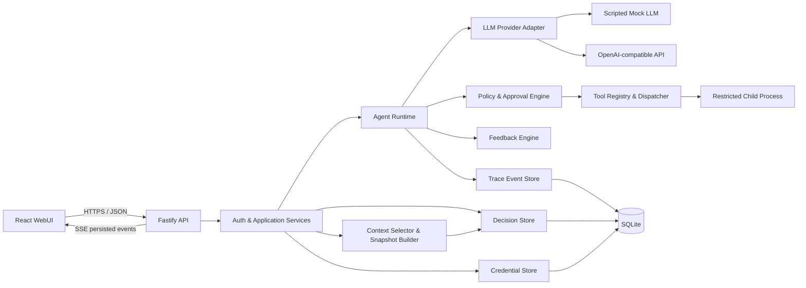
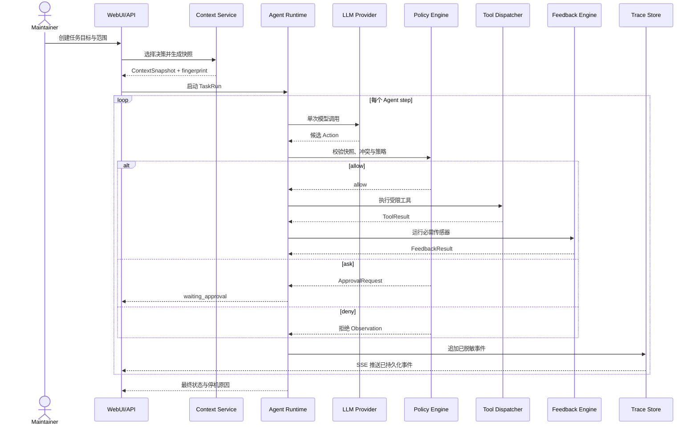
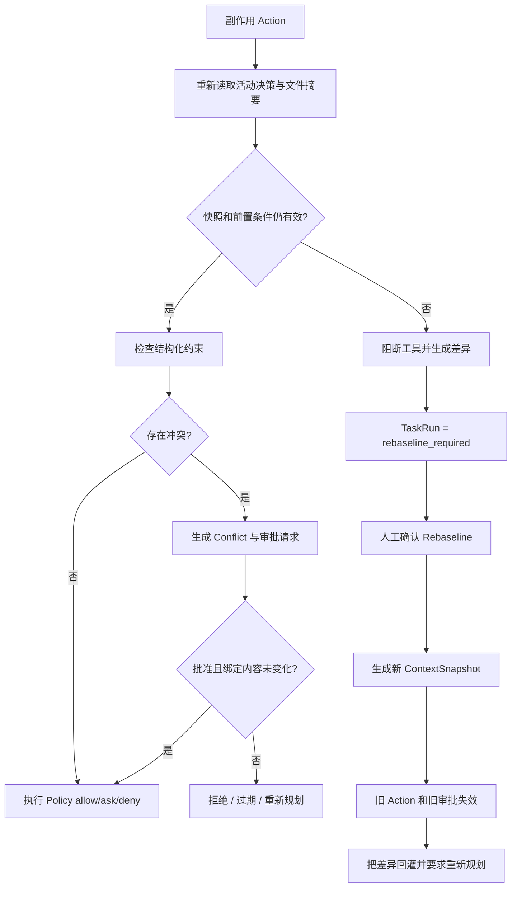
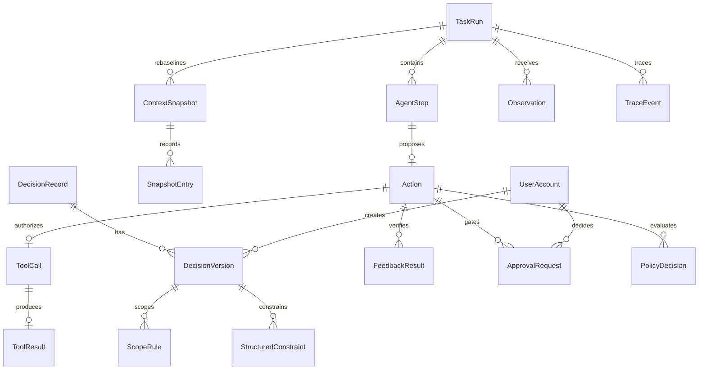
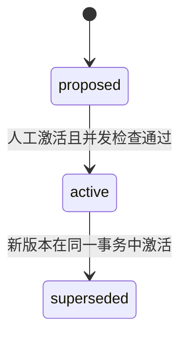
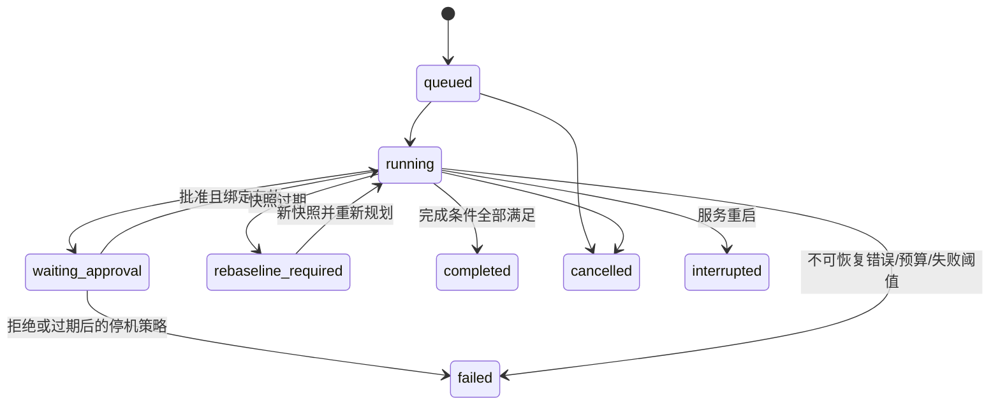
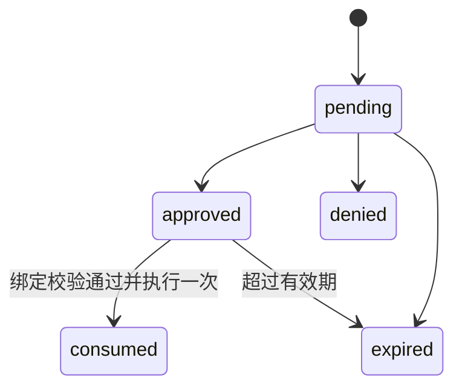
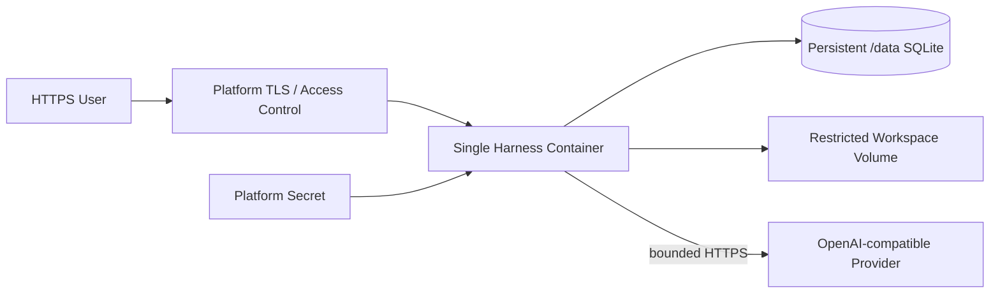

# 决策感知型 Coding Agent Harness 需求规约

## 1. 文档控制

| 字段 | 内容 |
| --- | --- |
| 文档版本 | 1.0.0 |
| 当前状态 | 项目负责人已逐节批准；G1 设计确认通过；仍禁止实现 |
| 适用范围 | AI4SE 期末项目 A：Coding Agent Harness |
| 权威需求来源 | 本文件；与其他说明冲突时，以项目负责人最新批准的本文件版本为准 |
| 上游设计输入 | `SPEC_PROCESS.md` 中经批准的 T01 结论 |
| 变更规则 | 需求变更必须记录理由、候选方案、影响和负责人结论；批准后通过新版本修订本文件 |

本规约定义产品需求、Harness 机制、架构、安全边界、验收标准和交付约束。它不包含实现步骤；实现任务只能在本规约批准并由 T03 生成 `PLAN.md` 后开始。

## 2. 产品需求

### 2.1 问题陈述

小型项目开发团队的成员会分别使用 Codex、Claude Code 等 Coding Agent，在独立会话和分支中完成任务，最后通过 Git、MR 和 CI 汇合成果。需求解释、设计理由和历史约束却散落在不同会话、文档和成员记忆中。后续 Agent 因缺少有效决策或持有过期决策而修改代码，通常直到 MR 汇合时才暴露契约冲突，造成返工、错误合并或部署兼容性破坏。

Git 能记录文件变化，MR 能组织人工评审，CI 能验证可机械检查的结果，但三者都不能独自回答：某项设计决策当前哪个版本有效、适用于哪些文件或模块、为什么被选择、是否已被替代，以及正在运行的 Agent 是否仍依据最新决策行动。

本项目构建一个决策感知型 Coding Agent Harness，将团队确认的设计决策保存为带版本、来源、适用范围和结构化约束的记录。在 Agent 行动前，系统确定性选择相关决策并生成可复现快照；在写入或其他副作用发生前，系统检查快照是否过期、约束是否冲突，并通过 HITL、反馈传感器和 Trace 形成可审计闭环。

T01 对问题发生频率的判断来自角色化需求推演，不是外部用户实测数据。项目不得把“每个迭代一至两次冲突”等假设写成已验证成效；真实频率和节省时间只能在后续试用中校准。

### 2.2 目标用户与角色

#### 主要用户

使用 Git、MR、CI 和一个或多个 Coding Agent 协作的小型项目开发团队。首版规模基线为一个项目、最多 10 名成员。

#### 系统角色

| 角色 | 主要职责 | 权限边界 |
| --- | --- | --- |
| `admin` | 创建成员、配置系统、管理凭据、激活决策、处理审批 | 不得绕过不可覆盖的 `deny` 安全规则 |
| `maintainer` | 登记和激活决策、创建任务、处理审批、查看完整 Trace | 不得管理系统主密钥或提升成员角色 |
| `viewer` | 查看决策、任务、快照、反馈和脱敏 Trace | 不得修改决策、启动任务或处理审批 |
| Coding Agent | 根据任务快照提出结构化 Action，并根据 Observation 调整下一步 | 不能自行授权、激活决策、裁决冲突或声明未验证任务完成 |
| LLM 供应商 | 提供一次模型推理结果 | 不得获得数据库、凭据库或工具的直接访问权 |

### 2.3 已批准使用场景

#### 场景 A：依赖或配置变更

成员让 Agent 升级依赖或调整配置。Harness 在行动前提供当前配置与环境变量契约；拟议动作改变既有格式或接口时，系统在写入前阻断，展示冲突决策及来源并请求人工审批。

#### 场景 B：并行开发中的决策版本漂移

两个 Agent 在不同分支并行执行任务。某项决策产生新活动版本后，仍持有旧快照的 Agent 在下一次写入前被识别为过期；系统展示差异、重新生成快照，并要求 Agent 重新规划。

#### 场景 C：新成员或新 Agent 接手任务

没有历史会话的新成员或 Agent 提交任务目标、目标文件、模块和标签。Harness 只选择仍然有效且范围匹配的决策，生成包含版本、来源、选择理由和指纹的精简上下文包，不要求读取全部历史聊天。

### 2.4 30 秒价值陈述

面向成员分别使用 Coding Agent 的小型开发团队，本项目提供一个可追溯、版本化的团队决策 Harness。它在 Agent 编码前提供当前任务真正需要的设计约束，并在发现过期决策或契约冲突时暂停执行、请求人工确认，从而把原本在 MR 阶段才暴露的设计冲突提前到行动之前。

### 2.5 产品目标

1. 将团队确认的设计决策保存为不可变、可追溯的版本历史。
2. 根据任务路径、模块、标签和状态确定性选择有效决策。
3. 对相同输入生成完全相同的 `ContextSnapshot` 及指纹。
4. 在任何写入或其他副作用前检测过期快照和结构化约束冲突。
5. 通过 HITL、客观反馈、预算和停机机制约束 Agent 行动。
6. 让每轮决策、动作、观察、审批、反馈和停机原因可脱敏回放。
7. 让全部核心机制在移除真实 LLM 后仍可离线、确定性验证。

### 2.6 成功信号

首版是否成功以可重复验收为准，不以未经验证的效率百分比为准：

- 固定任务、代码状态和决策版本集合生成相同快照与 SHA-256 指纹。
- 选择器只纳入范围匹配且状态为 `active` 的版本，并为选择和排除给出机器可读理由。
- 决策被替代后，旧快照在下一次副作用前被阻断，旧 Action 不得执行。
- Rebaseline 展示决策差异、生成新快照并触发重新规划。
- 范围相交且结构化约束互斥时生成 `Conflict` 并进入 HITL。
- 危险动作拦截、失败驱动修正和旧快照 Rebaseline 三项演示可重复运行且失败时返回非零退出码。
- 核心测试不使用网络、真实 LLM 或真实 API Key。

### 2.7 非目标

- 不构建万能 Coding Agent，不训练或微调模型。
- 不替代 Git、MR、CI 或现有 Coding Agent 的代码生成能力。
- 不保存全部聊天记录，不自动从聊天、会议或 MR 文本中推断正式决策。
- 不允许无边界、无人监督的自主执行。
- 首版不支持多项目、多租户、大型企业或强合规平台。
- 首版不支持多服务副本同时写同一数据库。
- 不把 prompt、Skill、规则文件、配置文件或现成 Agent Runner 计为 Harness 内核。
- 不在 T02 决定具体公网云平台；该决策最迟在 T19 完成。

## 3. 术语与用户故事

### 3.1 术语

| 术语 | 定义 |
| --- | --- |
| `DecisionRecord` | 一项长期决策的稳定身份，聚合其不可变版本历史 |
| `DecisionVersion` | 决策在某一时刻的不可变内容、范围、约束、理由和来源 |
| `ScopeRule` | 以全局、模块、路径 glob 或标签描述的适用范围规则 |
| `ContextSnapshot` | 任务代码状态与所选决策版本集合的不可变、可复现上下文快照 |
| `TaskRun` | 一次由 Harness 管理的 Agent 任务运行 |
| `Rebaseline` | 发现快照过期后，比较差异、生成新快照、废止旧 Action 并重新规划的协议 |
| `Conflict` | 范围相交且结构化约束不能同时满足的机器可读冲突 |
| `HITL` | Human-in-the-Loop；副作用动作执行前的人工审批机制 |
| `Action` | LLM 提出的单个结构化下一步动作 |
| `Observation` | 工具、策略或传感器返回并回灌 Agent 的结构化事实 |
| `Trace` | 按时间记录决策、动作、策略、工具、反馈、审批和停机的脱敏事件链 |
| `CredentialRef` | 指向加密凭据的引用；业务数据和前端均不保存明文凭据 |

### 3.2 INVEST 用户故事

#### US-01：登记可追溯决策

作为维护者，我希望创建包含理由、来源、范围和结构化约束的候选决策，以便团队评审后把它变成可执行约束。

- 前置条件：维护者已登录。
- 独立验收：提交有效字段后产生状态为 `proposed` 的不可变版本；它不会进入任务上下文，且审计记录包含创建者和来源。

#### US-02：激活和替代决策版本

作为维护者，我希望激活候选版本或用新版本替代旧版本，以便团队始终有唯一、可追溯的当前决策。

- 前置条件：候选版本存在，调用者提供其看到的当前活动版本号。
- 独立验收：事务完成后同一 `DecisionRecord` 只有一个 `active` 版本；旧版本为 `superseded`，并发版本不一致时不发生任何状态改变。

#### US-03：按任务范围选择决策

作为 Agent，我希望根据目标文件、模块和标签获得仍然有效的相关决策，以便不加载无关信息也不遗漏适用约束。

- 前置条件：任务声明目标文件、模块和标签。
- 独立验收：选择结果只包含匹配的 `active` 版本，并为每个候选提供选择或排除理由。

#### US-04：生成可复现上下文快照

作为团队成员，我希望任务启动时生成带代码状态和决策版本集合的指纹快照，以便任何人可以确认 Agent 当时依据了什么。

- 前置条件：代码状态和决策查询成功。
- 独立验收：同一规范化输入重复生成的 JSON 和 SHA-256 指纹完全相同，本地时间和数据库返回顺序不影响结果。

#### US-05：阻断过期任务并 Rebaseline

作为维护者，我希望旧快照在下一次写入前被阻断并展示差异，以便 Agent 不会依据被替代的决策继续产生副作用。

- 前置条件：任务快照中的至少一个活动版本已被替代。
- 独立验收：工具调用次数保持不变，任务进入 `rebaseline_required`；生成新快照后所有未执行旧 Action 失效，Agent 必须重新规划。

#### US-06：处理结构化冲突和审批

作为维护者，我希望系统在互斥约束出现时暂停并要求人工决定，以便 LLM 不能静默选择其中一方。

- 前置条件：两条范围相交的活动约束不能同时满足，或拟议动作触发 `ask`。
- 独立验收：系统创建绑定动作摘要、文件摘要和快照指纹的单次审批；批准内容发生变化、被拒绝或过期时工具不得执行。

#### US-07：运行受治理的 Agent 任务

作为维护者，我希望启动一个有步数、时间、权限和反馈边界的 Agent 任务，以便它可以工作但不能无限循环或绕过验证。

- 前置条件：任务输入有效，系统配置通过校验，LLM 适配器可用。
- 独立验收：每轮最多执行一个结构化 Action；达到完成、最大步数、连续失败、审批拒绝、取消或环境故障条件时记录明确停机原因。

#### US-08：查看可审计 Trace

作为查看者，我希望查看任务使用的决策版本、动作、工具结果、反馈和停机原因，以便复盘结果而不泄露凭据。

- 前置条件：查看者具有项目读取权限。
- 独立验收：WebUI 能按任务顺序显示脱敏事件；构造的假 API Key 不出现在响应、日志或导出 Trace 中。

#### US-09：安全管理模型凭据

作为管理员，我希望隐藏录入、查看状态、更新和清除模型 API Key，以便真实适配器可用且密钥不被前端或日志暴露。

- 前置条件：加密主密钥可用。
- 独立验收：界面只显示配置状态；更新后旧密文不再可用，清除后调用真实适配器快速失败且不回显明文。

## 4. 模块化功能规约

所有功能模块均通过应用服务调用。WebUI、LLM 和工具不得直接写数据库。错误响应至少包含稳定 `error_code`、可公开说明和 `trace_id`；敏感内部信息只能进入经过脱敏的服务端诊断记录。

### 4.1 决策登记与不可变版本历史

**输入及前置条件**

- 创建 `DecisionRecord`：标题、理由、来源、至少一条范围或全局标记、零至多条结构化约束；调用者为 `admin` 或 `maintainer`。
- 创建后续版本：稳定决策 ID、调用者看到的当前活动版本号以及完整新版本内容。
- 激活版本：候选版本 ID、预期当前活动版本号和人工确认理由。

**行为**

1. 新版本使用同一决策 ID 和单调递增版本号，初始状态为 `proposed`。
2. 版本创建后内容不可修改；更正必须创建新版本。
3. 激活操作在一个事务中校验乐观并发、激活候选版本、替代旧活动版本并写审计事件。
4. Agent 只能调用 `decision.propose` 创建候选版本，不能激活、替代或删除决策。

**输出及可观察结果**

- 返回稳定决策 ID、版本号、状态、来源、创建者、创建时间和审计事件 ID。
- WebUI 可查看完整版本链和替代关系。

**边界条件**

- 同一 `DecisionRecord` 最多一个 `active` 版本。
- 版本不得物理删除；首版不支持合并两个稳定决策 ID。
- 没有结构化约束的决策可供上下文阅读，但不能参与自动冲突检测。

**错误处理**

- 缺少来源、范围非法或约束 Schema 错误：`DECISION_INVALID`。
- 预期活动版本与实际不一致：`DECISION_VERSION_CONFLICT`，事务不产生部分状态。
- 非候选版本被激活或非法状态转换：`DECISION_STATE_INVALID`。
- 权限不足：`AUTH_FORBIDDEN`。

**验收条件**

- `FR-DEC-01`：并发提交两个以同一旧版本为基线的激活请求时，恰有一个成功，另一个返回版本冲突。
- `FR-DEC-02`：任何 API 均不能修改已存在版本的理由、范围、约束或来源。

**依赖**：US-01、US-02；`DecisionRepository`、身份模块、审计模块。

### 4.2 决策范围匹配、优先级和状态筛选

**输入及前置条件**

- 任务目标、一个或多个工作区相对目标文件、模块集合和标签集合。
- 候选决策版本及其全局、模块、路径 glob 和标签范围。

**行为**

1. 首先排除状态不是 `active` 的版本。
2. 未声明某个范围维度表示该维度不限制匹配。
3. 同一维度内任一规则匹配即可；不同维度之间必须全部满足。
4. 路径统一转换为工作区相对、使用 `/` 分隔且不包含 `..` 的规范形式后再匹配。
5. 全局决策与匹配的具体决策同时进入结果；系统不得用“更具体”规则静默覆盖全局约束。
6. 对每个候选输出稳定的选择或排除原因，并按决策 ID、版本号排序。

**输出及可观察结果**

- `selected`：决策 ID、版本、匹配维度和理由。
- `excluded`：决策 ID、版本和 `INACTIVE`、`MODULE_MISMATCH`、`PATH_MISMATCH` 或 `TAG_MISMATCH` 等理由。

**边界条件**

- 空目标文件允许，但任务必须至少提供模块或标签；三者均空时拒绝创建任务。
- 首版不使用向量检索、自然语言相似度或 LLM 评分。
- glob 只匹配工作区相对路径，不允许绝对路径和父目录逃逸。

**错误处理**

- 任务范围为空：`TASK_SCOPE_EMPTY`。
- 非法 glob 或非规范路径：`SCOPE_INVALID`。
- 查询失败：`DECISION_QUERY_FAILED`，不得生成部分快照。

**验收条件**

- `FR-SCOPE-01`：打乱候选决策数据库返回顺序不改变最终选择、排除理由和排序。
- `FR-SCOPE-02`：构造全局、匹配、不匹配和失效版本时，仅全局与完整匹配的活动版本进入结果。

**依赖**：US-03；决策版本模块、路径规范化模块。

### 4.3 `ContextSnapshot` 确定性生成与指纹

**输入及前置条件**

- 任务 ID、Git commit、工作区 diff 摘要、目标文件及文件摘要、模块、标签、选择与排除结果。
- 所有输入已经通过路径和 Schema 校验。

**行为**

1. 对对象键、集合元素、决策版本和目标文件采用规范排序。
2. 排除本地当前时间、数据库自增顺序和非确定性运行字段。
3. 使用 UTF-8 规范 JSON 序列化生成内容摘要。
4. 使用 SHA-256 生成 `code_state_hash` 和整体 `fingerprint`。
5. 快照创建后不可修改；Rebaseline 必须创建新快照并关联旧快照。

**输出及可观察结果**

- 完整快照、规范 JSON、指纹、所选决策摘要及排除理由。
- WebUI 可复制和导出不含敏感信息的快照。

**边界条件**

- dirty worktree 允许启动，但其 diff 摘要和目标文件摘要必须进入代码状态。
- 原始完整 diff 不进入快照；只保存必要摘要和目标文件哈希。
- 读取 Git 状态失败时不允许用空值伪装干净工作区。

**错误处理**

- Git 状态不可用：`CODE_STATE_UNAVAILABLE`。
- 规范序列化失败：`SNAPSHOT_SERIALIZATION_FAILED`。
- 决策查询或文件摘要不完整：`SNAPSHOT_INPUT_INCOMPLETE`。

**验收条件**

- `FR-SNAPSHOT-01`：相同逻辑输入以不同字段与集合顺序提交，产生完全相同的规范 JSON 和指纹。
- `FR-SNAPSHOT-02`：任一活动决策版本或目标文件摘要变化都会改变指纹。

**依赖**：US-04；范围选择器、Git 状态读取器、哈希服务、快照存储。

### 4.4 任务启动、Agent 运行状态与停机

**输入及前置条件**

- 任务目标、目标文件、模块、标签、选择的 LLM 适配器和可选的低于系统上限的预算。
- 调用者为 `admin` 或 `maintainer`；配置、凭据状态和工作区检查通过。

**行为**

1. 创建 `queued` 任务并生成初始快照，成功后进入 `running`。
2. 每轮只接受一个结构化 Action，依次执行解析、快照校验、策略判定、工具分发和反馈。
3. 每轮持久化 `AgentStep`、Observation、反馈和预算消耗。
4. `ask` 进入 `waiting_approval`；快照过期进入 `rebaseline_required`。
5. 只有 Agent 提出完成且必需传感器为 `PASS`、不存在冲突和待审批时，任务才能进入 `completed`。
6. 最大步数、连续失败、预算耗尽、审批拒绝、人工取消、不可恢复环境错误或服务重启产生明确停机状态和原因。

**输出及可观察结果**

- 任务状态、当前步骤、快照 ID、预算、待审批信息、最终摘要和停机原因。
- 状态变化通过持久化事件和 SSE 发布。

**边界条件**

- 首版单实例最多同时运行 4 个任务；超出时任务保持 `queued`。
- 服务重启后原 `running` 任务标记为 `interrupted`，不自动重放副作用动作。
- LLM 供应商失败不能让任务显示为完成。

**错误处理**

- 任务输入无效：`TASK_INVALID`。
- LLM 输出解析失败：生成 `ACTION_PARSE_FAILED` Observation；达到连续失败阈值后停机。
- 预算耗尽：`TASK_BUDGET_EXHAUSTED`。
- 非法状态转换：`TASK_STATE_INVALID`。

**验收条件**

- `FR-RUN-01`：脚本化 mock LLM 可驱动多轮动作并断言每轮顺序、Observation 和最终停机原因。
- `FR-RUN-02`：没有 `PASS` 反馈或存在未处理冲突时，即使 mock LLM 返回完成也不得进入 `completed`。

**依赖**：US-07；Agent Runtime、快照、治理、工具、反馈和 Trace 模块。

### 4.5 写入前过期检测、差异与 Rebaseline

**输入及前置条件**

- 当前任务快照、拟执行副作用 Action、当前活动决策集合和目标文件当前摘要。

**行为**

1. 每个写入或其他副作用 Action 执行前重新查询当前活动决策版本。
2. 比较快照内决策版本、代码状态和目标文件预期摘要。
3. 任一相关版本被替代、相关活动版本新增或目标文件摘要变化时阻断动作。
4. 生成旧、新决策集合和结构化约束的 diff，将任务置为 `rebaseline_required`。
5. 人工确认 Rebaseline 后生成新快照，使全部未执行旧 Action 和旧审批失效，并把差异作为 Observation 要求 LLM 重新规划。
6. 已完成的文件修改不自动回滚，但在任务继续前必须重新运行冲突与反馈检查。

**输出及可观察结果**

- 过期原因、决策 diff、代码状态差异、新旧快照关联和失效 Action 列表。

**边界条件**

- 普通只读查询可以在快照过期后完成，但不得产生外部副作用。
- Rebaseline 不能复用旧快照 ID 或旧审批。
- 连续 Rebaseline 达到 3 次时停止自动推进并升级给人。

**错误处理**

- 快照过期：`SNAPSHOT_STALE`，工具调用次数不得增加。
- 文件摘要不一致：`FILE_PRECONDITION_FAILED`。
- Rebaseline 时决策再次变化：返回新的 `SNAPSHOT_STALE`，不得发布不一致快照。

**验收条件**

- `FR-REBASE-01`：替代决策后，持有旧快照的 `file.write` 在工具分发前被拒绝。
- `FR-REBASE-02`：Rebaseline 后旧 Action 与旧批准均不可消费，mock LLM 必须产生新的 Action 才能继续。

**依赖**：US-05；快照、决策、文件摘要、审批和 Agent Runtime。

### 4.6 结构化冲突与 HITL 审批

**输入及前置条件**

- 范围相交的活动结构化约束，或策略引擎判定为 `ask` 的 Action。
- 约束操作符限于 `equals`、`one_of`、`present` 和 `absent`。
- 约束键在比较前按统一规则规范化；`equals` 的值为标量，`one_of` 的值为非空且去重的标量数组，`present` 和 `absent` 不携带值。

**行为**

1. 相同约束键出现不同 `equals`、无交集 `one_of`、`equals` 不属于 `one_of`，或同时要求 `present` 与 `absent` 时生成 `Conflict`。
2. 冲突记录包含相关决策版本、范围交集、约束键、不可兼容值和检测规则。
3. 审批请求绑定 Action 类型、规范化参数、目标文件摘要、快照指纹、审批人和 15 分钟有效期。
4. 审批状态为 `pending`、`approved`、`denied`、`expired`、`consumed`；批准只能消费一次。
5. 参数、文件摘要或快照变化时批准失效。

**输出及可观察结果**

- 结构化冲突、策略理由、审批状态、人工理由和审计事件。

**边界条件**

- 自然语言理由不参与自动冲突裁决。
- `deny` 规则不可通过审批覆盖。
- 首版不提供通用策略编程语言。

**错误处理**

- 批准内容不匹配：`APPROVAL_BINDING_MISMATCH`。
- 审批过期或已消费：`APPROVAL_NOT_USABLE`。
- 无权审批：`AUTH_FORBIDDEN`。

**验收条件**

- `FR-HITL-01`：危险 Action 进入审批时工具调用为零；篡改任一绑定字段后批准无法使用。
- `FR-HITL-02`：固定互斥约束每次生成相同冲突分类和关联版本集合。

**依赖**：US-06；冲突检测器、策略引擎、审批存储、身份与审计模块。

### 4.7 受限工具、反馈传感器与失败回灌

**输入及前置条件**

- 已解析 Action、通过的策略判定和有效快照。
- 工具注册表包含 `decision.query`、`decision.propose`、`file.read`、`file.write`、`command.run` 和 `sensor.run`。

**行为**

1. 工具调用先按 Schema 校验，再解析工作区边界和资源限制。
2. 文件工具拒绝绝对路径、父目录逃逸、符号链接逃逸和敏感文件。
3. 命令工具使用可执行文件与参数数组，不经过 Shell 字符串拼接；限制工作目录、环境、120 秒时间和 64 KiB 输出。
4. 传感器统一返回 `PASS`、`FAIL`、`CONFLICT`、`ENV_ERROR` 或 `TIMEOUT`。
5. `FAIL` 和 `CONFLICT` 作为 Observation 回灌下一轮；副作用工具失败不自动重试。
6. 连续验证失败 3 次后停止自动推进并升级给人。

**输出及可观察结果**

- `ToolResult` 至少包含 `status`、`data`、`error_code`、`redacted_output` 和 `evidence`。
- 反馈包含传感器、分类、退出码、摘要证据和关联 Action。

**边界条件**

- 允许命令仅来自配置白名单；安装依赖和白名单外非破坏性命令进入 `ask`。
- 环境错误不得伪装为业务失败或通过。
- 完整原始工具输出不进入长期记忆。

**错误处理**

- 未知工具：`TOOL_UNKNOWN`。
- 参数错误：`TOOL_ARGUMENT_INVALID`。
- 越界路径：`PATH_OUTSIDE_WORKSPACE`。
- 超时：`TOOL_TIMEOUT`；输出截断必须带 `truncated=true`。

**验收条件**

- `FR-TOOL-01`：路径逃逸、符号链接逃逸、Shell 拼接和敏感文件读取样本全部被拒绝。
- `FR-FEEDBACK-01`：第一次传感器失败被回灌后，脚本化 mock LLM 改变下一动作，第二次验证通过。

**依赖**：US-07；工具注册表、策略、进程执行器、脱敏器和 Agent Runtime。

### 4.8 Trace、审计查询与 WebUI 展示

**输入及前置条件**

- 任务、决策、审批、工具和反馈模块产生的结构化事件。

**行为**

1. 事件按任务内单调序号追加写入，不就地修改历史事件。
2. 记录快照指纹、使用的决策版本、Action、策略结果、审批、工具摘要、反馈和停机原因。
3. 写入前执行字段级敏感信息脱敏和长度限制。
4. WebUI 可按任务、事件类型、状态和时间查询；SSE 只推送已持久化事件。
5. SSE 断线重连后先读取持久化状态，再从最后事件序号继续。

**输出及可观察结果**

- 脱敏事件列表、任务时间线、审批审计和可导出的 JSON 摘要。

**边界条件**

- 不保存 LLM 隐藏推理链；只保存可公开的 Action、Observation 和摘要。
- 默认 Trace 保留 30 天；决策版本和审批审计不随 Trace 清理。
- `viewer` 只能读取，不得通过查询接口触发任务行为。

**错误处理**

- Trace 持久化失败时，副作用 Action 不得被报告为完整成功；任务进入 `TRACE_PERSIST_FAILED` 停机或人工处理。
- SSE 连接失败不改变任务状态。

**验收条件**

- `FR-TRACE-01`：任务所有状态转换均存在相邻、可排序的事件证据。
- `FR-TRACE-02`：把构造的假 Key 放入 LLM、工具和异常输出后，数据库、API、SSE 和导出均不出现明文。

**依赖**：US-08；Trace 存储、脱敏器、查询 API 和 WebUI。

### 4.9 凭据状态、录入、更新与清除

**输入及前置条件**

- 凭据名称、供应商、隐藏输入的 Key；加密主密钥可用且调用者为 `admin`。

**行为**

1. 后端接收明文后立即使用 AES-256-GCM 和唯一随机 nonce 加密，数据库只保存密文、nonce、认证标签和元数据。
2. 本地主密钥由隐藏输入派生；Docker 或云环境从 Secret 注入，不写入数据库。
3. 状态接口只返回 `configured`、供应商、更新时间和脱敏标识，不返回密文或明文。
4. 更新创建新密文并使旧密文不可用；清除删除明确的一条凭据密文和引用。
5. LLM Adapter 只在一次请求期间获得解密值，不把它加入上下文、Trace、记忆或错误。

**输出及可观察结果**

- 配置状态、更新时间和成功/失败审计；WebUI 输入框提交后立即清空。

**边界条件**

- `.env` 仅允许作为显式启用的可选来源，必须提示其明文和进程环境风险。
- 首版不向普通成员显示或导出凭据。
- 没有主密钥时系统可使用 mock 模式，但真实适配器快速失败。

**错误处理**

- 主密钥不可用：`CREDENTIAL_MASTER_KEY_UNAVAILABLE`。
- 解密认证失败：`CREDENTIAL_DECRYPT_FAILED`，不得返回任何密文细节。
- 真实适配器未配置：`LLM_CREDENTIAL_MISSING`。

**验收条件**

- `FR-CRED-01`：数据库备份和所有 API 响应均不包含提交的假 Key 明文。
- `FR-CRED-02`：更新和清除后旧凭据不能再完成适配器调用，状态接口正确变化。

**依赖**：US-09；加密服务、凭据存储、身份与 LLM Adapter。

## 5. 领域与 Harness 机制设计

### 5.1 领域定义

本项目服务 coding 场景：Agent 读取项目文件和有效决策，提出文件或命令动作，运行测试、lint、类型检查和构建，并根据客观结果调整下一步。该领域的关键工程事实是：代码修改可由工具落地，正确性可由确定性传感器部分验证，而设计决策版本、工作区边界和危险副作用必须在 LLM 之外由代码治理。

四类领域机制如下：

| 类别 | 首版定义 |
| --- | --- |
| 动作与工具 | 决策查询/提议、受限文件读写、受限命令和反馈传感器 |
| 客观反馈 | 决策版本、结构化契约差异、测试、lint、类型检查和构建结果 |
| 危险动作 | 契约变化、决策激活、共享核心文件写入、依赖安装、密钥访问、路径逃逸、删除、部署和强推 |
| 跨会话记忆 | 不可变决策版本、范围、来源、任务快照、审批审计和必要 Trace；不保存完整聊天 |

### 5.2 六维最低代码机制

#### 5.2.1 决策主循环

项目代码必须实现 `Agent Runtime`，按以下顺序组织一次运行：

1. 接收任务、代码状态和预算，生成 `ContextSnapshot`。
2. 通过单次调用的 `LLMProvider` 获取一个候选响应。
3. 将响应解析为一个结构化 `Action`；解析失败转为 Observation。
4. 执行快照新鲜度、文件前置条件、冲突和权限检查。
5. 对 `allow` Action 进行工具分发，对 `ask` Action 暂停，对 `deny` Action 拒绝。
6. 保存 `ToolResult`，运行必需反馈传感器并回灌结果。
7. 根据完成条件、最大 30 步、连续失败 3 次、预算、审批、取消和环境状态决定继续或停机。

LLM 不能直接改变任务状态。任务完成由 Runtime 同时检查“Agent 请求完成、必需反馈为 `PASS`、无冲突、无待审批”四项条件。

#### 5.2.2 工具分发

`ToolRegistry` 必须以名称和 Schema 注册工具；`ToolDispatcher` 负责工具查找、参数验证和结构化异常。文件工具必须执行真实路径解析、工作区围栏、符号链接检查和 compare-and-set 文件摘要。命令工具必须使用参数数组启动受限子进程，应用白名单、120 秒超时、64 KiB 输出限制和最小环境变量。

工具层不得自行调用 LLM，也不得绕过 Policy Engine。未知工具、参数错误、工具异常和超时均返回统一 `ToolResult`，不得抛弃可供下一轮使用的客观信息。

#### 5.2.3 记忆与上下文

长期记忆只包含对未来任务有结构性价值的信息：不可变 `DecisionVersion`、范围、来源、快照、审批审计和必要 Trace。`ContextSelector` 使用确定性范围规则选择版本；`SnapshotBuilder` 规范序列化任务、代码摘要和决策集合并生成 SHA-256 指纹。

任务结束后不长期保存完整聊天、隐藏推理链和工具原始输出。凭据、token、密码和 `.env` 内容在进入记忆前必须被拒绝。Trace 按保留策略清理，但决策版本与审批审计永久保留。

#### 5.2.4 治理

`PolicyEngine` 使用显式规则输出 `allow`、`ask` 或 `deny`：

- `allow`：普通项目文件读取、决策查询、`git status`、`git diff` 和配置的验证命令。
- `ask`：文件写入、依赖安装、共享核心文件修改、契约变化、决策激活或替代、白名单外非破坏性命令。
- `deny`：密钥或 `.env` 读取、工作区外访问、文件删除、Shell 字符串拼接、联网部署、强推和绕过验证。

审批状态机、15 分钟有效期、单次消费和动作摘要绑定必须由代码实现。`deny` 不可被任何角色覆盖；审批前工具调用次数必须为零。

#### 5.2.5 反馈

`FeedbackEngine` 通过统一传感器接口运行：

- `DecisionVersionSensor`：检测快照中的决策是否仍为当前活动版本。
- `ContractDiffSensor`：检查结构化配置和环境变量契约的删除、改名或不兼容变化。
- `CommandSensor`：执行测试、lint、类型检查和构建。

传感器返回 `PASS`、`FAIL`、`CONFLICT`、`ENV_ERROR` 或 `TIMEOUT`。`FAIL` 与 `CONFLICT` 回灌下一轮并要求修改计划；`ENV_ERROR` 不计为业务失败；连续失败达到阈值后升级给人。带副作用的工具不因传感器结果自动重试。

#### 5.2.6 配置与可观测性

配置必须覆盖工作区、工具白名单、策略、传感器、LLM Provider、最大步数、连续失败阈值、命令超时、输出上限、并发和日志保留。配置使用 Schema 校验，错误配置在服务启动或任务创建时快速失败；安全默认值采用最小权限。

Trace 必须逐轮记录快照指纹、决策版本、LLM 公开响应摘要、Action、策略、审批、工具结果、反馈、预算和停机原因。日志和 Trace 使用同一字段级脱敏器，供测试、WebUI 和审计读取。系统不记录供应商隐藏推理链。

### 5.3 自研边界

#### 必须由项目代码实现

- Agent 主循环、Action 解析、预算和停机。
- 工具注册、参数校验、分发、工作区围栏和结构化错误。
- 决策版本存储、范围选择、快照、过期检测、Rebaseline 和清除策略。
- `allow` / `ask` / `deny`、审批状态机、动作绑定和审计。
- 反馈传感器、分类、回灌、重试上限和升级。
- 配置校验、日志脱敏和 Trace。

#### 允许使用的底层零件

- LLM 供应商的单次 Chat Completions API 或普通 HTTP 客户端。
- Web、数据库、Schema、哈希、加密、测试和进程管理库。
- SQLite 及 ORM，但领域状态转换和不变量仍由本项目定义。

#### 禁止作为 Harness 内核

- LangChain `AgentExecutor`、AutoGen、CrewAI、LlamaIndex Agent 或供应商 Agent Runner。
- 宿主 Coding Agent 的 Agent loop、Skill、hook、memory 或治理机制。
- 仅用 prompt 要求 LLM 自行检查冲突、安全、反馈或完成状态。

prompt、Skill、规则文件和配置是内容物或开发辅助，不计入 Harness 内核工作量。

### 5.4 可注入 LLM 抽象

`LLMProvider` 只负责一次模型调用：接收已组织的消息和可用 Action Schema，返回供应商响应或结构化供应商错误。它不包含循环、工具执行、记忆、重试决策或治理。

首版必须提供：

1. `ScriptedMockLLM`：按固定脚本逐次返回 Action、完成、解析失败或供应商错误。
2. 一个 OpenAI-compatible Chat Completions 适配器：可配置 `baseURL`、模型名和凭据引用。

核心测试只使用 `ScriptedMockLLM`。真实适配器只用于人工集成测试和受控 smoke test。

### 5.5 主要贡献：版本化决策记忆与上下文

其余五个维度提供完整最低闭环，本项目把以下机制作为主要贡献并做深：

#### 不可变版本与并发

- `DecisionVersion` 一旦创建不可修改；状态只允许 `proposed → active → superseded`。
- 激活新版本使用乐观并发和事务，保证同一决策只有一个活动版本。
- 每个版本保留理由、来源、创建者、范围、结构化约束和替代关系。

#### 确定性范围选择

- 支持全局、模块、路径 glob 和标签。
- 同维度任一匹配、跨维度全部匹配；只选择 `active` 版本。
- 输出选择和排除理由；不使用 embedding、LLM 排名或数据库自然顺序。

#### 规范序列化与快照指纹

- 输入统一路径格式、Unicode 和集合排序。
- 规范 JSON 不包含当前时间和运行顺序等非确定字段。
- 相同输入生成完全相同内容与 SHA-256；任一相关版本或文件摘要变化都会改变指纹。

#### 写前阻断与 Rebaseline

- 每个副作用 Action 前重新检查决策版本和目标文件摘要。
- 旧快照被阻断后展示决策 diff，生成新快照，并使旧 Action 与旧批准失效。
- 已写修改不自动回滚，但必须在新快照下重新检查和验证。
- 连续 Rebaseline 3 次后升级给人，防止无限循环。

#### 结构化冲突

- 首版约束操作符为 `equals`、`one_of`、`present`、`absent`。
- 范围相交且约束不可兼容时生成包含版本、范围、键、值和检测规则的 `Conflict`。
- 冲突必须进入 HITL；LLM 无权静默选择一方。

### 5.6 移除真实 LLM 后的确定性验证

| 维度 | 直接构造的测试输入 | 必须断言的结果 |
| --- | --- | --- |
| 决策 | 脚本化 mock 的 Action 序列 | 轮次顺序、Observation、预算和停机原因 |
| 工具 | mock 工具、未知名称、越界路径和异常 | 调用次数、拒绝位置、结构化 `ToolResult` |
| 记忆 | 固定决策历史、路径、模块和标签 | 选择/排除理由、规范 JSON、指纹和清除结果 |
| 治理 | 危险 Action、审批、篡改参数和过期时间 | 审批前零调用，批准失效，`deny` 不可覆盖 |
| 反馈 | 第一次失败、第二次通过的 mock 传感器 | 失败回灌、下一 Action 改变、最终完成 |
| 配置 | 非法配置和含假 Key 的事件 | 快速失败，数据库、日志和 Trace 无明文 Key |

所有表中测试不得访问网络、真实模型或真实 Key，并且多次运行结果一致。

### 5.7 三项强制机制演示

#### DEMO-01：危险动作拦截

脚本化 mock LLM 提出读取 `.env` 或删除文件的 Action。Policy Engine 返回 `deny`，工具调用为零，Trace 记录规则与停机/反馈结果。演示必须自动断言结果。

#### DEMO-02：失败驱动修正

mock LLM 第一次写入使固定传感器返回 `FAIL`；结果回灌后 mock LLM 提出不同 Action，第二次传感器返回 `PASS`，任务完成。演示必须断言两次 Action 不同且反馈顺序正确。

#### DEMO-03：旧快照阻断与 Rebaseline

任务以决策版本 1 生成快照；测试激活版本 2 后让 mock LLM 提出写入。系统必须在工具前返回 `SNAPSHOT_STALE`、展示差异、生成新快照、废止旧 Action，并在重新规划后才允许继续。

三项演示由一个命令运行，不依赖网络、真实模型和 Key；任一断言失败时命令返回非零退出码。

## 6. 系统架构

### 6.1 架构风格

系统采用“前后端逻辑分离、生产单容器、后端模块化单体”架构。React 在浏览器运行，只通过 HTTP/SSE 调用 Fastify；浏览器不得访问数据库、LLM 凭据或工具执行器。Fastify 后端在一个 Node.js 进程内组织职责独立的模块，耗时命令在受限子进程执行。生产环境可以由 Fastify 提供构建后的前端静态文件，从而只需要一个应用容器和一个公网地址。

### 6.2 组件图

### 6.3 组件职责

| 组件 | 单一职责 | 明确不负责 |
| --- | --- | --- |
| React WebUI | 输入、展示、审批交互和脱敏事件消费 | 安全裁决、数据库访问、LLM/工具调用 |
| Fastify API | 认证、CSRF、Schema 校验、调用应用服务、SSE | 领域状态转换和命令执行 |
| Application Services | 编排创建决策、启动任务、审批、Rebaseline 等用例 | 实现选择算法或直接 SQL |
| Decision Store | 保存不可变决策版本和事务状态转换 | 自然语言推断和范围选择 |
| Context Selector | 确定性范围匹配、冲突检测和选择理由 | 写决策和调用 LLM |
| Snapshot Builder | 规范序列化、代码状态摘要和指纹 | 修改工作区或重用旧快照 ID |
| Agent Runtime | 主循环、预算、状态与停机 | 自行授权和直接访问供应商密钥 |
| LLM Provider | 一次模型调用与供应商错误转换 | 循环、工具、记忆、治理和完成判断 |
| Policy & Approval | `allow/ask/deny`、审批绑定和审计 | 执行工具或覆盖 `deny` |
| Tool Registry/Dispatcher | Schema、查找、工作区围栏、受限执行 | 决定业务完成或自动重试副作用 |
| Feedback Engine | 运行传感器、分类和产生 Observation | 用流畅文本替代退出码等证据 |
| Credential Store | 加密、解密、状态、更新和清除 | 向前端或 Trace 返回明文 |
| Trace Event Store | 追加、脱敏、查询和保留策略 | 保存隐藏推理链或可变业务状态 |

### 6.4 主数据流

### 6.5 过期、冲突与 Rebaseline 流

### 6.6 调用边界和核心接口

下表定义语义接口，不锁定 TypeScript 文件名或函数签名；T03 只能在保持调用方向和错误语义的前提下细化。

| 接口 | 主要输入 | 主要输出 | 稳定错误类别 | 调用方向 |
| --- | --- | --- | --- | --- |
| `DecisionService` | 决策内容、预期版本、操作者 | 不可变版本、状态转换、审计 ID | invalid/version-conflict/state/forbidden | Application → Domain |
| `ContextService` | 任务范围、代码状态、候选版本 | 选择结果、冲突、快照和指纹 | scope/query/serialization | Application/Runtime → Domain |
| `AgentRuntime` | 任务、快照、预算、适配器 | 状态、Step、Observation、停机原因 | parse/budget/state/interrupted | Application → Runtime |
| `LLMProvider` | 消息、Action Schema、模型配置 | 单次响应或供应商错误 | unavailable/auth/rate-limit/invalid-response | Runtime → Adapter |
| `PolicyEngine` | Action、身份、快照和文件摘要 | `allow`、`ask`、`deny` 与理由 | policy-invalid | Runtime → Governance |
| `ApprovalService` | 请求、审批人、决定、绑定摘要 | 审批状态和消费令牌 | expired/mismatch/consumed/forbidden | Application/Runtime → Governance |
| `ToolExecutor` | 已授权 ToolCall 和限制 | `ToolResult` 与证据 | unknown/argument/path/timeout/execution | Runtime → Tools |
| `FeedbackEngine` | Action、ToolResult、传感器配置 | 分类结果与 Observation | sensor-missing/environment/timeout | Runtime → Feedback |
| `CredentialStore` | 凭据引用、明文输入或清除请求 | 配置状态或短时解密值 | master-key/decrypt/missing | Application/LLM Adapter → Infrastructure |
| `TraceStore` | 已脱敏事件或查询条件 | 事件序列和游标 | persist/query | 所有后端模块 → Infrastructure |

### 6.7 同步、异步与失败隔离

- 决策管理、身份、凭据状态和普通查询使用同步 HTTP 请求。
- 创建任务同步返回 `task_id`，实际运行由进程内 `TaskScheduler` 异步调度；并发上限为 4。
- SSE 只发布已经成功持久化的事件；断线不改变任务状态，重连按事件序号补读。
- 命令在独立子进程执行，超时后只终止该明确子进程；API 进程继续运行。
- SQLite 关键状态变化使用事务；副作用工具成功但 Trace 持久化失败时不得显示完整成功，任务停止等待人工处理。
- 服务启动时把遗留 `running` 任务标记为 `interrupted`，不自动重放可能产生副作用的动作。

### 6.8 信任边界

1. **浏览器边界**：浏览器输入不可信；所有写请求必须认证、校验 CSRF 和 Schema。前端只获得脱敏数据。
2. **应用与 LLM 边界**：供应商响应不可信；只能解析为已知 Action，不能直接执行文本中的命令。
3. **应用与工具边界**：工具参数不可信；必须经过路径、白名单、权限、快照和资源检查。
4. **子进程边界**：子进程只获得明确工作目录、允许参数和最少环境变量，不继承模型 API Key。
5. **凭据边界**：主密钥不进入 SQLite；明文 Key 只在一次供应商请求所需的后端内存中短暂存在。
6. **持久化边界**：数据库文件和备份被视为可能泄露，故凭据必须认证加密，敏感输出必须在写入前脱敏。

### 6.9 外部依赖及降级行为

| 外部依赖 | 不可用时行为 |
| --- | --- |
| OpenAI-compatible LLM | 真实任务快速失败或进入供应商错误状态；mock 演示和核心测试继续可用 |
| Git 工作区 | 不能生成代码状态时拒绝启动真实任务，不用空摘要继续 |
| 文件系统/子进程 | 返回结构化环境错误，不伪装成验证失败或通过 |
| 加密主密钥 | 真实适配器禁用；WebUI 仍可查看非敏感状态和运行 mock 演示 |
| SQLite 持久卷 | 启动健康检查失败，不以临时内存库替代生产数据 |

## 7. 数据模型与不变量

### 7.1 核心实体

| 实体 | 关键字段及类型语义 | 关系和约束 | 生命周期 |
| --- | --- | --- | --- |
| `DecisionRecord` | `id` UUID、`title`、`current_active_version` 可空 | 稳定 ID；一对多版本 | 创建后永久保留 |
| `DecisionVersion` | `decision_id`、正整数 `version`、`status`、`rationale`、`source`、`created_by`、`created_at`、`supersedes` 可空 | `(decision_id, version)` 唯一；内容不可变；每个记录最多一个活动版本 | proposed → active → superseded |
| `ScopeRule` | `id`、`decision_version_id`、`dimension`、`pattern` | dimension 为 global/module/path/tag；pattern 规范化 | 随版本永久保留 |
| `StructuredConstraint` | `decision_version_id`、`key`、`operator`、规范 JSON `value` | operator 限定；同一版本内规范键唯一 | 随版本永久保留 |
| `ContextSnapshot` | `id` UUID、`task_id`、`parent_snapshot_id` 可空、规范输入、`code_state_hash`、`fingerprint` | 指纹由规范内容计算；内容不可变 | 随任务保留，不能原地更新 |
| `SnapshotEntry` | `snapshot_id`、决策 ID/版本、`selected`、`reason_code`、`reason_detail` | 每个快照与候选版本唯一 | 随快照保留 |
| `TaskRun` | `id`、`goal`、范围、`status`、`snapshot_id`、预算、连续失败数、`stop_reason` | 绑定一个当前快照；状态转换受控 | 终态后只追加 Trace，不改历史步骤 |
| `AgentStep` | `id`、`task_id`、单调 `sequence`、`snapshot_id`、公开响应摘要、状态 | `(task_id, sequence)` 唯一 | 追加写入 |
| `Action` | `id`、`step_id`、`type`、规范参数、`binding_hash`、`status` | 每 Step 最多一个可执行 Action | proposed → authorized → executed/failed；或 proposed/authorized → rejected/invalidated |
| `ToolCall` | `id`、`action_id`、工具名、规范参数、限制 | 一个 Action 至多一个实际 ToolCall | 创建后不可换绑 |
| `ToolResult` | `tool_call_id`、status、data、error_code、redacted_output、evidence | 与 ToolCall 一对一；输出已脱敏 | 完成后不可修改 |
| `Observation` | `id`、`task_id`、`step_id`、type、payload | 关联策略、工具或反馈事实 | 追加写入并可回灌 |
| `FeedbackResult` | `id`、`action_id`、sensor、classification、exit_code、evidence | classification 为五类枚举 | 追加写入 |
| `Conflict` | `id`、相关版本集合、范围交集、constraint_key、规则和值 | 输入规范化后结果可复现 | resolved 前阻止相关副作用 |
| `ApprovalRequest` | `id`、action_id/conflict_id、binding_hash、expires_at、status、decided_by/reason | 批准只能消费一次；`deny` 不创建可覆盖审批 | pending → approved/denied/expired → consumed |
| `PolicyDecision` | `id`、action_id、effect、rule_id、reason | effect 为 allow/ask/deny | 追加审计，不可修改 |
| `TraceEvent` | `task_id`、单调 sequence、type、redacted payload、created_at | `(task_id, sequence)` 唯一；SSE 游标来源 | 默认保留 30 天 |
| `CredentialRef` | `id`、provider、ciphertext、nonce、auth_tag、updated_at | 不含主密钥；前端 DTO 排除密文字段 | 更新替换密文；清除删除明确记录 |
| `UserAccount` | `id`、display_name、role、password_hash、disabled_at 可空 | 登录名唯一；密码为 Argon2id 哈希 | 管理员创建、可禁用，不物理删审计身份 |

### 7.2 关系概览

### 7.3 状态机

#### 决策版本

任何 `active → proposed`、`superseded → active`、物理删除或原地内容修改均为非法转换。

#### 任务运行

所有终态禁止回到 `running`；继续工作必须创建新任务或明确的新运行记录。

#### 审批

`denied`、`expired`、`consumed` 均为终态；绑定摘要变化时批准不可消费。

### 7.4 数据不变量

1. **版本顺序**：版本号为每个决策内单调递增正整数；创建使用事务和唯一约束。
2. **活动唯一性**：同一决策最多一个活动版本，由数据库唯一约束和领域事务共同保证。
3. **乐观并发**：激活和 Rebaseline 必须提交调用者读取到的版本/指纹；不一致则整体失败。
4. **规范序列化**：UTF-8、对象键字典序、集合按稳定业务键排序、路径使用 `/`、JSON 数字和字符串使用唯一表示；时间不参与快照指纹。
5. **时间来源**：审计时间由服务端 UTC 时钟产生并以 RFC 3339 保存；业务顺序使用单调 sequence，不依赖时间排序。
6. **哈希**：快照、代码状态、Action 和审批绑定使用 SHA-256；哈希不是凭据加密。
7. **敏感字段**：明文密码、API Key、主密钥、`.env` 内容和完整未脱敏输出不得进入任何领域实体、Trace 或前端 DTO。
8. **副作用前置条件**：任何写入/命令 Action 在执行前必须同时绑定有效快照、目标文件摘要和可消费授权。
9. **追加审计**：决策版本、AgentStep、PolicyDecision、Approval 决定和 Trace 事件只追加，不允许覆盖历史。

## 8. 非功能性需求

### 8.1 测量基线

除非需求另有说明，性能验收在 4 核 CPU、8 GiB 内存、本地 SSD、受支持 Node.js LTS、单个应用实例和下列固定数据规模下进行：最多 10 名成员、10,000 条决策版本、100,000 条 Trace 事件、4 个并发任务。性能测量不包含外部 LLM 网络延迟和项目自身测试/构建命令耗时。

### 8.2 性能

| 编号 | 指标 | 通过标准 |
| --- | --- | --- |
| `NFR-PERF-01` | 服务冷启动至健康检查可用 | 小于 5 秒 |
| `NFR-PERF-02` | 决策列表、任务状态和 Trace 分页查询 | 预热后 `p95 < 200 ms` |
| `NFR-PERF-03` | 范围选择、快照生成和写前新鲜度校验 | 预热后 `p95 < 500 ms` |
| `NFR-PERF-04` | 单条脱敏 Trace 事务追加 | `p95 < 100 ms` |
| `NFR-PERF-05` | WebUI 首屏可交互 | 本地网络、无缓存构建版本下小于 2 秒 |

性能测试必须记录硬件、数据量、样本数、预热方式和 `p50/p95/max`，不得只记录最快一次结果。

### 8.3 可靠性

- `NFR-REL-01`：决策激活、审批消费、Rebaseline 发布和任务终态使用原子事务；注入任一步骤失败后不得留下部分状态。
- `NFR-REL-02`：创建决策、任务、审批决定等写 API 接受幂等键；相同主体和幂等键重复提交返回同一结果，不产生重复实体。
- `NFR-REL-03`：副作用工具不自动重试；LLM 调用仅对明确的传输错误或速率限制最多重试 2 次，重试前不推进 Step 状态，并使用有上限退避。
- `NFR-REL-04`：命令默认 120 秒超时；Agent 最多 30 Step，连续验证失败或连续 Rebaseline 达到 3 次后停止并升级给人。
- `NFR-REL-05`：服务异常退出后，数据库事务保持一致；重启时原 `running` 任务转为 `interrupted`，不自动重放工具。
- `NFR-REL-06`：SSE 断线不影响任务；客户端使用最后事件序号补读，重复事件按 `(task_id, sequence)` 去重。
- `NFR-REL-07`：数据库不可写、Trace 不能持久化或快照无法完成时，系统采用保守失败，不显示完成。

### 8.4 安全

- `NFR-SEC-01`：所有文件路径先规范化并解析真实路径；拒绝绝对路径、`..`、工作区外路径和指向工作区外的符号链接/连接点。
- `NFR-SEC-02`：命令使用可执行文件和参数数组，不调用 Shell 解释字符串；只允许配置白名单，工作目录固定，环境变量按允许列表传递。
- `NFR-SEC-03`：读取 `.env`、密钥、密码、私钥，删除文件，联网部署和强推为不可覆盖的 `deny`。
- `NFR-SEC-04`：后端写 API 要求认证、角色授权、请求 Schema 和 CSRF 校验；会话 Cookie 使用 `HttpOnly`、`Secure`、`SameSite=Strict`。
- `NFR-SEC-05`：密码使用 Argon2id 哈希；失败登录不得暴露账号是否存在，并实施按账号和来源的速率限制。
- `NFR-SEC-06`：日志、Trace、Observation、工具输出、SSE、API 和导出使用同一脱敏策略；任何真实或构造 Key 明文均不得持久化。
- `NFR-SEC-07`：前端采用限制脚本来源的 CSP，不将任何密钥或主密钥写入构建产物、浏览器存储和源映射。

### 8.5 可用性与无障碍

- 首次启动必须明确展示数据库、主密钥、管理员账户和 LLM 配置状态，不把缺失配置显示为成功。
- 错误页面同时展示用户可理解说明、稳定错误码和 Trace ID；不得要求用户阅读服务端堆栈才能知道下一步。
- 审批页面必须展示触发规则、决策来源、目标文件、拟议动作、快照版本、风险和批准有效期。
- 任务页面必须区分 `failed`、`interrupted`、`waiting_approval` 和 `rebaseline_required`，不能都显示为“暂停”。
- WebUI 的主要流程支持键盘操作、可见焦点、语义标签和不依赖颜色的状态表达；自动化无障碍扫描不得有严重级别错误。
- 前端失败或 SSE 断线时不得伪造后端成功状态。

### 8.6 可观测性

- 每个 HTTP 请求、TaskRun、AgentStep、Action、审批、ToolCall 和 TraceEvent 具有可关联 ID。
- 每轮记录使用的快照指纹和决策版本，但不保存隐藏推理链。
- 指标至少包括任务状态数、Step 数、工具成功率、反馈分类、审批次数、Rebaseline 次数、LLM 延迟/错误、token 用量和脱敏事件数。
- 所有终态必须有机器可读 `stop_reason`；不存在空停机原因。
- Trace 默认保留 30 天，决策版本和审批审计永久保留；清理任务必须留下清理数量和时间记录。

### 8.7 兼容性与资源边界

- 本地开发与验收支持 Windows 11 x86-64 和 Linux x86-64；主要 Docker 产物目标为 Linux `amd64`。其他平台不作为首版通过条件。
- Node.js 使用项目锁定的当前 LTS 大版本；浏览器支持当前稳定版 Chromium、Firefox 和 Edge。
- SQLite 使用持久化磁盘、外键和 WAL；首版只支持单应用实例，不支持共享数据库的多副本写入。
- 应用本身在空闲状态目标内存小于 512 MiB；并发任务上限 4，子进程资源另受配置限制。
- 单次工具输出保存上限 64 KiB；超过时截断并标记。达到 100,000 条 Trace 或磁盘使用达到配置容量 80% 时产生告警。
- LLM 预算包括最大 Step、单任务 token/费用上限和供应商速率；超过上限必须停机，不允许静默追加费用。

## 9. 凭据威胁模型与安全存储

### 9.1 资产

- 学校或用户提供的 LLM API Key。
- 加密主密钥、主密码和凭据派生材料。
- 用户密码哈希与会话 Cookie。
- 可能包含私有代码、决策理由和路径信息的 Trace。
- Git 历史、CI 日志、构建产物、数据库备份和部署配置。

### 9.2 攻击者与入口

| 攻击者/故障 | 主要入口 |
| --- | --- |
| 未认证网络访问者 | 登录、API、SSE、公开 WebUI |
| 低权限成员 | 越权 API、审批、导出和凭据状态接口 |
| 恶意或被注入的 LLM 输出 | Action 参数、文件路径、命令和工具内容 |
| 恶意项目文件或依赖 | 间接提示注入、符号链接、测试/构建子进程 |
| 获得数据库/备份的人 | SQLite 文件、卷快照和备份 |
| 开发者误操作 | Git 提交、终端历史、日志、截图、CI 变量和构建产物 |
| 供应商或网络故障 | 错误响应、重试、代理日志和超时信息 |

### 9.3 凭据存储设计

1. API Key 使用 AES-256-GCM 认证加密，每条凭据使用唯一、密码学安全的随机 nonce。
2. 本地交互模式通过隐藏输入获得主密码，并使用 Argon2id 与唯一 salt 派生 256 位主密钥；最低参数为 64 MiB 内存、3 次迭代、并行度 1，最终参数须通过启动环境能力测试。
3. Docker/线上模式优先从 Docker Secret 或平台 Secret 注入随机 256 位主密钥；主密钥不得保存到 SQLite。
4. 数据库保存凭据引用、供应商、密文、nonce、认证标签、更新时间和加密版本，不保存明文或主密钥。
5. 解密后的 Key 只在一次 LLM HTTP 请求所需的后端内存中短暂存在，使用后释放引用；不加入上下文、Trace、Observation 或错误。
6. 主密钥轮换使用事务性“解密旧密文—用新密钥重新加密—验证认证标签—一次提交”；任一步失败保留旧版本，不留下混合状态。

### 9.4 凭据生命周期

| 阶段 | 要求 |
| --- | --- |
| 首次录入 | 本地终端隐藏输入或 HTTPS WebUI；提交后输入框清空，响应只返回配置状态 |
| 查看 | 仅显示 `configured`、供应商、更新时间和脱敏标识，不显示密文或明文 |
| 使用 | `LLMProvider` 通过 `CredentialRef` 临时解密；子进程和前端不获得 Key |
| 更新 | 创建新认证密文并替换引用；旧密文不可继续调用供应商 |
| 清除 | 删除明确的密文记录和引用；审计只记录谁、何时清除，不记录值 |
| 无效凭据 | 供应商认证失败转换为 `LLM_AUTH_FAILED`；不把响应头、请求或 Key 写入错误 |
| 存储不可用 | 真实适配器禁用并快速失败；mock 模式仍可运行，WebUI 明确显示降级 |
| 泄露处置 | 立即禁用/轮换供应商 Key、轮换主密钥、扫描当前文件和 Git 历史、审计日志并记录事件 |

### 9.5 威胁、措施和验证

| 威胁 | 预防 | 检测 | 恢复 | 验证方式 |
| --- | --- | --- | --- | --- |
| Key 被提交到 Git | `.gitignore`、禁止明文配置、提交前扫描 | CI 与最终 Git 历史扫描 | 供应商撤销并轮换，清理历史需人工批准流程 | 在测试仓库提交假 Key，扫描 job 必须失败 |
| Key 进入日志/Trace | 字段级脱敏、敏感键拒绝、输出上限 | 测试检索假 Key、脱敏计数指标 | 清理受影响日志并轮换 Key | 向 LLM/工具/异常注入同一假 Key，所有存储与 API 均不得出现 |
| 数据库备份泄露 | AES-256-GCM，主密钥分离 | 备份审计和文件权限告警 | 轮换主密钥与凭据 | 仅持数据库文件无法恢复明文；篡改密文认证失败 |
| WebUI 越权读取凭据 | 后端 DTO 白名单、角色授权、HTTPS | 越权审计和异常访问指标 | 禁用会话/用户并轮换 Key | `viewer` 和未认证请求只能获得拒绝或配置状态 |
| LLM 诱导读取 `.env` | 不可覆盖 `deny`、敏感路径规则 | PolicyDecision 与拒绝 Trace | 无副作用；审查输入来源 | mock LLM 提出读取 `.env`，工具调用必须为零 |
| 路径/符号链接逃逸 | 真实路径校验和工作区围栏 | 越界错误计数 | 阻断任务并人工审计 | 构造 `..`、绝对路径、symlink/junction 样本全部拒绝 |
| 子进程继承 Key | 环境允许列表和独立参数数组 | 子进程环境测试 | 终止进程并轮换暴露 Key | 测试命令打印环境时不存在模型 Key |
| 主密钥丢失 | 独立备份/Secret 管理和启动检查 | 健康检查显示不可用 | 从受控备份恢复；无备份时重新录入供应商 Key | 缺少主密钥时真实适配器失败但不损坏密文 |
| 加密数据被篡改 | GCM 认证标签和版本字段 | 解密认证失败事件 | 从备份恢复或重新录入 | 修改密文任一字节必须得到统一认证失败 |

### 9.6 `.env` 边界

`.env` 仅作为显式启用的开发兼容来源，不是推荐安全存储。系统和 README 必须说明：文件是明文、可能被备份或误提交，进程环境也可能被同权限进程读取。默认配置不读取 `.env`；若用户启用，文件必须被 Git 忽略，值仍不得进入日志、Trace、记忆或子进程环境。

## 10. 技术选型、WebUI 与交付方案

### 10.1 技术选型

| 领域 | 选择 | 理由与边界 |
| --- | --- | --- |
| 语言 | TypeScript | 前后端共享类型和 Schema；严格模式帮助状态机和 Action 边界；不以类型替代运行时校验 |
| 运行时 | 项目锁定的 Node.js LTS | 支持 Fastify、受控子进程和单容器分发；具体小版本由锁文件固定 |
| 包管理 | pnpm 与锁文件 | 节省依赖空间并保证 CI/本地可重复安装；CI 使用冻结锁文件 |
| 后端 | Fastify | 明确的插件边界、Schema 与流式响应；业务逻辑不得写入路由处理器 |
| 前端 | React + Vite | 适合状态丰富的任务、审批和 Trace UI；生产构建为静态资源 |
| API/共享 Schema | Zod + TypeScript DTO | 同一 Schema 用于 API 输入、Action 和配置验证；前端 DTO 使用白名单排除密文字段 |
| 持久化 | SQLite + Drizzle ORM | 单实例、事务、关联查询、临时测试库和单文件分发；领域规则不放入 ORM hook |
| 配置 | YAML 文件 + Zod Schema | 人类可读，启动时严格校验；凭据不写入 YAML，未知安全字段默认拒绝 |
| 单元/集成测试 | Vitest | TypeScript 原生体验，适合 mock LLM、内存 Repository 和临时 SQLite |
| 端到端测试 | Playwright | 覆盖浏览器、SSE、审批和 Rebaseline 主要流程 |
| 密码/派生 | 维护良好的 Argon2 实现 | 使用 Argon2id；参数满足本规约最低值并通过环境测试 |
| 对称加密 | Node.js `crypto` AES-256-GCM | 标准库认证加密，避免自定义密码算法 |
| 实时更新 | Server-Sent Events | 首版主要为服务端单向推送；比 WebSocket 更简单，支持事件序号恢复 |
| 视觉设计 | Open Design | 前端按其设计系统和可访问性原则实现；若具体组件与安全需求冲突，以本规约和明确记录的偏离为准 |

系统采用模块化单体，不引入微服务、消息队列、向量数据库或独立 Worker。所有外部库必须记录许可证；实现前在 T03 明确版本和供应链检查。

### 10.2 LLM 供应商策略

- `LLMProvider` 保持供应商无关，只允许一次消息调用。
- `ScriptedMockLLM` 是核心测试、CI 和机制演示的默认实现。
- 首个真实实现为 OpenAI-compatible Chat Completions Adapter，配置 `baseURL`、模型名、超时和 `CredentialRef`。
- Adapter 不调用供应商 Agent SDK 的循环、工具、memory 或 guardrail。
- 真实调用必须配置单任务 token/费用上限、最大重试和速率；学校 Key 只用于手动集成测试或受控 smoke test。
- 供应商不兼容、认证失败或响应 Schema 错误必须转换为稳定错误，不影响 mock 路径。

### 10.3 WebUI 信息架构

| 页面 | 必须展示/支持 |
| --- | --- |
| 登录与首次启动 | 管理员创建、数据库/主密钥/LLM 状态、明确的未配置提示 |
| 任务列表与创建 | 目标、文件、模块、标签、预算、Provider、状态和停机原因 |
| 任务运行详情 | 当前快照、Step、Action、策略、工具摘要、反馈、预算和 SSE 状态 |
| 决策列表与详情 | 状态、范围、来源、结构化约束、版本历史、提议、激活和替代 |
| ContextSnapshot | Git commit、dirty 摘要、选择/排除理由、规范内容和指纹 |
| 差异与 Rebaseline | 旧/新版本、约束 diff、代码状态、失效 Action 和重新规划状态 |
| 冲突与审批 | 冲突规则、风险、动作参数、文件摘要、有效期、批准/拒绝理由 |
| Trace | 按任务和事件类型过滤的脱敏时间线、导出和停机证据 |
| 成员与权限 | 管理员创建/禁用成员、角色和最近安全事件 |
| 配置与凭据 | 非敏感配置、Provider 状态、隐藏录入、更新和清除；永不回显 Key |

首版不包含移动端 App、聊天记录管理、可视化工作流编辑器、多个项目切换和用户自助注册。公网部署必须关闭匿名任务运行和匿名真实模型调用。

### 10.4 分发形态

#### 主要分发：Docker/OCI 镜像

- 单个 Linux `amd64` 镜像包含 Fastify 服务和 React 静态构建产物。
- `/data` 挂载持久卷保存 SQLite 和允许持久化的运行数据。
- `/workspace` 挂载被管理的项目工作区；默认只允许一个明确工作区根目录。
- 主密钥从 `/run/secrets/...` 或等价平台 Secret 读取，不烘焙进镜像。
- 镜像以非 root 用户运行，公开单个 HTTP 端口，由部署平台终止 TLS。
- README 必须给出单条构建命令、单条启动命令、卷/工作区/Secret 配置、健康检查、备份和已知限制。

#### 辅助分发：本地 Node.js 开发运行

- 支持 Windows 11 x86-64 与 Linux x86-64 的源码安装和开发启动。
- 使用锁定 Node LTS、pnpm 冻结锁文件和明确的数据库迁移命令。
- 本地首次启动通过终端隐藏输入配置主密码和管理员，不要求把 Key 写入命令参数或历史。

首版不承诺单文件二进制、npm 全局包、macOS 签名应用或多架构生产镜像。

### 10.5 GitLab CI/CD

本项目远端位于南京大学 GitLab，过程与交付以 GitLab MR、Pipeline 和 `.gitlab-ci.yml` 为准。课程通用材料中出现的 GitHub、PR 和 GitHub Actions 是通用表述；当其与最终清单冲突时，本项目采用 GitLab、MR 和 GitLab CI 的明确要求。

Pipeline 至少包含：

1. **`unit-test`**：名称必须精确匹配；运行全部核心 mock LLM 单元测试和机制演示，不联网、不使用真实模型或 Key，失败不得 `allow_failure`。
2. `lint`：代码风格与静态规则。
3. `typecheck`：TypeScript 严格类型检查。
4. `secret-scan`：扫描当前文件；最终审计另外扫描 Git 历史。
5. `integration-test`：使用临时 SQLite，不依赖外部服务。
6. `e2e`：使用 mock Provider 运行关键 Playwright 流程。
7. `build`：构建前后端和生产镜像；选定 Registry 后才执行发布。

每次 push 自动运行至少 `unit-test`、`lint`、`typecheck` 和 `secret-scan`。MR 合并到 `dev` 前相关 Pipeline 必须通过；最终 `dev → main` MR 后 `main` 最新 Pipeline 必须为 passed。

### 10.6 线上部署架构

具体公网平台在 T19 前由项目负责人选择。候选平台必须满足：单容器、持久卷、HTTPS、平台 Secret、健康检查、日志访问、费用/速率上限和截止前稳定公网 URL。未决时采用保守默认：不部署，不上传学校 Key，不用临时无持久磁盘服务伪装完成。

部署形态固定为：

- 生产只运行一个应用副本；平台不得自动扩为多个写共享 SQLite 的副本。
- 公网演示默认支持 mock 演示；真实 Provider 必须登录、限速、限制预算并受管理员控制。
- 生产配置不得使用开发 `.env` 文件作为推荐方案。
- 上线前运行健康检查、数据库写入、SSE、登录、mock 演示、凭据状态和一次受控真实 Provider smoke test。
- 记录部署 URL、镜像/commit、配置版本、smoke test 时间和结果；不记录 Secret 值。

### 10.7 全新机器冷启动

1. 获取仓库或已发布镜像并核对版本。
2. 创建持久化数据目录和受限项目工作区。
3. 生成或提供主密钥 Secret；不得在命令行参数中直接写学校 Key。
4. 启动单容器并通过健康检查。
5. 通过隐藏流程创建首个管理员。
6. 在 HTTPS WebUI 中录入用户自己的 Provider Key，或保持 mock 模式。
7. 创建示例决策、运行三项机制演示和一次端到端任务。
8. 验证重启后数据库持久化、运行中任务中断语义和 Trace 查询。

全新机器流程必须由 README 给出可复制命令，并在发布前至少实际执行一次；不能只根据开发机器成功推断可分发。

## 11. 需求—验收—测试追踪矩阵

表中“外部依赖”表示验证是否必须访问真实 LLM、网络或真实 Key。核心机制全部为“否”。未来任务列只是 T03 拆分提示，不构成 `PLAN.md`。

| 需求编号 | 用户故事/模块 | 通过条件 | 失败条件 | 验证层级 | 外部依赖 | 未来任务 |
| --- | --- | --- | --- | --- | --- | --- |
| `REQ-001` | US-01/4.1 决策登记 | 创建不可变 `proposed` 版本并记录来源与审计 | 可原地修改或 Agent 自动激活 | 单元+集成 | 否 | T06/T11 |
| `REQ-002` | US-02/4.1 版本激活 | 并发激活恰有一个成功且活动版本唯一 | 两请求均成功或出现部分状态 | 集成 | 否 | T11 |
| `REQ-003` | US-03/4.2 范围选择 | 只选完整匹配的活动版本并说明选择/排除理由 | 选择失效/无关版本或顺序改变结果 | 单元 | 否 | T11/T14 |
| `REQ-004` | US-04/4.3 快照 | 相同逻辑输入生成相同规范 JSON 与 SHA-256 | 时间、集合顺序或数据库顺序改变指纹 | 单元 | 否 | T11/T14 |
| `REQ-005` | US-05/4.5 写前检查 | 旧快照在工具分发前返回 `SNAPSHOT_STALE` | 旧 Action 实际写入或命令执行 | 单元+机制演示 | 否 | T10/T13/T15 |
| `REQ-006` | US-05/4.5 Rebaseline | 展示 diff、新建快照、废止旧 Action/审批并重新规划 | 复用旧 ID/批准或不重新规划 | 单元+集成+演示 | 否 | T10/T14/T15 |
| `REQ-007` | US-06/4.6 冲突 | 固定互斥约束产生稳定 Conflict 并进入 HITL | LLM 静默选择或范围不相交也报冲突 | 单元+演示 | 否 | T09/T14/T15 |
| `REQ-008` | US-06/4.6 审批绑定 | 参数、文件或快照变化使批准失效，批准只消费一次 | 审批前执行或批准可重放 | 单元+集成 | 否 | T09 |
| `REQ-009` | US-07/5.2 主循环 | mock 驱动完整循环并记录每轮 Observation/停机原因 | 调用现成 Runner 或空停机原因 | 单元+集成 | 否 | T06/T07/T13 |
| `REQ-010` | US-07/4.7 工具围栏 | 越界路径、symlink/junction、Shell 拼接和敏感读取被拒绝 | 任一样本产生工具副作用 | 单元+跨平台集成 | 否 | T08 |
| `REQ-011` | US-07/4.7 反馈 | 首次 FAIL 回灌后 mock 改变 Action，第二次 PASS | 失败未回灌、假完成或无限重试 | 单元+机制演示 | 否 | T10/T15 |
| `REQ-012` | US-07/4.4 完成门 | 反馈 PASS、无冲突和审批时才 completed | mock 声称完成即直接通过 | 单元 | 否 | T13 |
| `REQ-013` | US-08/4.8 Trace | 每个状态变化有单调事件，SSE 只推已持久化事件 | 事件缺口、乱序无序号或推送未持久化结果 | 集成+e2e | 否 | T12/T16 |
| `REQ-014` | US-08/安全脱敏 | 假 Key 不出现在数据库、日志、API、SSE 和导出 | 任一通道出现明文 | 单元+集成+CI | 否 | T12/T17/T18 |
| `REQ-015` | US-09/4.9 凭据 | AES-GCM 密文、状态不回显、更新/清除有效 | 数据库或前端获得明文，旧 Key 更新后仍可用 | 单元+集成 | 否 | T17 |
| `REQ-016` | 5.3 自研边界 | 主循环、治理、反馈、记忆均为项目代码 | 依赖 AgentExecutor/Agent Runner/宿主 Skill 实现核心 | Spec 审查+代码评审 | 否 | T06–T14 |
| `REQ-017` | DEMO-01 危险动作 | `.env`/删除 Action 被 deny，工具调用零，自动断言 | 实际工具被调用或仅靠 prompt 阻止 | 机制演示+CI | 否 | T15/T18 |
| `REQ-018` | DEMO-02 失败修正 | 两个不同 Action、反馈顺序正确、最终 PASS | 第二轮未变化或失败仍退出零 | 机制演示+CI | 否 | T15/T18 |
| `REQ-019` | DEMO-03 版本行为 | 版本 2 激活后版本 1 快照阻断并 Rebaseline | 旧 Action/批准仍可执行 | 机制演示+CI | 否 | T15/T18 |
| `REQ-020` | 8.2 性能 | 固定规模下满足全部 `p95` 与冷启动目标 | 任一指标超限且无已批准修订 | 性能测试 | 否 | T14/T20 |
| `REQ-021` | 8.5 WebUI | 键盘可用、状态清晰、严重无障碍错误为零 | 假成功、审批信息不全或严重扫描错误 | e2e+人工可用性 | 否 | T16 |
| `REQ-022` | 10.5 GitLab CI | 精确 `unit-test` 离线通过，lint/type/secret/build 可追踪 | 依赖真实 Key/网络或用 allow_failure 伪装 | CI | 否 | T18 |
| `REQ-023` | 10.4 分发 | 新机器单容器启动、持久化重启、Secret 配置成功 | 需开发机隐含状态或镜像包含 Key | 分发验收 | 否 | T19 |
| `REQ-024` | 10.6 线上部署 | 公网 HTTPS WebUI、单副本持久卷、限额和 smoke test | 无 URL、数据重启丢失、匿名消耗学校 Key | 线上 smoke+人工 | 是，仅受控 smoke | T19/T20 |
| `REQ-025` | 文档与审计 | README、SPEC、PLAN、日志、反思和许可证齐全 | 缺文件、无过程证据或 Git 历史含 Key | 最终人工审计+CI | 否 | T20 |

### 11.1 T01 六条成功判据映射

| T01 判据 | 正式需求 |
| --- | --- |
| 相同输入产生相同快照 | `REQ-004`、`NFR-PERF-03` |
| 只选择相关活动决策并解释理由 | `REQ-003` |
| 决策替代后旧快照写前阻断 | `REQ-005` |
| 差异、刷新快照、重新规划和旧动作失效 | `REQ-006` |
| 同范围互斥约束结构化冲突并 HITL | `REQ-007`、`REQ-008` |
| 全部行为由 mock 离线验证 | `REQ-003` 至 `REQ-019` 的外部依赖均为否 |

## 12. 风险与未决问题

### 12.1 风险登记

概率和影响使用低/中/高三级。每项都必须在最迟任务前重新评估；风险降低不能仅凭主观宣称，必须有检测证据。

| 风险 | 概率 | 影响 | 预防 | 检测 | 恢复/降级 | 最迟处理 |
| --- | --- | --- | --- | --- | --- | --- |
| 范围匹配错误导致遗漏或污染上下文 | 中 | 高 | 限定四类确定性范围、规范路径、保留理由 | 固定表驱动测试、变形/顺序测试 | 阻断任务，人工修正范围并 Rebaseline | T11/T14 |
| 活动约束过多造成冲突爆炸 | 中 | 高 | 约束键命名规范、激活前预检、只支持四个操作符 | 冲突数和重复键指标 | 人工合并/替代决策；超过阈值不启动任务 | T09/T14 |
| 快照和 Trace 存储持续增长 | 中 | 中 | 快照只存摘要、Trace 30 天、分页和索引 | 行数、数据库大小、磁盘 80% 告警 | 导出后清理 Trace；决策历史不删 | T12/T20 |
| 决策频繁变化造成 Rebaseline 循环 | 中 | 中 | 每次副作用前校验、上限 3 次 | 每任务 Rebaseline 次数 | 停机升级给人，等待决策稳定后新建任务 | T13/T14 |
| Windows/Linux 路径和命令差异 | 高 | 高 | 统一路径语义、参数数组、平台适配器 | 双平台 CI/人工集成样本 | 不支持的平台快速失败，禁止放宽围栏 | T08/T19 |
| 符号链接或 junction 绕过工作区 | 中 | 极高 | realpath、逐段检查、敏感目录拒绝 | 攻击样本和拒绝指标 | 阻断任务、审计工作区、修复规则 | T08 |
| 凭据库/Argon2 在目标平台不兼容 | 中 | 高 | 选维护良好库、启动能力测试、Secret 模式 | Windows/Linux 集成测试 | mock 模式降级；真实 Provider 禁用 | T17/T19 |
| WebUI 与 Runtime 信任边界被绕过 | 中 | 高 | 所有裁决在后端、DTO 白名单、CSRF/RBAC | API 越权与 e2e 安全测试 | 禁用会话/用户，回滚部署并审计 | T16/T17 |
| LLM 输出解析失败或供应商不可用 | 高 | 中 | 严格 Action Schema、mock 优先、错误分类 | 解析失败率、供应商错误率 | 最多 2 次安全重试后停机；切换 mock/Provider | T06/T13 |
| 传感器环境错误被误判为代码失败 | 中 | 高 | 五类反馈分类、保存退出码和环境证据 | 故障注入测试 | 返回 `ENV_ERROR`，不计业务失败，人工修复环境 | T10 |
| Trace 或错误泄露敏感信息 | 中 | 极高 | 写前统一脱敏、敏感键拒绝、最少输出 | 假 Key 注入测试、凭据扫描 | 清理记录、轮换 Key、记录安全事件 | T12/T17/T18 |
| 公网部署成本或学校 Key 被滥用 | 中 | 高 | 登录、限速、预算、mock 默认、平台告警 | 调用量、费用、匿名拒绝日志 | 禁用真实 Provider、轮换 Key、缩容/停机 | T19 |
| 规约范围超过个人项目周期 | 高 | 高 | 模块化单体、YAGNI、六维最低+单一主贡献 | PLAN 估算、每个 Gate 剩余工作 | 推迟非验收增强，不削弱核心闭环 | T03/T14 |
| 基础模块稀释版本化上下文主贡献 | 中 | 高 | T14 专门深化五项版本机制 | 代码/测试和演示贡献占比审查 | 停止通用平台扩展，回到主贡献 | T14/T20 |
| 演示对评审者不直观 | 中 | 中 | 固定样本、自动断言、WebUI 时间线和 README 图解 | 陌生用户按 README 试跑 | 简化样本和说明，不修改机制来伪造通过 | T15/T20 |

### 12.2 未决问题登记

未决事项不是无约束占位符；下表给出有限选项、当前倾向、负责人、截止阶段和未处理时的保守行为。

| 编号 | 问题与候选选项 | 当前倾向 | 负责人 | 最迟决策 | 保守默认行为 |
| --- | --- | --- | --- | --- | --- |
| `OPEN-01` | 公网平台：支持持久卷的托管容器、学校服务器、自有公网服务器 | 通过 T19 实测选择满足全部能力且成本最低者 | 项目负责人 | T19 开始前 | 不部署，不上传学校 Key，不使用无持久磁盘平台 |
| `OPEN-02` | 镜像 Registry：NJU GitLab Registry 或其他公开 OCI Registry | 优先 NJU GitLab Registry，先验证权限和截止期可访问性 | 项目负责人 | T19 | 只构建本地镜像，不宣称已分发 |
| `OPEN-03` | Node.js LTS 与具体依赖版本 | T05 时选择当时受支持 LTS，并由锁文件固定 | T05 实现者、项目负责人批准 | T05 | 不安装依赖、不创建工程骨架 |
| `OPEN-04` | Open Design 具体主题与组件组合 | T16 依据任务/审批信息密度选择，保持本规约信息架构 | T16 实现者、项目负责人批准 | T16 | 使用其默认可访问样式，不自创复杂视觉系统 |
| `OPEN-05` | 生产主密钥来源：平台 Secret 文件或平台 Secret 环境注入 | 优先文件挂载；若平台只支持环境注入，记录风险并限制进程访问 | T17/T19 实现者 | T19 | 真实 Provider 禁用，仅运行 mock |
| `OPEN-06` | 真实 Provider 的 `baseURL`、模型名和学校额度限制 | 使用学校正式说明支持的 OpenAI-compatible 参数 | 项目负责人 | T17 手动集成前 | 不进行真实调用，不猜测接口或额度 |

### 12.3 后续决策纪律

- 任何未决项的选择必须更新本表、`SPEC_PROCESS.md` 和 `AGENT_LOG.md`，记录候选、证据和人工批准。
- 若选择改变已批准架构、安全或验收要求，必须先修订 SPEC 并重新完成相应审查，不能仅在实现中偏离。
- T03 只能把已决定内容拆成任务；不能替项目负责人替换产品边界或自行消除未决事项。

### 12.4 批准记录与进入 T03

| 项目 | 结论 |
| --- | --- |
| 批准时间 | 2026-07-16 16:53:08 +08:00 |
| 逐节结论 | 第 1–12 节均经项目负责人批准；审计中对约束值类型、Action 生命周期和状态图作一致性澄清后批准 |
| G1 状态 | 通过：产品边界、主要贡献、架构、安全、验收和交付约束已形成可追踪规约 |
| 实现权限 | 未开放；仍须先完成 T03 计划并在实现前通过 G3 |

进入 T03 的前置条件：本批准版本及审计记录已提交；随后以独立提交只清空 `guiding.md`；T02 分支按项目流程合入最新 `dev`；从更新后的 `dev` 开始 T03，并调用 `writing-plans` 生成可执行 `PLAN.md`。任何后续需求变更均按第 12.3 节重新审查。
